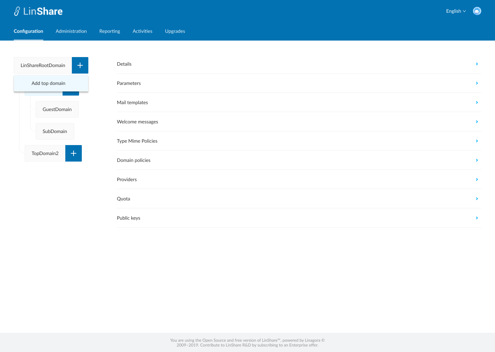
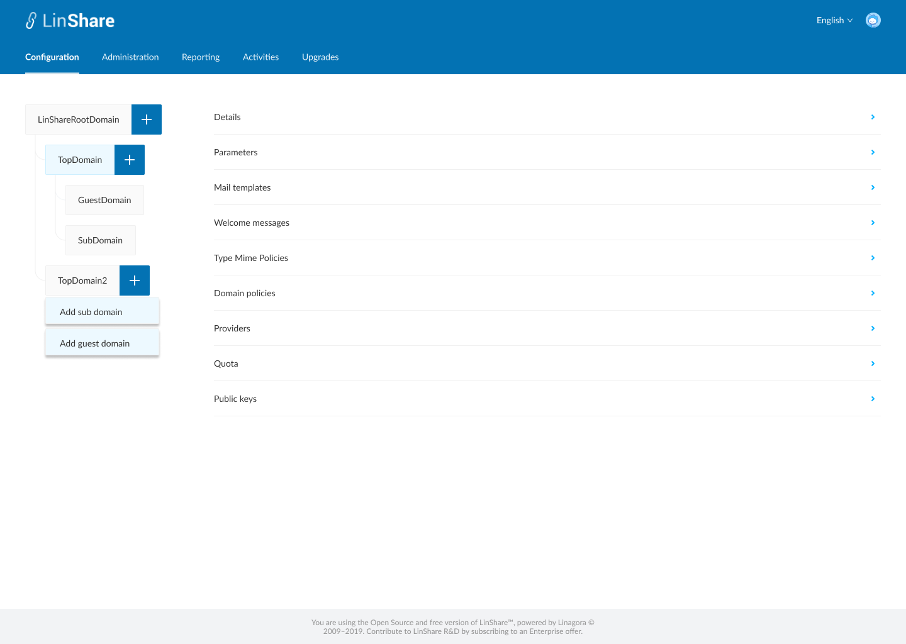
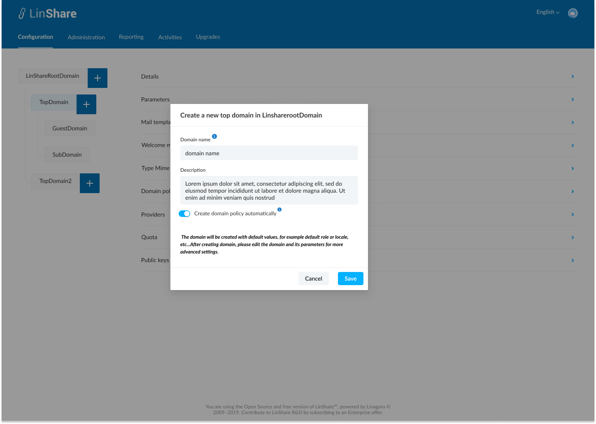
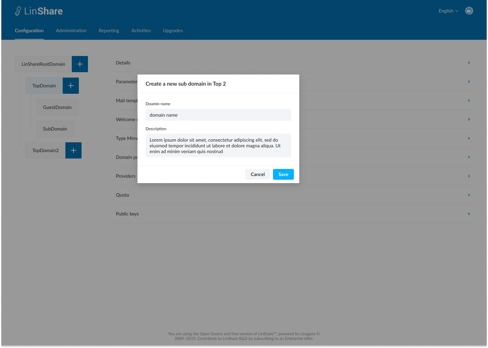

# Summary

* [Related EPIC](#related-epic)
* [Definition](#definition)
* [Screenshots](#screenshots)
* [Misc](#misc)

## Related EPIC

* [New admin portal](./README.md)

## Definition

#### Preconditions

* Given that i am super-admin in Linshare 
* I logged-in to Amin portal successfully

#### Description

* After log-in Admin Portal successfully, i go to Administration tab
* On the left of screen, i can see a domain tree. 
* There are 4 types of domain: root domain, Top domain, Guest domain and Sub domain 
* There are 3 levels in domain tree:
   * Root domain is highest level: From root domain, i can add top domains. There are no limitation about number of top domains i can create. 
   * Top domain is second level: From each top domain, i can create as many sub domain as I want sub domain and only 1 guest domain
   * Sub domain and guest domain is third level: I cannot create any lower level domain. 
* When i click on Cross icon of Root domain in domain tree, the button :"Add top domain" will be displayed.
* When i click on button "Add top domain", a screen will be opened. 
* On this new screen, i can see:
   * Screen name: Create a new [domain type] in [Parent domain name]
   * Domain name: A text field that allow me to input domain name. This field is mandatory. I can click on Information icon to see the explaination: "This domain name will be used officially in whole platform, both Admin site and End user site" 
   * Description: A text field that allow me to input description. This field is optional 
   * A toggle : Create domain policy automatically. Default value is false. I can click on con Information to see the explaination:" If enabled, a rule will be created automatically by authorizing the newly created domain to communicate with itself only. All other communications are forbidden by default. If disabled, the default domain policy will be applied. It will allow all other domains to see this domain."
   * I can see a text message:"  The domain will be created with default values, for example default role or locale, etc...After creating domain, please edit the domain and its parameters for more advanced settings."

#### Postconditions

* After input information, i click button Save, the system will validate:
   * If there is any error in field Domain name (ex: blank fileld, domain name is over max length) , it will be highlighted with red border and an error message
   * If there is no error, the new top domain is created, the popup is closed and system will display an toast message to confirm creation with a link towards domain Detail page.
* If i click on the link, i will land to the detail page.
* The new created domain will be displayed in the domain tree under its parent domain.
* If i click on Cross button of a Top domain:
   * If top domain does not have any lower level domain or only has sub domains, i can see 2 options: Add sub domain/Add guest domain
   * If top domain already has a guest domain, i can only see 1 option: Add sub domain. 
* Only super admin can create domains. 

[Back to Summary](#summary)

## UI Design

#### Mockups

#### Final design

[Back to Summary](#summary)
## Misc

[Back to Summary](#summary)
