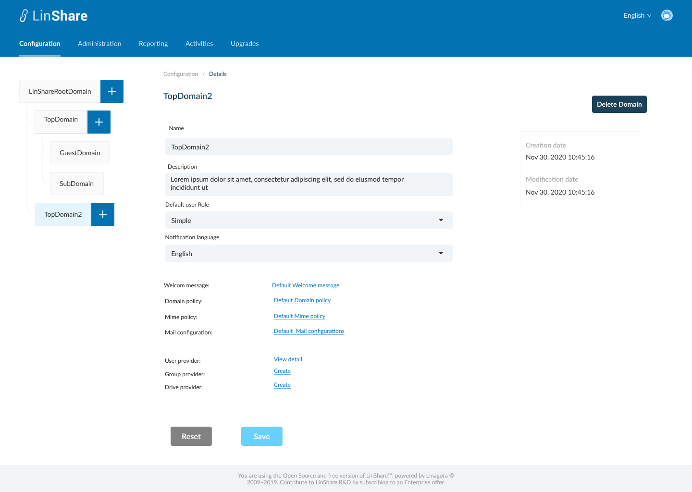
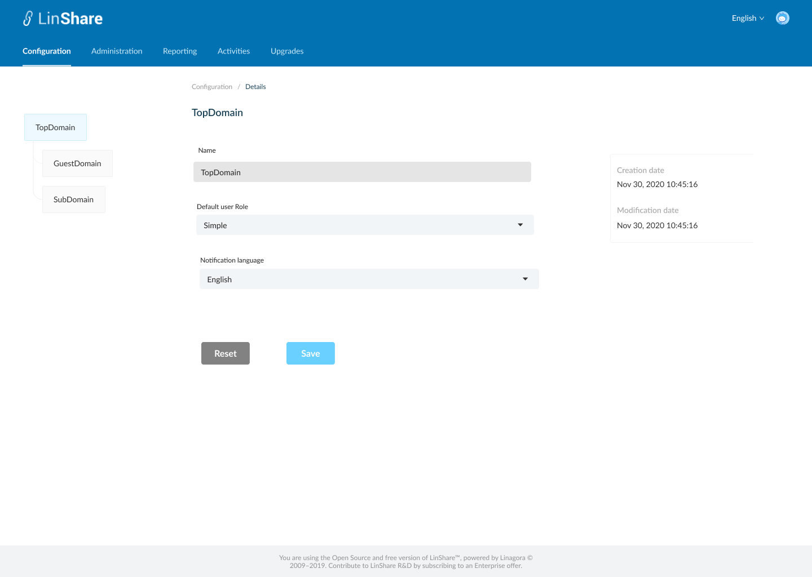
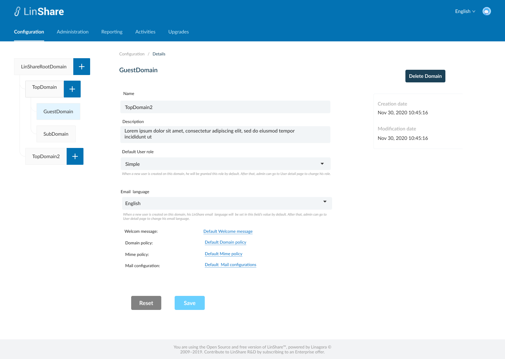
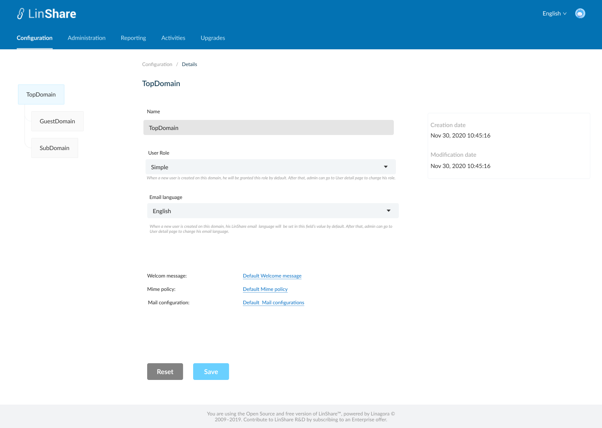
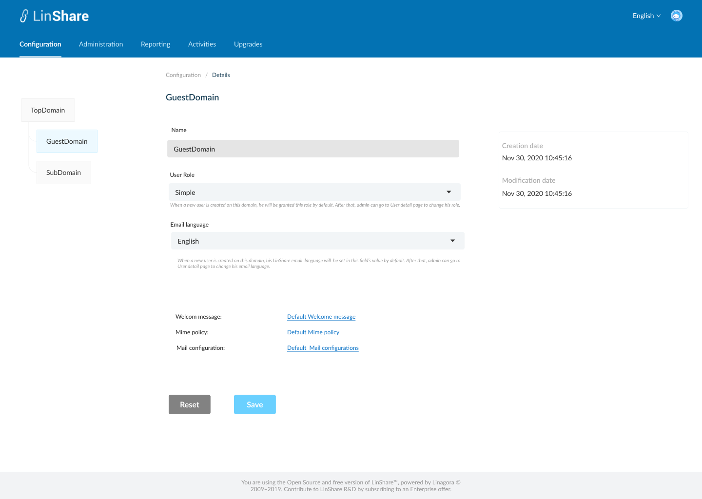

# Summary

* [Related EPIC](#related-epic)
* [Definition](#definition)
* [Screenshots](#screenshots)
* [Misc](#misc)

## Related EPIC

* [New admin portal](./README.md)

## Definition

#### Preconditions

* Given that i am admin/super-admin in Linshare 
* I logged-in to Amin portal successfully
* On Domain tree, i select a domain. 
* I go to Configuartion tab on top navigation bar and select Details, the screen Domain Detail of current selected domain on domain tree will be disppayed.

#### Description

**UC1. As a super-admin, i can view and edit root domain details**
* With the Root domain Detail page, I can see the information: 
   * Name: A text field when i click on, i can edit current name 
   * Description: A text field when i click on, i can edit current description
   * Creation date: Non-editable field
   * Modification date: Non-editable field
* When i click Save button, the system will validate:
   * If the field: "Name" is invalid (blank, over max length..), the field will be marked with red border and an error message
   * If valid, the updates will be saved and system will display a successful notification
* When i click Cancel button, the updates will not be saved.

**UC2. As a super-admin, i can view and edit Top domain/Sub domain details**
* With a lower-level domain (Top domain/Sub domain), i can see the information:
   * Name: A text field when i click on, i can edit current name 
   * Description: A text field when i click on, i can edit current description
   * Default user role: The default value of this field is Simple. I can choose from the dropdown list options: Simple or Administrator. I can see a description text under this field "This role will be assigned to all newly created users on this domain. Administrator can still change user's role later in Administration page".
   * Email language:  The default value of this field is English. I can choose from the drop-down list options: English, French, Russian. I can see a description text under this field: "Notification emails will be sent in this language for all newly created users on this domain. Administrator can still change user's email language later in Administration page".
   * Creation date: Non-editable field
   * Modification date: Non-editable field
   * Welcome message: Display name of welcome message this domain is using, when i click on this link i am navigated to the Detail page of this Welcome message in View mode.
   * Mime policy: Display name of mime policy this domain is using, when i click on this link i am navigated to the Detail page of this Mime policy in View mode
   * Domain policy: Display name of domain policy this domain is using, when i click on this link i am navigated to the Detail page of this Domain policy in Read mode
   * Mail configuration: Display name of Mail configuration this domain is using, when i click on this link i am navigated to the Detail page of this Mail configuration in View mode
   * User provider/Group provider/Drive provider: If the provider has been set up yet, there will be a link "View detail" , when i click on this link, i am navigated to detail page of that provider. If the provider has not been set up, there will be a link "Create", when i click on this link, i am navigated to the Create page of that provider. 
   * When i cancel the view, i am navigated back to this Domain detail page. 
* When i click Save button, the system will validate:
   * If the field: "Name" is invalid (blank, over max length..), the field will be marked with red border and an error message
   * If valid, the updates will be saved and system will display a successful notification
* When i click Cancel button, the updates will not be saved.

**UC3. As a super-admin, i can view and edit a Guest domain**

- With a guest domain, i can see the information:
   * Name: A text field when i click on, i can edit current name 
   * Description: A text field when i click on, i can edit current description
   * Default user role: The default value of this field is Simple. I can choose from the dop-down list options: Simple or Administrator. I can see a description text under this field "This role will be assigned to all newly created users on this domain. Administrator can still change user's role later in Administration page".
   * Email language:  The default value of this field is English. I can choose from the drop-down list options: English, French, Russian. I can see a description text under this field: "Notification emails will be sent in this language for all newly created users on this domain. Administrator can still change user's email language later in Administration page".
   * Creation date: Non-editable field
   * Modification date: Non-editable field
   * Welcome message: Display name of welcome message this domain is using, when i click on this link i am navigated to the Detail page of this Welcome message in Read mode.
   * Mime policy: Display name of mime policy this domain is using, when i click on this link i am navigated to the Detail page of this Mime policy in Read mode
   * Domain policy: Display name of domain policy this domain is using, when i click on this link i am navigated to the Detail page of this Domain policy in Read mode
   * Mail configurations: Display name of Mail configurations this domain is using, when i click on this link i am navigated to the Detail page of this Mail congigurations in Read mode
   * When i cancel the view, i am navigated back to this Domain detail page. 
* When i click Save button, the system will validate:
   * If the field: "Name" is invalid (blank, over max length..), the field will be marked with red border and an error message
   * If valid, the updates will be saved and system will display a successful notification
* When i click Cancel button, the updates will not be saved.

**UC4. As an nested admin, i can view and edit Details page of my domains which i am admin on**
* If i am the nested admin, i can see the information:
   * Name: Non-editable field displays current domain name. I cannot edit this field
   * Default user role: The default value of this field is Simple. I can choose from the dop-down list options: Simple or Administrator. I can see a description text under this field "This role will be assigned to all newly created users on this domain. Administrator can still change user's role later in Administration page".
   * Email language:  The default value of this field is English. I can choose from the drop-down list options: English, French, Russian. I can see a description text under this field: "Notification emails will be sent in this language for all newly created users on this domain. Administrator can still change user's email language later in Administration page".
   * Creation date: Non-editable field
   * Modification date: Non-editable field
   * Welcome message: Display name of welcome message this domain is using, when i click on this link i am navigated to the Detail page of this Welcome message in Read mode.
   * Mime policy: Display name of mime policy this domain is using, when i click on this link i am navigated to the Detail page of this Mime policy in Read mode
   * Mail configurations: Display name of Mail configurations this domain is using, when i click on this link i am navigated to the Detail page of this Mail congigurations in Read mode
   * When i cancel the view, i am navigated back to this Domain detail page. 
* When i click Save button, the system will save the updates and displayed successful notification
* When i click Cancel button, the updates will not be saved.

#### Postconditions

[Back to Summary](#summary)

## UI Design

#### Mockups

#### Final design

[Back to Summary](#summary)
## Misc

[Back to Summary](#summary)
