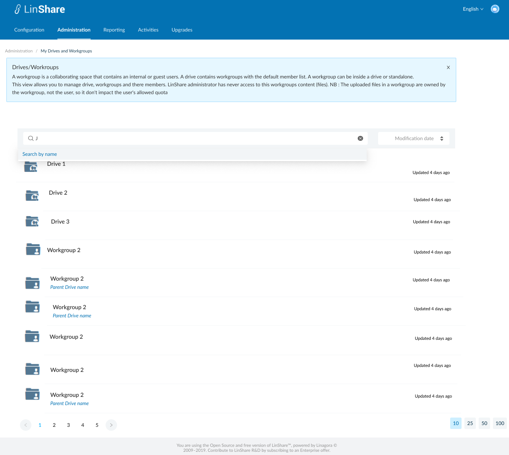
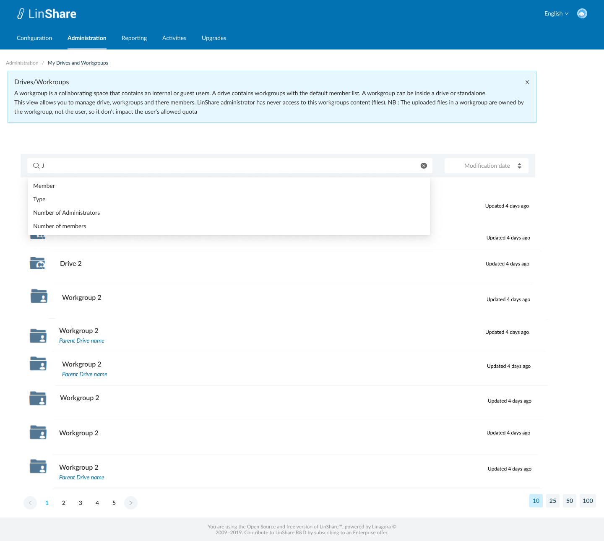

# Summary

* [Related EPIC](#related-epic)
* [Definition](#definition)
* [Screenshots](#screenshots)
* [Misc](#misc)

## Related EPIC

* [New admin portal](./README.md)

## Definition

#### Preconditions

- Given that i am Super admin of new Admmin Portal 

#### Description

- After log-in succesfully to  Admin Portal, i go to Administration screen 
- On Administration tab, I click on My Drives/ Workgroups, the screen My Drives and Workgroups will be opened. 
- In new view I can see the list of all workgroups and Drives
- I click on the search bar, there will be a drop-down list of search criteria including: 
   - Member:  When i select this search citeria, the search bar will display: Member = "text input". When i start typing, i can see the suggestion list of Linshare user (internal and guest account) which have first name, last name or email contains text inputted. I can select member from the list. When i click Enter, the system will search workgroups that contain that selected user as a members 
   - Type: When i select this search criteria, the seach bar will display Type = "Dropdown list". The options are: Workgroups (all Workgroups), Drives, Nested workgroups (workgroups which are inside a drive), Independent Workgroups (workgroups which are not inside any drive)
   - Number of administrators: When i select this search criteria, the search bar will display Number of Administrators = "Dropdown list". Options are: None/More than 0
   - Number of members: When i select this search criteria, the search bar will display Number of Members = "Dropdown list". Options are: None/More than 0
- When i start typing on search bar without select any search criteria from the dropdown list, the system will show default search criteria is Workgroup/Drive's name.

#### Postconditions

- I can search drives/workgrousp by one of above criteria or combine them
- Each search criteria in the search bar is seperated by a delete icon. I can click this icon to delete the criteria
- After select one criteria in search bar, that option is hidden in the dropdown list of search criteria. 
- For example: 
     - I chose Member as a search criteria
     - I type some character and see the list of suggestion
     - I select one user (John Doe-user1@linshare.org) from the list
     - Now the search bar is: Member=John Doe 
     - When i click on search bar, i can see the list of criteria is: Type; Administrator number; Member number. 

[Back to Summary](#summary)

## UI Design

#### Mockups

#### Final design

[Back to Summary](#summary)
## Misc

[Back to Summary](#summary)
