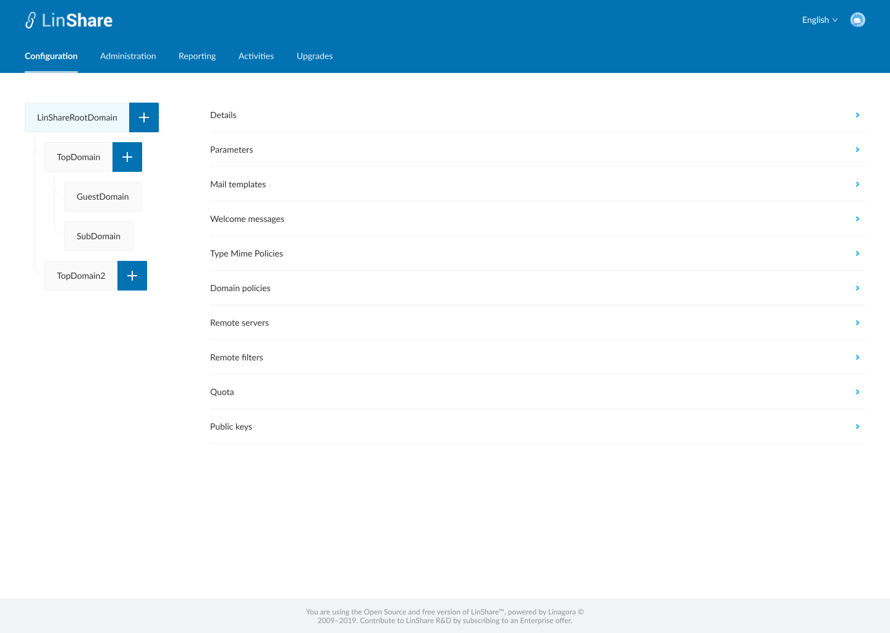
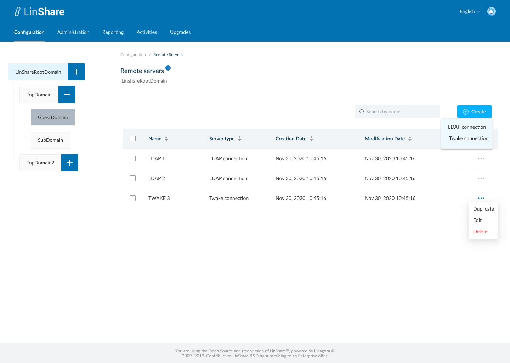
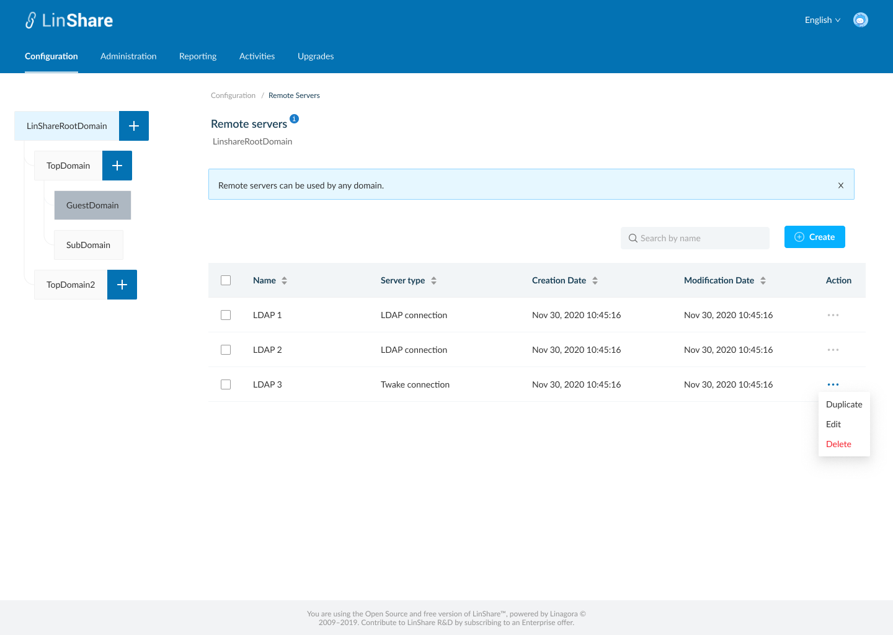

# Summary

* [Related EPIC](#related-epic)
* [Definition](#definition)
* [Screenshots](#screenshots)
* [Misc](#misc)

## Related EPIC

* [New admin portal](./README.md)

## Definition

#### Preconditions

* Given that i am super-admin in LinShare 
* I logged-in to ADmin portal successfully

#### Description

- I go to Configuration tab on top navigation bar, if i am selecting root domain in domain tree, i can see the Configuration screen including: Details, Parameters, Mail templates, Welcome messages, Mine Type policies, Domain policies, Remote servers, Remote filters, Quota, Plublic keys.
- If i am selecting a nested domain in domain tree, i can see the Configuration screen including: Details, Parameters, Mail templates, Welcome messages, Mine Type policies, Domain policies, Remote servers, Remote filters, Providers, Quota, Plublic keys 
- If i am selecting a guest domain in domain tree, i can see the Configuration screen including: Details, Parameters, Mail templates, Welcome messages, Mine Type policies, Domain policies, Quota, Plublic keys 
- I click on Root domain or a nested domain in domain tree and click on Remote servers, the screen Remote servers list will be opened.

#### Postconditions

- I can see a help message on screen name: "Remote servers can be used for any domain.
- All current servers will be listed in a table, including columns: 
   - Name
   - Server type
   - Creation date
   - Modification date
   - Action
- I can sort by each column: Name, Server type, Creation date, Modification date
- Default sort is last modification date
- In Action column, when i click on thee-dots button, i can see the drop-down list: Duplicate, Edit, Delete
- I can see a search bar and typing in, the system will search by server name and display corresponding result in the table below
- When i click button "Create", i can see the drop-down list: LDAP connection, Twake connection
- The remote server list is paginated and the default number of displayed items is 25, I can change this number at the bottom of page

[Back to Summary](#summary)

## UI Design

#### Mockups

#### Final design

[Back to Summary](#summary)
## Misc

[Back to Summary](#summary)
