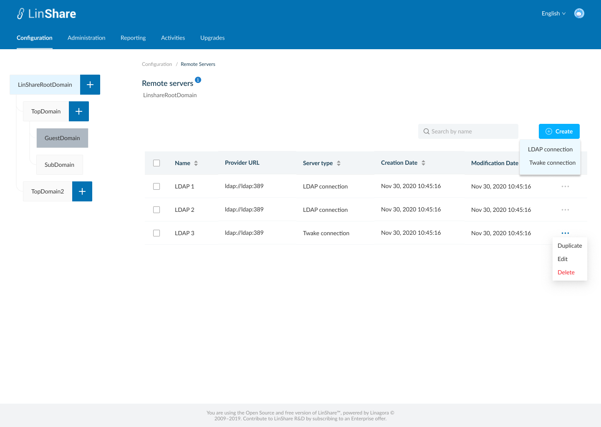
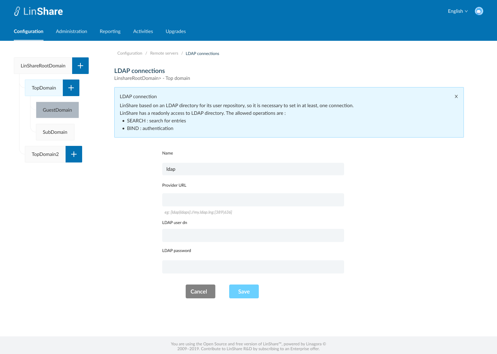
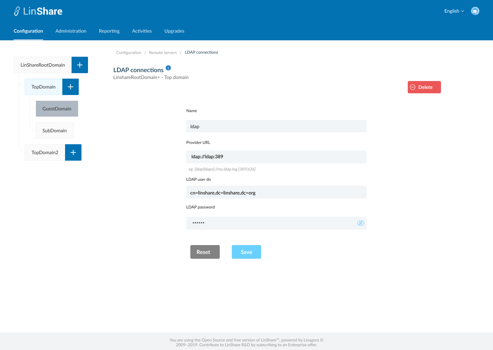
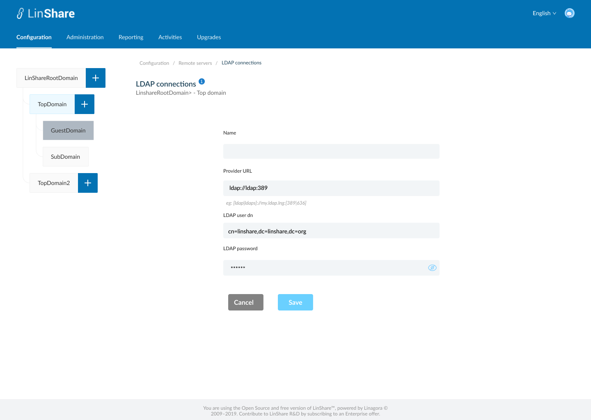

# Summary

* [Related EPIC](#related-epic)
* [Definition](#definition)
* [Screenshots](#screenshots)
* [Misc](#misc)

## Related EPIC

* [New admin portal](./README.md)

## Definition

#### Preconditions

* Given that i am super-admin in Linshare 
* I logged-in to Admin portal successfully

#### Description

**UC1. Create LDAP connection**
- I go to Configuartion tab on top navigation bar, and select Remote servers
- The screen listing Remote server will be displayed 
- I click on  button Create, there will be 2 options: LDAP connection and twake connection
- I select LDAP connection, screen Create LDAP connection will be displayed.
- In this screen i can see a helper message on screen name when i click information icon
- To create an LDAP connection, i need to input fields:
   - Name: a text field and mandatory
   - Provider URL: Text field and madatory
   - LDAP user dn: a texfield and optional
   - LDAP password: a text field and optional. When i start typing in this field, the inputed characters will be hidden by star icons automatically and the closed Eye icon will be shown. I click to this icon, the field value will be shown.
- When i click button Save, the system will validate if any mandatory field is blank, it will be highlighted in red and a message:"[field name] cannot be blank"
- If there is no error, the new LDAP connection is created and there will be a successful notification
- I am redirected to the Screen remote server listing, and the new create LDAP connection appears on the list.
- If i click button Cancel, i am navigated to the Listing server screen.

**UC2. Edit LDAP connection**

- There are 2 ways to access Edit LDAP connection screen:
   - In the Remote server listing screen, i click on three dot-button of an LDAP server and select option Edit from the drop-down list
   - Or i can click an the LDAP server row on the Remote server listing table 
- On the LDAP servers screen, i can edit all fields: Name, Provider URL, LDAP user dn, LDAP password then click button Save.
- If any mandatory field is blank, it will be highlighted in red and a message:"[field name] cannot be blank"
- If non of the madatory fields is not blank, the updates will be saved and there will be a successful toast message.
- If i click button Reset, all the updates will be reset to the before value
- I can click Remote servers on the breadcrumb to navigate back to the server listing screen.

**UC3. Duplicate an LDAP connection**

- On the Remote server listing screen, i click on thee-dot button of an LDAP server and select option Duplicate from the drop-down list 
- The screen Create LDAP server will be opened
- Except the field Name is blank, other fields will have the same value as the LDAP server that i slected to duplicate
- I input the field Name, and can edit other fields
- When i click button Save, the system will validate if any mandatory field is blank, it will be highlighted in red and a message:"[field name] cannot be blank"
- If there is no error, the new LDAP connection is created and there will be a successful notification
- If i click button Cancel, i am navigated to the Listing server screen.

**UC4. Delete an LDAP connection**

- There are 2 ways to delete an LDAP server:
   - In the Remote server listing screen, i click on three dot-button of an LDAP server and select option Delete from the drop-down list
   - Or i can click an the LDAP server row on the Remote server listing table to go to LDAP server detail screen. On this screen i can see the button Delete 
- When i click on button Delete, there will be an confirmation popup: "You are about to delete this remote sever connection, this procedure is irreversible. Do you want to proceed?" and Yes/No button
- I choose Yes to confirm, the server connection will be deleted.
- System will prompt a deletion confirmation toast. 

#### Postconditions

[Back to Summary](#summary)

## UI Design

#### Mockups

#### Final design

[Back to Summary](#summary)
## Misc

[Back to Summary](#summary)
