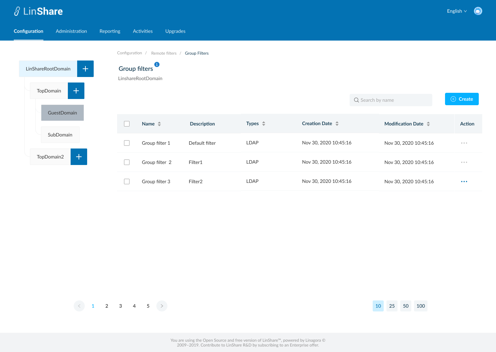
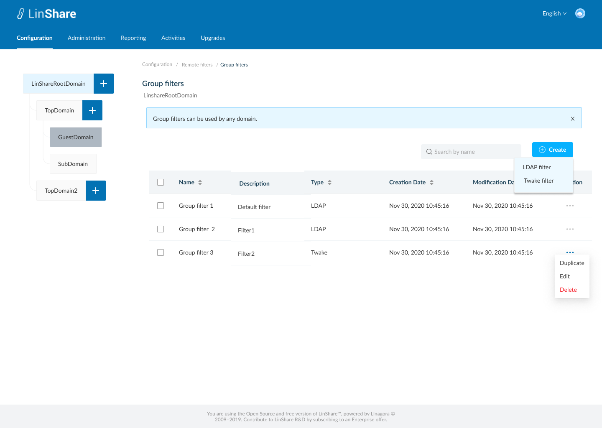

# Summary

* [Related EPIC](#related-epic)
* [Definition](#definition)
* [Screenshots](#screenshots)
* [Misc](#misc)

## Related EPIC

* [New admin portal](./README.md)

## Definition

#### Preconditions

- Given that i am super-admin in LinShare 
- I logged-in to Admin portal successfully

#### Description

- I go to Configuration tab on top navigation bar, if i am selecting root domain in domain tree, i can see the Configuration screen including: Details, Parameters, Mail templates, Welcome messages, Mine Type policies, Domain policies, Remote servers, Remote filters, Quota, Plublic keys.
- If i am selecting a nested domain in domain tree, i can see the Configuration screen including: Details, Parameters, Mail templates, Welcome messages, Mine Type policies, Domain policies, Remote servers, Remote filters, Providers, Quota, Plublic keys 
- If i am selecting a guest domain in domain tree, i can see the Configuration screen including: Details, Parameters, Mail templates, Welcome messages, Mine Type policies, Domain policies, Quota, Plublic keys 
- I click on Root domain or a nested domain in domain tree and click on Remote filters, the screen Remote filters list will be opened.

#### Postconditions

- On Remote filters screen, i can see three kinds of filters: User filters, Group filters, Drive filters.
- I can see a help message on screen name: "Remote filters can be used for any domain".
- I click on Group filters, the screen Group filters list will be opened. 
- I can see a help message on screen name: "Group filters can be used for any domain".
- All current filters will be listed in a table, including columns: 
   - Name
   - Description
   - Type
   - Creation date
   - Modification date
   - Action
- I can sort by each column: Name, Type, Creation date, Modification date
- Default sort is last modification date
- In Action column, when i click on thee-dots button, i can see the drop-down list: Duplicate, Edit, Delete
- I can see a search bar and typing in, the system will search by filter name and display corresponding result in the table below
- When i click button "Create", i can see the drop-down list: LDAP filter, Twake filter

[Back to Summary](#summary)

## UI Design

### Mockups

### Final design

[Back to Summary](#summary)
## Misc

[Back to Summary](#summary)
