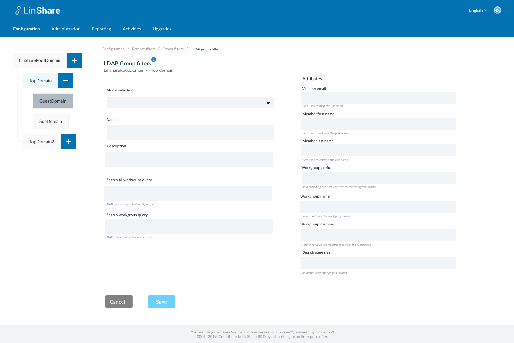
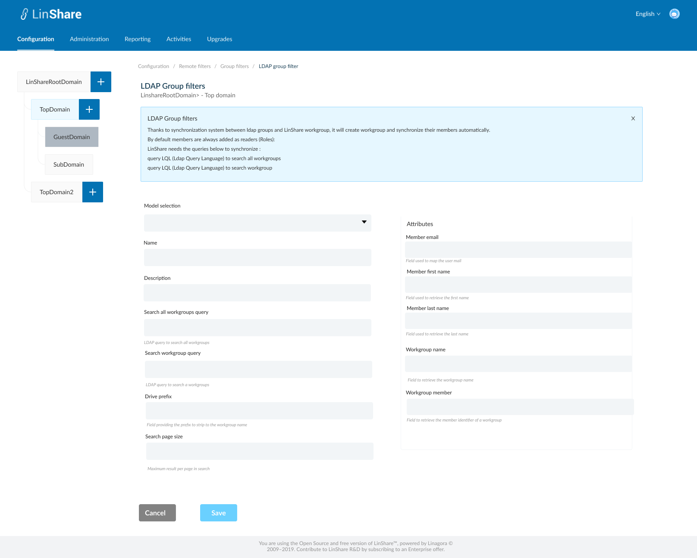
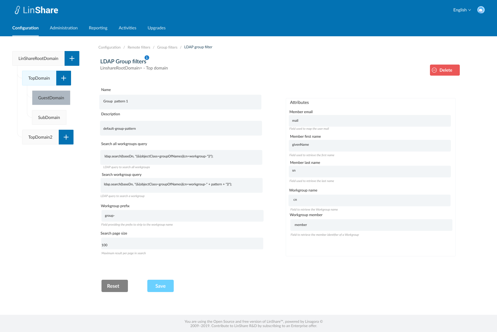
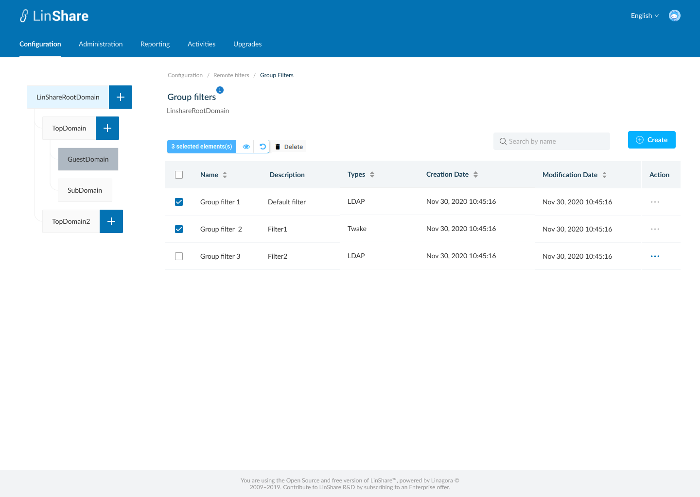
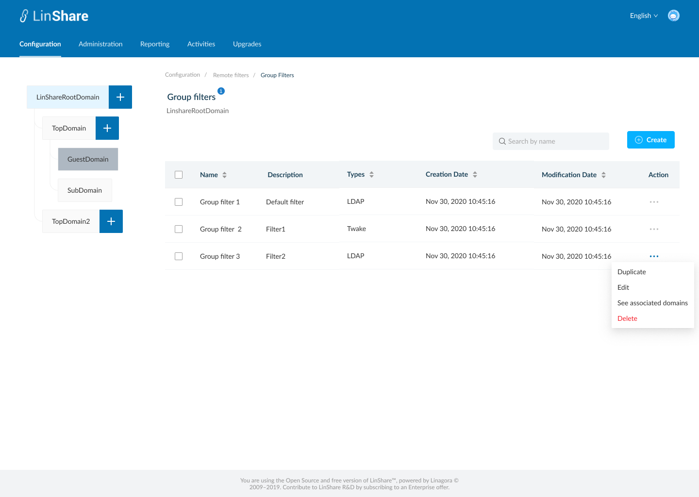
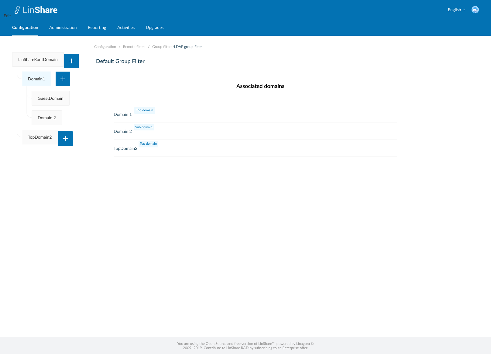
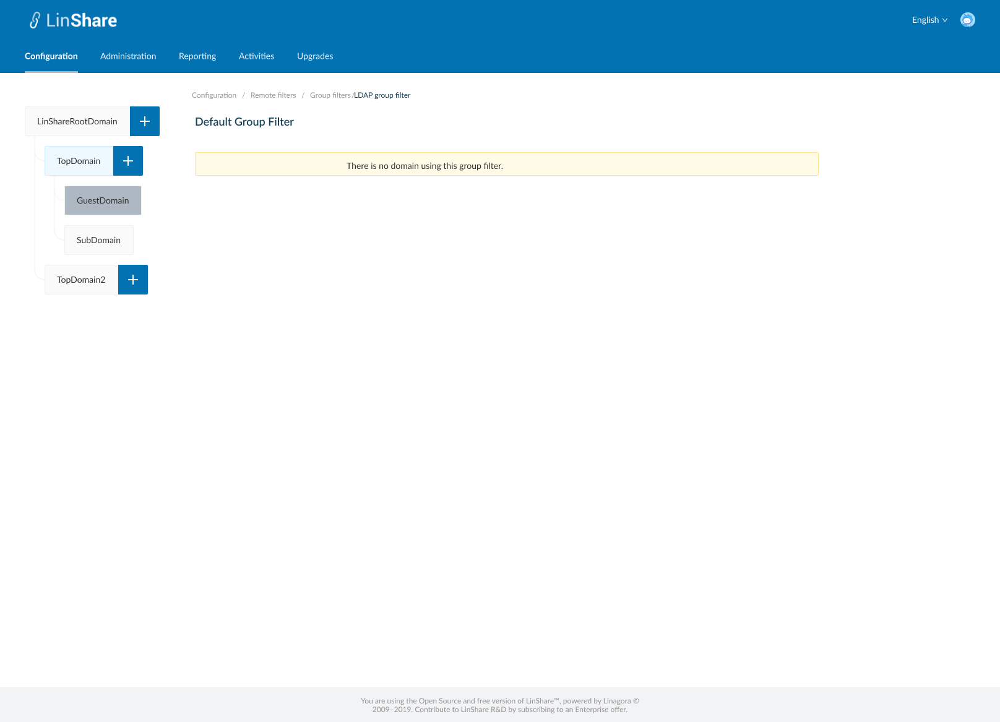

# Summary

* [Related EPIC](#related-epic)
* [Definition](#definition)
* [Screenshots](#screenshots)
* [Misc](#misc)

## Related EPIC

* [New admin portal](./README.md)

## Definition

#### Preconditions

* Given that i am super-admin in LinShare 
* I logged-in to Admin portal successfully

#### Description

**UC1. Create LDAP group filter**
- I go to Configuration tab on top navigation bar, and select Remote filters
- The screen listing Remote filters will be displayed, i select Group filters, the screen listing group filters is opened. 
- I click on  button Create, screen Create LDAP Group filter will be displayed.
- In this screen i can see a helper message on screen name when i click information icon
- To create an LDAP Group filter, i need to input fields:
   - Model selector: optional field, a drop-down list includes 1 options: Ldap groups
      - When i select the model, other fields on screen excepting "Name" will be filled out automatically.
   - Name: a text field and mandatory
   - Description: a text field and optional
   - Search all workgroups query: a text field and mandatory
   - Search workgroup query: a text field and mandatory
   - Attributes fields on the right of screen are:
      - Member email: a text field and mandatory
      - Member first name: a text field and mandatory
      - Member last name: a text field and mandatory
      - Workgroup prefix: a text field and optional
      - Workgroup name: a text field and mandatory
      - Workgroup member: a text field and mandatory
      - Search page size: a text field and mandatory
      - Below each of filed,  there will be a grey text to explain what is this field used for (check the screen 2)
- When i click button Save, the system will validate if any mandatory field is blank, it will be highlighted in red and a message:"[field name] cannot be blank"
- If there is no error, the new LDAP group filter is created and there will be a successful notification
- I am redirected to the Screen Group filters listing, and the new create LDAP group filter appears on the list.
- If i click button Cancel, i am navigated to the Listing group filters screen.

**UC2. Edit LDAP Group filter**

- There are 2 ways to access Edit LDAP group filter screen:
   - In the Group filters listing screen, i click on three dot-button of an LDAP group filter and select option Edit from the drop-down list
   - Or i can click an the LDAP group filter row on the  group filter listing table. 
- On the LDAP group filter screen, i can edit all fields excepting "Model selector" (this field will not be shown in Edit mode) then click button Save.
- If any mandatory field is blank, it will be highlighted in red and a message:"[field name] cannot be blank"
- If none of the mandatory fields is  blank, the updates will be saved and there will be a successful toast message.
- If i click button Reset, all the updates will be reset to the before values.
- I can click Group filters on the breadcrumb to navigate back to the Group filter listing screen.

**UC3. Duplicate an LDAP Group filter**

- On the Group filter listing screen, i click on thee-dot button of an LDAP Group filter and select option Duplicate from the drop-down list 
- The screen Create LDAP Group filter will be opened
- Except the field Name is blank, other fields will have the same value as the LDAP Group filter that i slected to duplicate
- I input the field Name, and can edit other fields
- When i click button Save, the system will validate if any mandatory field is blank, it will be highlighted in red and a message:"[field name] cannot be blank"
- If there is no error, the new LDAP Group filter is created and there will be a successful notification
- If i click button Cancel, i am navigated to the Group filter listing screen.

**UC4. Delete an LDAP Group filter**

- There are 2 ways to delete an LDAP group filter:
   - In the group filter listing screen, i click on three dot-button of an LDAP group filter  and select option Delete from the drop-down list
   - Or i can click an LDAP Group filter row on the Group filter listing table to go to LDAP group filter detail screen. On this screen i can see the button Delete.
- When i click on button Delete:
   - If the group filter is not accociated with any domain, there will be an confirmation popup: "You are about to delete this Group filter, this procedure is irreversible. Do you want to proceed?" and Yes/No button
      - I choose Yes to confirm, the Group filter will be deleted.
      - System will prompt a deletion confirmation toast.
   - If the Group filter is accociated with any domain, the system will display message: "This group filter is accociated with at least one domain. You cannot delete."

**UC5. Delete multiple group filters**

- On Group filter listing screen, i can select multiple Group filters on the list by tick the checkbox of each item
- There will be a top bar that indicates number of selected group filters, an isolation icon, an Undo icon and a Delete icon. 
- When i click on Isolation icon, the screen only shows selected items 
- When i click on Undo icon, all the selected items are unselected 
- When i click on button Delete:
   - If any of selected group filters is not accociated with any domain, there will be an confirmation popup: "You are about to delete [number of seleted items] group filters, this procedure is irreversible. Do you want to proceed?" and YEs/No button 
      - I choose Yes to confirm, the selected Group filters will be deleted.
      - System will prompt a deletion confirmation toast.
   - If any of selected group filters is accociated with any domain, the system will display message: " One of selected group filters is accociated with at least one domain. You cannot delete."

**UC6. View associated domains**

- On Group filter listing screen, i click on three-dot button on Action column.
- I select option "View associated domains"
- A new screen will be opened
- I can see the list of domain's name which are using the group filter. 
- There will be a lable next to each domain's name that indicating domain type of that domain
- Only Top domain or sub domain can use an group filter, Root domain and guest domain can't.
- When i click one domain on the list, i am navigated to Group provider page of that domain. 
- If the group filter is not associated with any domain, there will be a text message: " There is no domain using this group filter. "

#### Postconditions

[Back to Summary](#summary)

## UI Design

#### Mockups

#### Final design

[Back to Summary](#summary)
## Misc

[Back to Summary](#summary)
