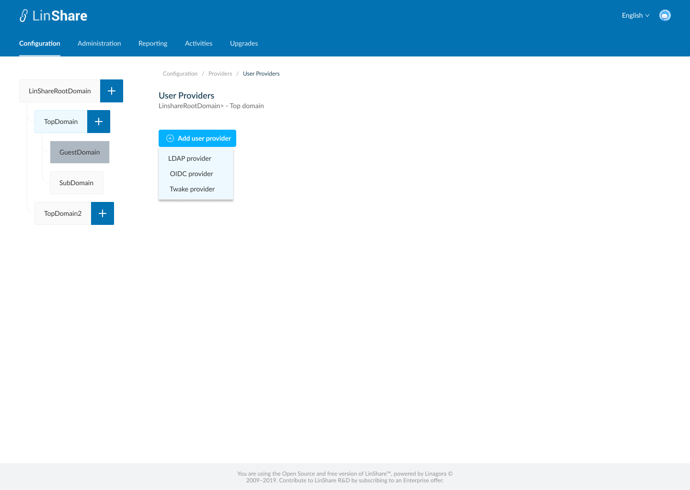
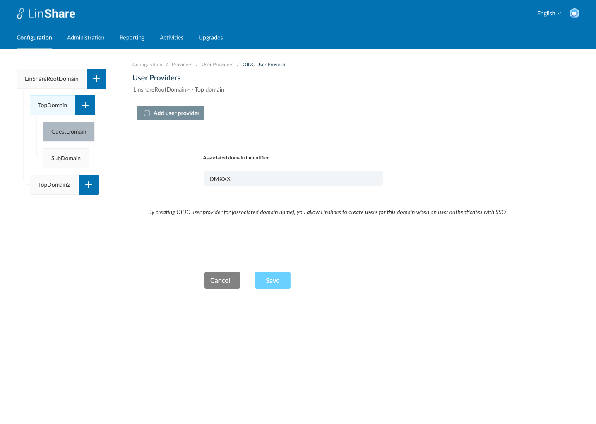
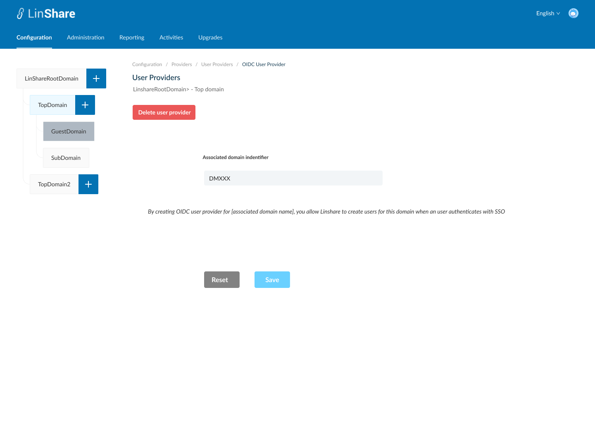

# Summary

* [Related EPIC](#related-epic)
* [Definition](#definition)
* [UI Design](#ui-design)
* [Misc](#misc)

## Related EPIC

* [New admin portal](./README.md)

## Definition

#### Preconditions

- Given that i am super-admin in LinShare 
- I logged-in to Admin portal successfully
- I choose a nested domain in domain tree and click on Configuration screen, i click on item Providers. (If i select root domain or guest domain in domain tree, i cannot see item Providers)
- On screen Providers, i can see 3 types: User providers, Groups Provider, Drive Providers. 

#### Description

**UC1. Create OIDC User Provider** 

- I select User Providers, if the current selected domain doesn't have an user provider, screen 2 will be displayed.
- When i click button "Add user provider", there will be a drop-down list with 3 options: LDAP provider, OIDC provider, Twake provider
- I select OIDC provider, screen 3 will be displayed, the button Add user provider will be disabled
- To add an OIDC user provider, I need to fill:
   - "Associated domain indentifier". This is a string field and mandatory.
   - Check external user ID: A checkbox. : If enabled, LinShare will search for a claim named 'external_uid', store it in the database at the first connection. Then the store value will be compared with the value provided by OIDC at each authentication attempt. if it does not match, user will be rejected.
   - Use Access Claim:  A checkbox: If enabled, LinShare will search for a claim named 'linshare_access' and compare it to the value store in key 'oidc.access.claim.value="linshare"' in the property file. If it does not match, user will be rejected.
   - Use Role Claim:  A checkbox: If enabled, LinShare will search for a claim named 'linshare_role' to define the default role value when creating the profile at first connection only (Possible values: ADMIN, SIMPLE)
   - Use email locale Claim: A checkbox: If enabled, LinShare will search for a claim named 'linshare_locale' to define the default role value when creating the profile at first connection only (Possible values: ENGLISH, FRENCH, RUSSIAN)
- I can also see a text message :"By creating OIDC user provider for [associated domain name], you allow LinShare to create users for this domain when a user authenticates with OIDC. The user will be created in this domain if the value of the claim 'domain_discriminator' matches the value above."," 
- When i click button Save, the system will validate:
   - If associated domain identifier is already in use by an other domain/oidc provider in LinShare, the field will be highlighted in red and a message:"Associated domain identifier already exists"
   - If Associated domain identifier field is blank, it will be highlighted in red and a message:"Associated domain identifier cannot be blank"
- If there is no error, the User provider is saved and there will be a successful notification, I am redirected to Screen 4. 
- If i click button Cancel, i am navigated to the screen 2
- Now when there is a person log-in Linshare with OIDC and his OIDC identifier is founded in associated domain, he will be created user account in this domain.

**UC2. Edit OIDC USer Provider**

- I select User Providers, if current selected domain already had a user provider, screen 4 will be displayed.
- On this screen, I can edit the field "Associated Domain identifier". and other checkboxes.
- When i click button Save, the system will validate:
   - If associated domain identifier is already existing in LinShare, the field will be highlighted in red and a message:"Associated domain identifier already exists"
   - If associated domain identifier field is blank, it will be highlighted in red and a message:"Associated domain identifier cannot be blank"
- If there is no error, the User provider is updated and there will be a successful notification. 
- I can see the non-editatble fields:
   - Creation date
   - Modification date: This field will be the latest modification date.
- If i click button Reset, the field will be reset to the before-updated values.

**UC3.Delete OIDC User Provider**

- On screen 4, i can see a Delete button
- When i click on this button, there will be a confimation popup:""You are about to delete this user provider, this procedure is irreversible. Do you want to proceed?" and Yes/No button
- I choose Yes to confirm, the OIDC user provider will be deleted.
- System will prompt a deletion confirmation toast. 
- I am navigated to screen 1.

#### Postconditions

- The user provider is associated with the selected nested domain in the left domain tree. 
- Root domain is not associated with any User provider
- Guest domain is not associated with any USer provider

[Back to Summary](#summary)

## UI Design

#### Mockups

#### Final design

[Back to Summary](#summary)
## Misc

[Back to Summary](#summary)
