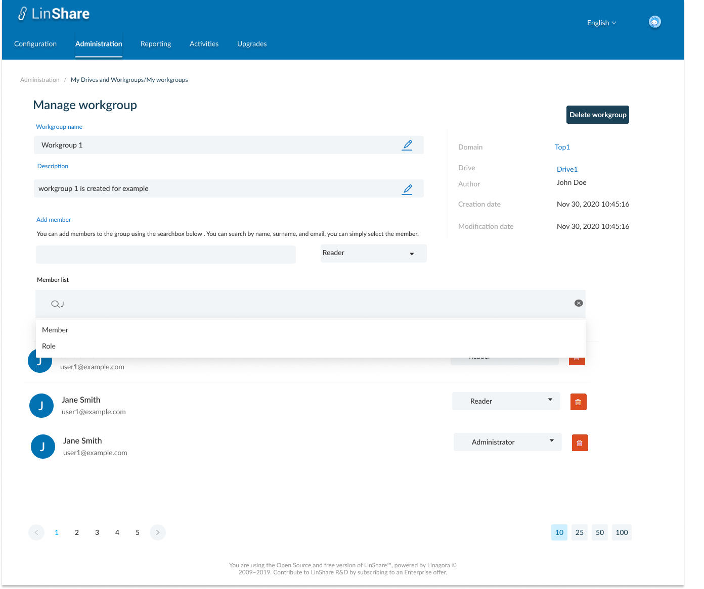
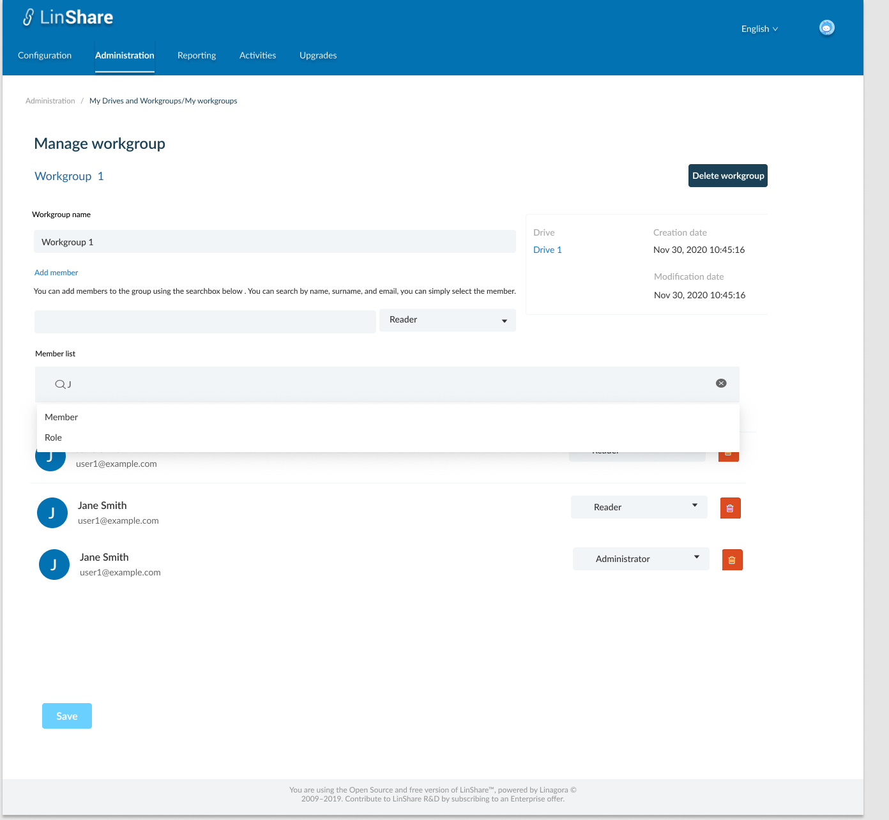
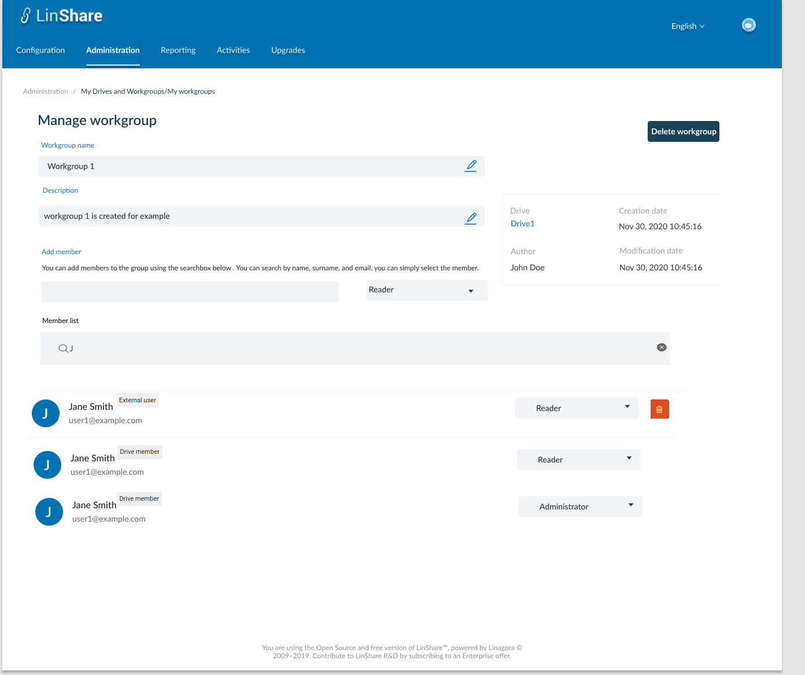

# Summary

* [Related EPIC](#related-epic)
* [Definition](#definition)
* [Screenshots](#screenshots)
* [Misc](#misc)

## Related EPIC

* [New admin portal](./README.md)

## Definition

### Preconditions

- Given that i am super-admin in Linshare 
- I logged-in to Amin portal successfully

### Description

**UC1.View/Edit/Delete workgroup**
- After log-in Admin Portal successfully, i go to Administration tab
- On Administration tab, i can see the list of links to screens: My users, My Drives/workgroups, My contact lists, Inconsistent users, loggers 
- I click on My Drives/ Workgroups, the screen My Drives and Workgroups list will be opened
- I click on a workgroup in the list, the screen Manage workgroup screen.
- The Manage workgroup page will include:
   - Workgroup's name 
   - "Delete workgroup" button:
      - When i click on this button, there will be a confirmation message.
      - When i choose Yes to confirm, the workgroup will be removed. Now the workgroup members cannot find that workgroup in User app.
      - I wil see a toast notification and back to the Workgroups/Drive list screen. 
   - On the right part i can see uneditable fields including: 
      - Drive: The link to parent Drive that contain current workgroup. I can click on this link to go to Manage drive . If this workgroup is standalone, the text "None" is displayed.
      - Creation date
      - Modification date 
      - Author: Creator of workgroup
   - On the left part i can see the editable fields including:
      - Worgkroup name: Text field. This field cannot be blank or contains special characters. When click icon Edit, i can change the name and click Save icon, if the workgroup name is invalid, i can see an error message.
      - Description: Display workgroup's desctiption. When i click on icon Edit, i can update the field and click save icon. 
   
**UC2.Manage member list of a standalone workgroup**
- In Manage workgroup screen, i can see the list of user: 
- A search bar: I can choose search criteria from the list: Member or Role.
   - If I choose member, the search bar will display: " Member = "text input" When i start typing, i can see the suggestion list of Linshare user (internal and guest account) which have first name, last name or email contains text inputed. I can select member from the list.
   - If I choose Role, the search bar will display: Role = "Dropdown list". Options include: Administrator, Writer, Contributor, Reader
   - I can only choose one search criteria, if i want to change, i have to delete the other.
   - If i do not choose search criteria and type in the search bar, the default search will be email.
- Each member is displayed in one role. Each role include:
   - Firstname + Last name of member
   - Email
   - Role: display current role of member. I can re-choose role from drop-down list: Administrator, Writer, Contributor, Reader. The new role will be updated instantly. 
   - A Delete button: When i click on this button, there will be a confirmation message. If i choose Yes, the member will be removed from workgroup. 
- Add member:
   - I can select role from the dropdown list (Administrator, Writer, Contributor, Reader)
   - Then i type in the field, system will display a suggestion list (internal user and guest user) which have first name, last name or email contains text inputed.
   - I select one user from this list then he will become the workgroup members with the selected role.  

**UC3. Manage member list of a nested workgroup (a workgroup inside a drive)**
- With a nested workgroup, i can also see the list of members and search member 
- Each member on the member list has a label : Drive member or External member to distinguish if a workgroup member is also a member of parent Drive.
- If member is a drive member, i can only update the role and cannot delete the member, so there is no Delete icon
- If member is external member, i can both update member role and Delete that member
- When i add a member to the workgroup, this member is an external member

[Back to Summary](#summary)

## UI Design

### Mockups

### Final design

[Back to Summary](#summary)

## Misc

[Back to Summary](#summary)
