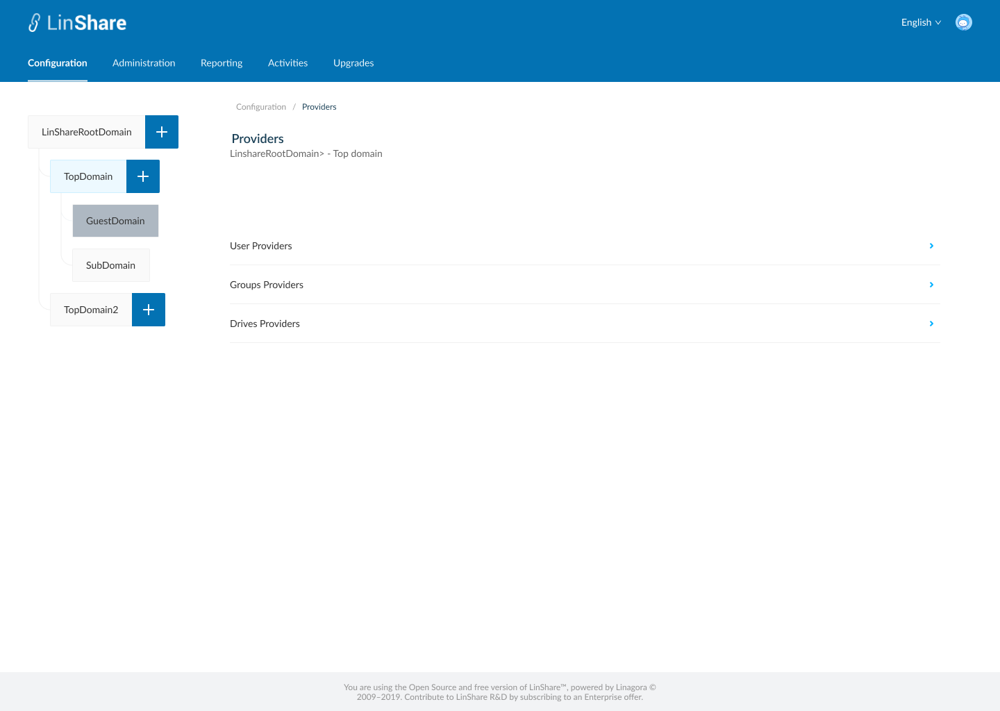
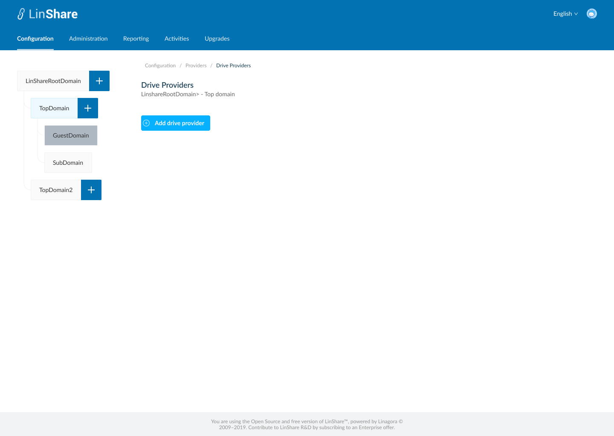
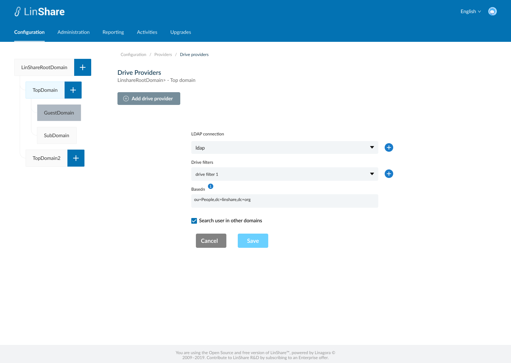

# Summary

* [Related EPIC](#related-epic)
* [Definition](#definition)
* [Screenshots](#screenshots)
* [Misc](#misc)

## Related EPIC

* [New admin portal](./README.md)

## Definition

#### Preconditions

- Given that i am super-admin in Linshare 
- I logged-in to Admin portal successfully
- I choose a nested domain in domain tree and click on Configuration screen, i click on item Providers. (If i select root domain or guest domain in domain tree, i cannot see item Providers)
- On screen Providers, i can see 3 types: User providers, Groups Provider, Drive Providers. 

#### Description

**UC1. Create LDAP Drive Provider** 
- I select Drive Providers, if the current selected domain doesn't have a drive provider, screen 2 will be displayed.
- When i click button "Add Drive provider", screen 3 will be displayed, the button Add drive provider will be disabled.
- To add an LDAP drive provider, i need to fill the followings:
   - LDAP connection: mandatory field, a drop-downlist which contain current LDAP connections list. There is a button next to this field that when i click on, i am navigated to Create LDAP connection screen
   - After i create a LDAP connection successfully, i am navigated back to this screen
   - Drive filter:  mandatory field,  a drop-down list which contain current LDAP drive filter list. There is a button next to this field that when i click on, i am navigated to Create LDAP drive filter Screen 
   - After i create a drive filter successfully, i am navigated back to this screen
   - Base dn:  a text field and mandatory.  When i hover the tooltip, there will be a legend: "LinShare will start looking for Drives from this position in your LDAP server."
   - Search in other domains: A checkbox, if i select, i will search users who are members of the remote LDAP drives in others domains than my own domain, according to the domain policies. 
- When i click button Save, the system will validate if any mandatory field is blank, it will be highlighted in red and a message:"[field name] cannot be blank"
- If there is no error, the drive provider is saved and there will be a successful notification, I am redirected to Screen 4. 
- If i click button Cancel, i am navigated to the Screen 2.

**UC2. Edit LDAP drive Provider**

- I select drive Providers, if current selected domain already had an drive provider, screen 4 will be displayed.
- On this screen, i can edit all fields: LDAP connection, drive filter, Basedn, checkbox Search user in other domains. 
- I click button Save, the system will validate if any mandatory field is blank, it will be highlighted in red and a message:"[field name] cannot be blank"
- If there is no error, the drive provider is updated and there will be a successful notification. 
- If i click button Reset, all the fields will be reset to the before-updated values.

**UC3.Delete LDAP drive Provider**

- On screen 4, i can see a Delete button
- When i click on this button, there will be a confimation popup:""You are about to delete this drive provider, this procedure is irreversible. Do you want to proceed?" and Yes/No button
- I choose Yes to confirm, the LDAP drive provider will be deleted.
- System will prompt a deletion confirmation toast. 
- I am navigated to screen 1.

#### Postconditions

- The drive is associated with the selected nested domain in the left domain tree. 
- Root domain is not associated with any drive provider
- Guest domain is not associated with any drive provider

[Back to Summary](#summary)

## UI Design

#### Mockups

#### Final design

[Back to Summary](#summary)
## Misc

[Back to Summary](#summary)
