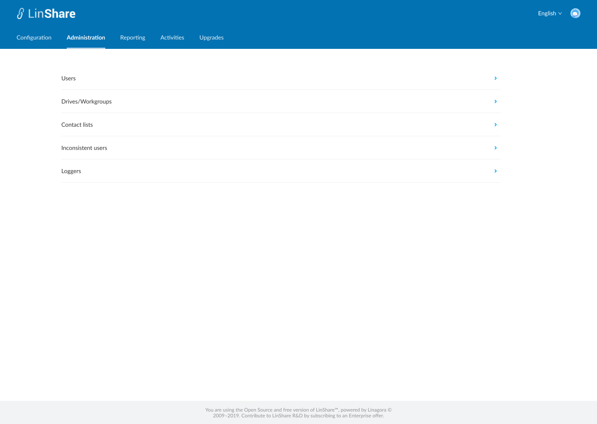
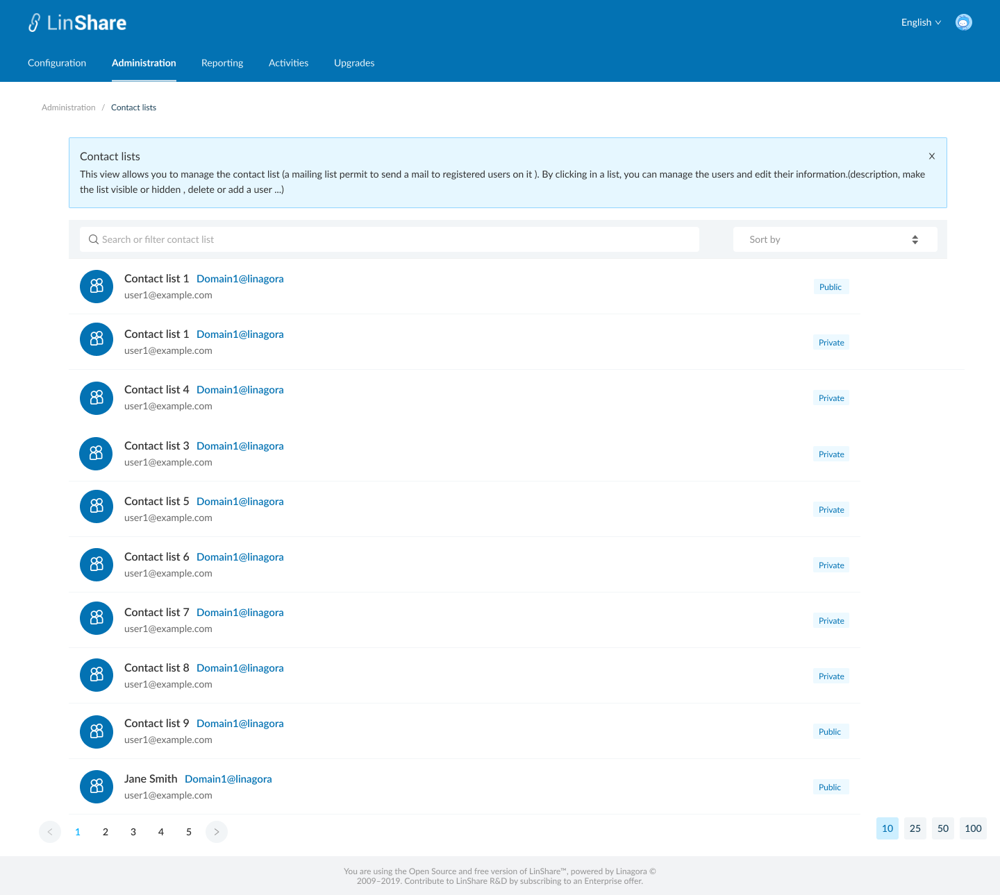

# Summary

* [Related EPIC](#related-epic)
* [Definition](#definition)
* [Screenshots](#screenshots)
* [Misc](#misc)

## Related EPIC

* [New admin portal](./README.md)

## Definition

#### Preconditions

- Given that i am supper admin or an nested admin

#### Description

- After log-in Admin Portal successfully, i go to Administration tab
- On Administration tab, i can see the list of links to screens: Users, Drives/workgroups, Contact lists, Inconsistent users, loggers 
- I click on Contact lists, the screen My contact lists will be opened. 
- In new view I can and see the following information:
     - A Search bar 
     - A Sort field
     - A list of all contact list

#### Postconditions

- If i am super admin, i can see contact lists of all  domains.
- If i am nested admin, i can only see contact lists of my domains. 
- When i click on icon tooltip next to screen name, i can see an colapsible text :"This view allows you to manage the contact list (a mailing list permit to send a mail to registered users on it ). By clicking in a list, you can manage the users and edit their information.(description, make the list visible or hidden , delete or add a user ...)".
- Each contact list is is displayed as an item with name, it's owner and a lable : Private of Public 
- The default number of displayed items is 25, i can change the number of iems at the bottom of page.
- When i click on a contact list item, the Manage Contact list screen will be opened. 

[Back to Summary](#summary)

## UI Design

#### Mockups

#### Final design

[Back to Summary](#summary)
## Misc

[Back to Summary](#summary)
