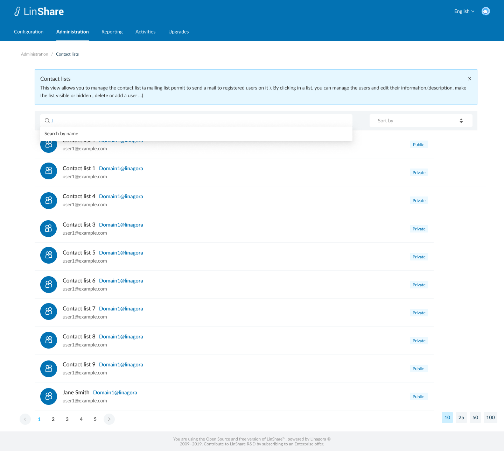
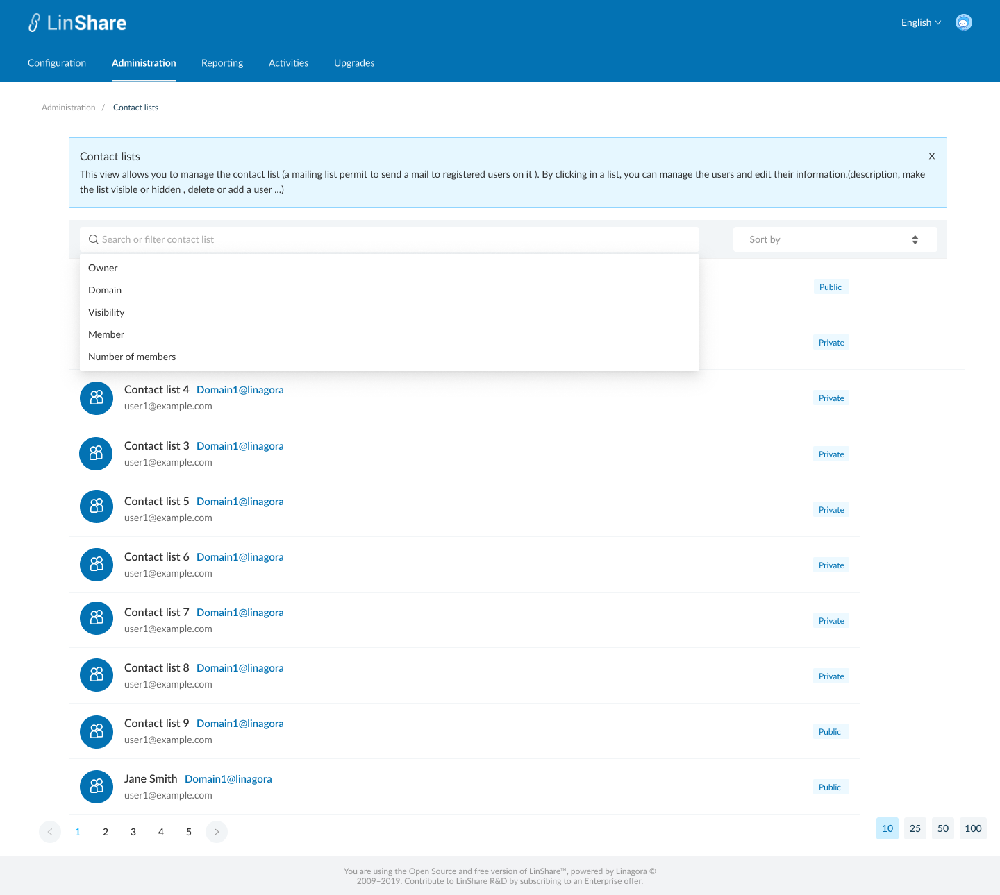
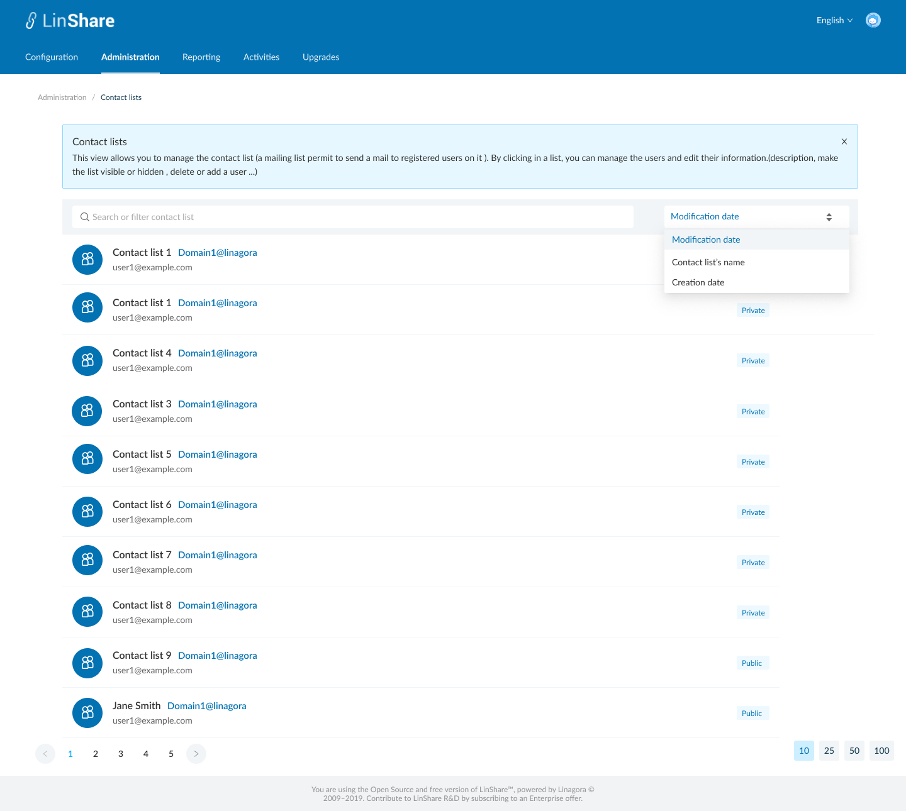

# Summary

* [Related EPIC](#related-epic)
* [Definition](#definition)
* [Screenshots](#screenshots)
* [Misc](#misc)

## Related EPIC

* [New Admin portal](./README.md)

## Definition

#### Preconditions

- Given that i am Super admin or nested admin of new Admmin Portal

#### Description

- After log-in succesfully to  Admin Portal, i go to Administration screen
- On Administration tab, I click on Contact lits, the screen Contact lists will be opened.
- In new view I can see the list of all contact lists

**UC1.Search contact lists**
- I click on the search bar, there will be a drop-down list of search criteria including:
   - Owner (of the contact list):  When i select this search citeria, the search bar will display: Owner = "text input". When i start typing, i can see the suggestion list of Linshare user (internal and guest account) which have first name, last name or email contains text inputted. I can select user from the list. When i click Enter, the system will search contact lists that belong to selected user. 
   - Visibility: When i select this search criteria, the search bar will display Visibility = "Dropdown list". Options are: Public/Private.
   - Member: When i select this search citeria, the search bar will display: Member = "text input". When i start typing, i can see the suggestion list of Linshare user (internal and guest account) which have first name, last name or email contains text inputted. I can select member from the list. When i click Enter, the system will search contact lists that contain that selected user as a member
   - Number of members: When i select this search criteria, the search bar will display Number of Members = "Dropdown list". Options are: None/More than 0
   - Domain:  When i select this search criteria, the search bar will display Domain = "Dropdown list". If i am super admin, the list of options will contain all domains. If i am nested admin, the list of options contains only my domains. 
- When i start typing on search bar without select any search criteria from the dropdown list, the system will show default search criteria is contact list's name.

**UC2.Sort contact lists**
- On the Sort field, i can see Default sort criteria is Modification date 
- When i click on Sort field, there will be drop-down list containing sort criteria: Modification date, Creation date, Contact list's name 
- I can select sort criteria from the list and use the arrow up and down to change order of sorting.

#### Postconditions

- I can search contact lists by one of above criteria or combine them
- Each search criteria in the search bar is seperated by a delete icon. I can click this icon to delete the criteria
- After select one criteria in search bar, that option is hidden in the dropdown list of search criteria.
- For example:
     - I chose Member as a search criteria
     - I type some character and see the list of suggestion
     - I select one user (John Doe-user1@linshare.org) from the list
     - Now the search bar is: Member=John Doe
     - When i click on search bar, i can see the list of criteria is: Owner, Visibility, Number of members, Domain. 

[Back to Summary](#summary)

## UI Design

#### Mockups

#### Final design

[Back to Summary](#summary)
## Misc

[Back to Summary](#summary)
