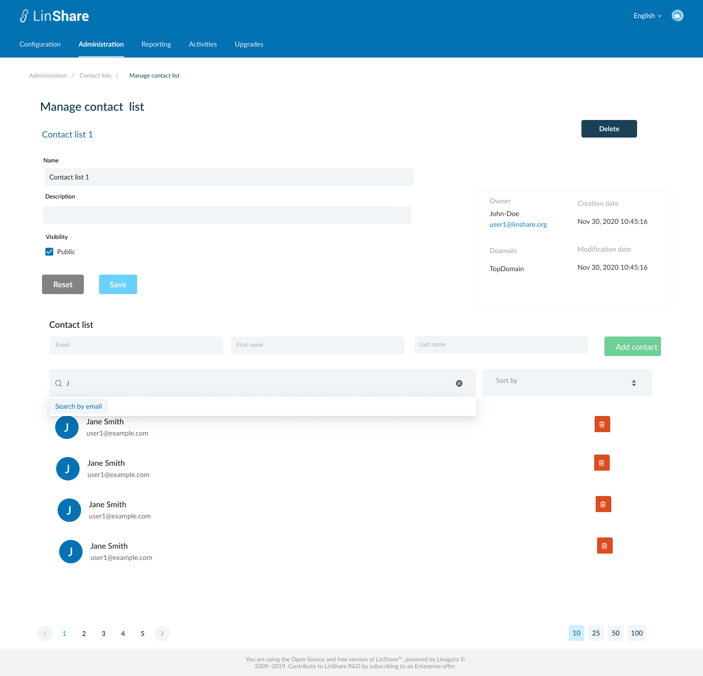
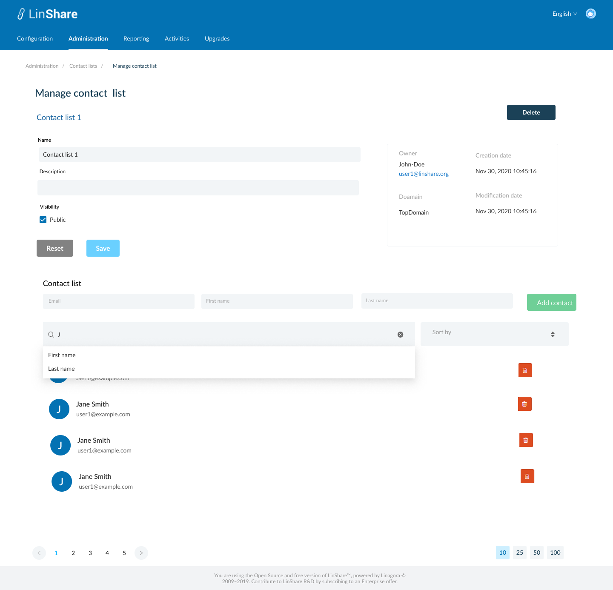
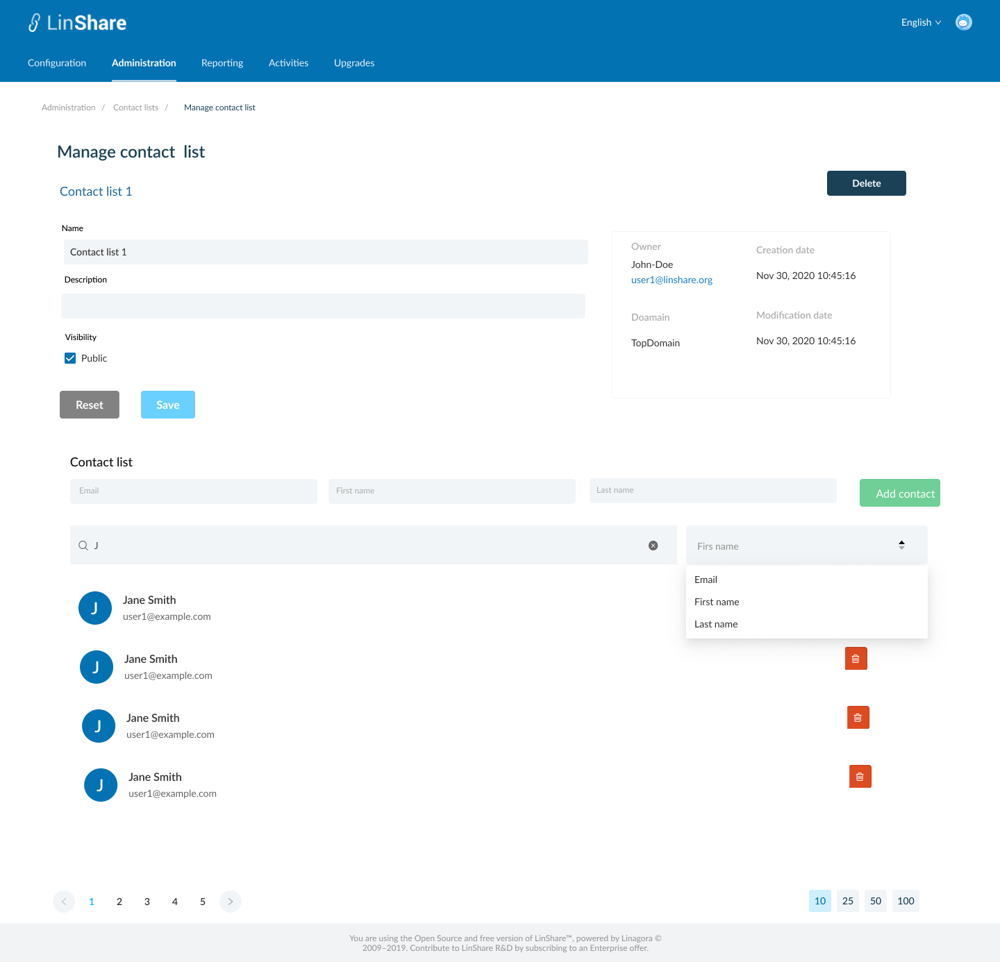

# Summary

* [Related EPIC](#related-epic)
* [Definition](#definition)
* [Screenshots](#screenshots)
* [Misc](#misc)

## Related EPIC

* [New admin portal](./README.md)

## Definition

### Preconditions

- Given that i am super-admin/nested admin in Linshare 
- I logged-in to Amin portal successfully

### Description

**UC1.View/Edit/Delete Contact list**
- After log-in Admin Portal successfully, i go to Administration tab
- On Administration tab, i can see the list that links to corresponding screens: Users, Drives/workgroups, Contact lists, Inconsistent users, loggers 
- I click on My Contact lists, the screen My Contact litsts will be opened. 
- I click on a Contact list, the screen Manage Contact list is displayed.
- On the screen, i can see below editabe informations:
   - Contact list's name: A requred field  
   - Description: An optional field 
   - Visibility: A checkbox, i can switch between Private and Public. If the contact list is private, other users cannot search/use this contact list. If it is public, other users can search/use the contact list.
   - When i click button Save, the system will validate if any mandatory field is blank, it will be highlight and an error message:"[field name] cannot be blank". Otherwise the updates are saved and there will be a successful notification.
   - When i click button Reset, all the updated field wil be reset to the before values. 
- On the right of screen  i can see uneditable fields including: 
      - Owner : Name -email of the contact list's owner. 
      - Creation date
      - Modification date 
      - Domain 
- "Delete" button:
      - When i click on this button, there will be a confirmation message.
      - When i choose Yes to confirm, the Contact list  will be removed.  
      - I will see a toast notification and back to the My contact lists screen. 
- The action Delete and Update  will be recorded in history log in both Admin portal and Contact list Owner's LinShare account 

**UC2.Manage member list of a contact list**
- Add member:
   - I can see three fields: Email(mandatory), Firstname(optional), Last name (optional)
   - When i typing in Email, the suggestion list of users will be displayed. I can choose one user from the list, and First name and Last name will be autofilled.
   - I can also add external user in contact list
   - Then i click button Add, if the email is not blank, the new contact will be added to the list below. If the Email is blank, it will be highted and there will be an error message. 
- View/Delete member list :
   - Each contact will be displayed innone row with informations: Email - First naem -Last name and a Delete icon. 
   - When i click on icon Delete, there will be an confirmation message
   - If i choose Yes, the deletion is executed and that contact will be removed from the list. 
- The actions Delete contact and Add contact will be recoreded in history log in both Admin portal and Contact list Owner's LinShare account 
- Search members:
   - When click on Search bar, i can see a drop-down list of search criteria: First name, Last name 
   - If i select First name as Search criteria,  the search bar will display: First name = "text input". When i type some text and click Enter, the system will search members with first name contains text inputted, in this contact list
   - If i select Last name as Search citeria, the search bar will display: Last name = "text input". I click Enter, When i type some text and click enter, the system will search members which have last name contains text inputted, in this contact list
   - If i do not select Search criteria and typing text in Search bar, the system will show default search criteria is member's Email. 
   - I can search contact lists by one of above criteria or combine them. 
   - Each search criteria in the search bar is seperated by a delete icon. I can click this icon to delete the criteria
   - After select one criteria in search bar, that option is hidden in the dropdown list of search criteria.
- Sort member: 
   - On the Sort field, i can see Default sort criteria is First name 
   - When i click on Sort field, there will be drop-down list containing sort criteria: Email. First name, Last name. 
   - I can select sort criteria from the list and use the arrow up and down to change order of sorting.

[Back to Summary](#summary)

## UI Design

### Mockups

### Final design

[Back to Summary](#summary)

## Misc

[Back to Summary](#summary)
