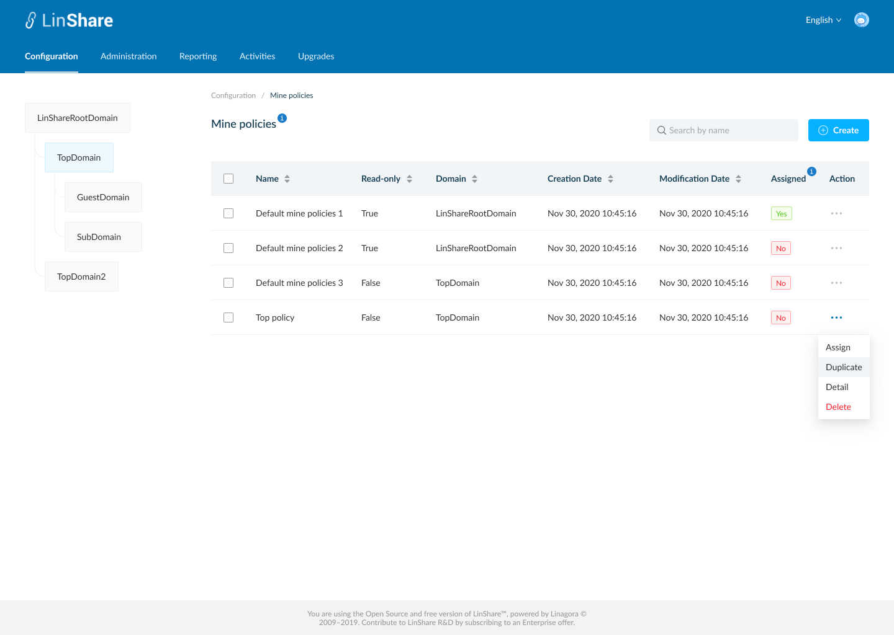
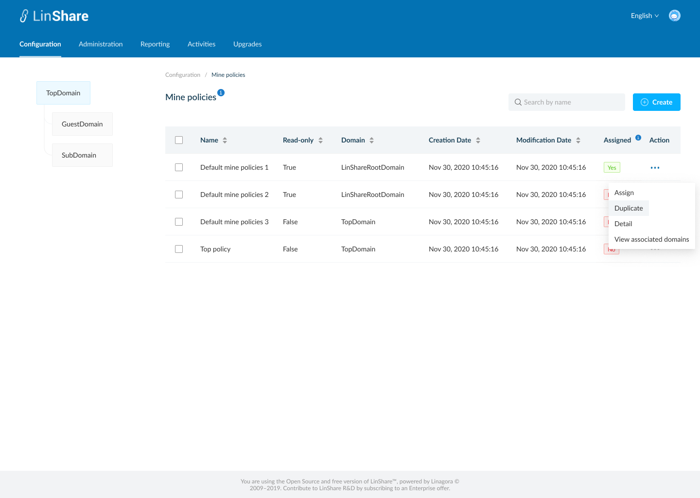
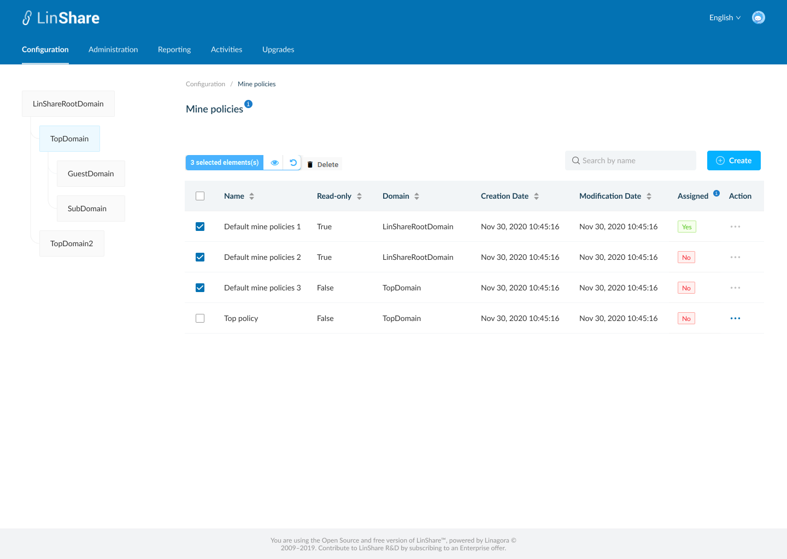
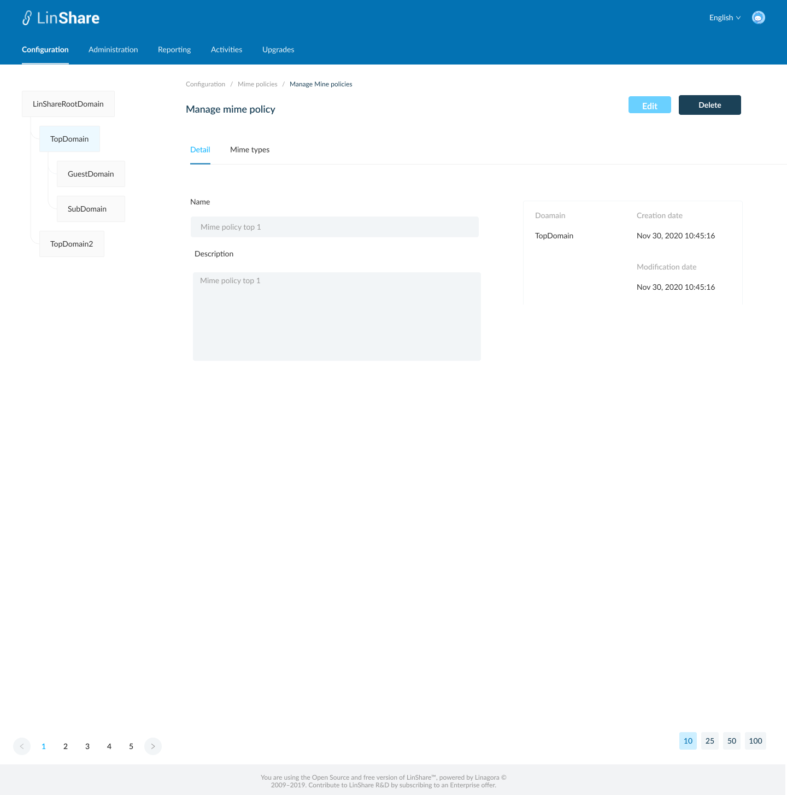
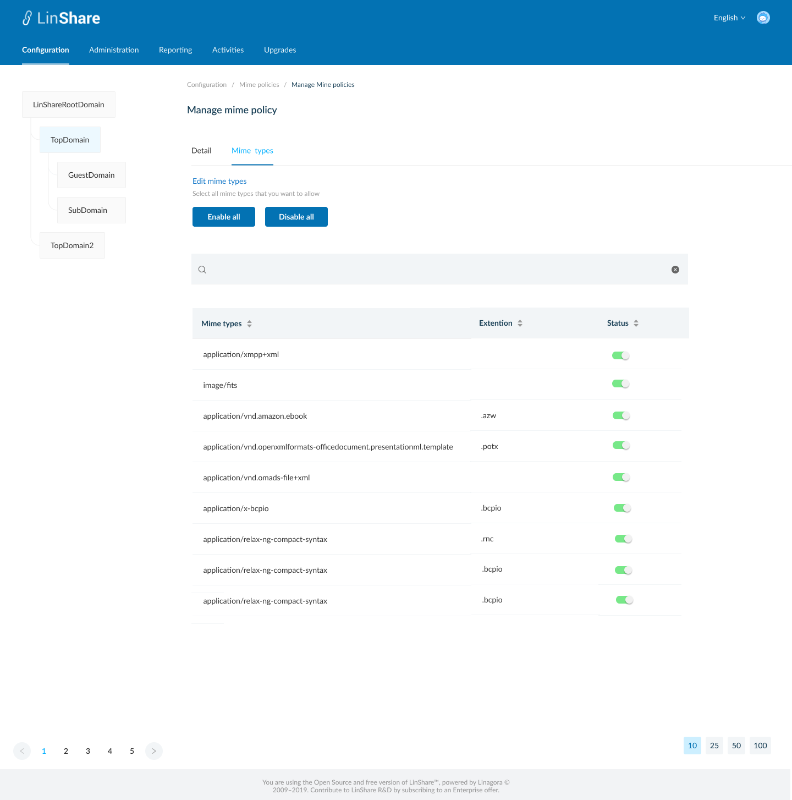
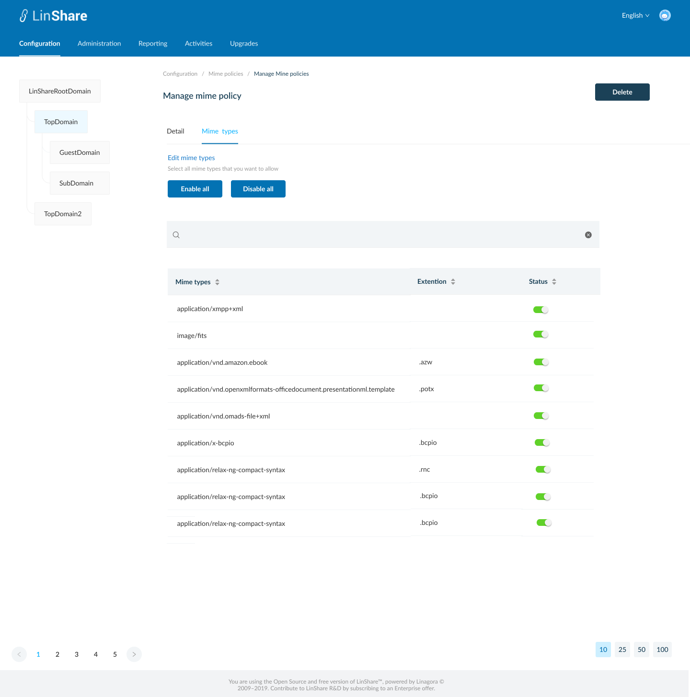
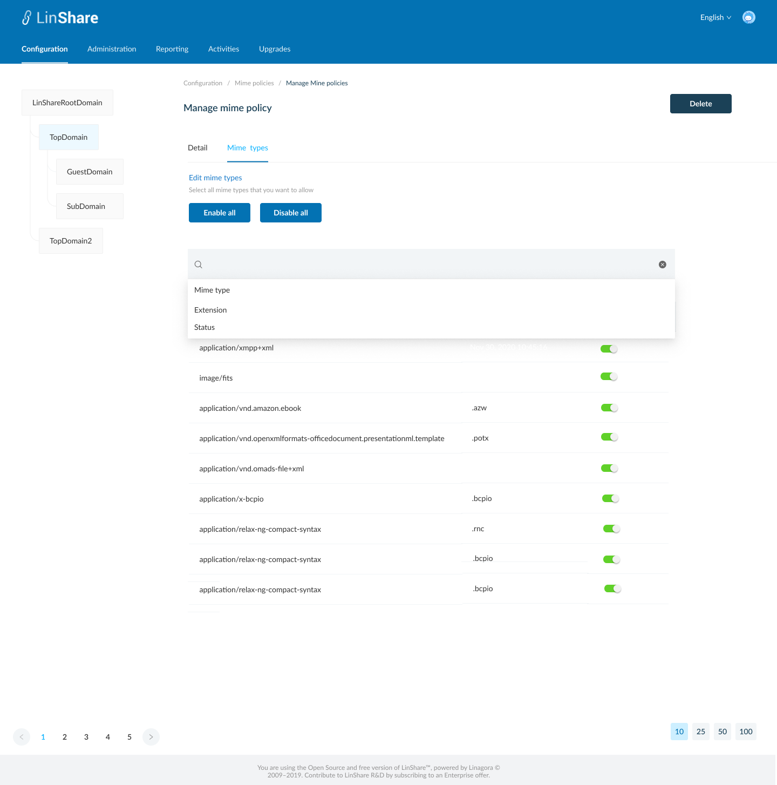
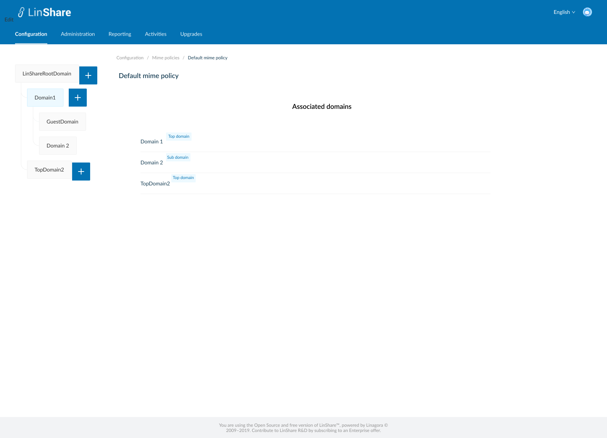
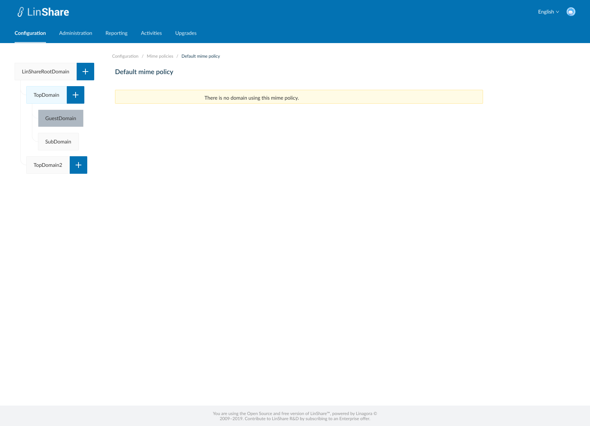

# Summary

* [Related EPIC](#related-epic)
* [Definition](#definition)
* [Screenshots](#screenshots)
* [Misc](#misc)

## Related EPIC

* [New admin portal](./README.md)

## Definition

#### Preconditions

- Given that i am super-admin/nested admin in LinShare 
- I logged-in to Admin portal successfully
- I select a domain in Domain tree and go to Configuration tab on top navigation bar
- I click on Mime policies, the screen Mine policies listing list will be opened.
- If i am selecting root domain in domain tree, i can see the list of mime policies that i created. They can be used for any lower-level domains.
- If i am selecting a nested domain in the domain tree, i can see the list of mime policies that i created and the mime policies from higher level domain. 

#### Description

**UC1. Create an mime policy**
- On Mime policies listing screen, i can click on create button 
- The screen Create mime policy will be displayed.
- I can see 2 tabs: Detail and Mime types
- On Detail tab i need to input fields:
   - Name: a text field and mandatory
   - Description: a text field and optional
- The non-editable fields incude:
   - Domain
   - Creation date
   - Modification date
- On the Second tab, I can see the list of all mime types in the table below
   - On the table i can see the columns: 
      - Mime types: Name of the mime type
      - Extention: the extention of the mime type
      - Status: a toggle button to epresent the state of the current row.
- By default, all the mime types on the table will be selected. 
- I can click on the button Enable all or disable all. When i hover the buttons, there will be a message: "This action will update the whole list of mime types on the server".
- Or i can go to enable/disable every mime type with the checkbox on each row
- I can click on Search bar to search by mime type' name or extentions, or status (enable or disable) ,the result will be displayed in the table below.
- The default Search is extention.  
- I can sort by each column: Mime type, Extention, Status
- The default Sort is Mime type
- When i click button Save, the system will validate if field "Name" is blank, it will be highlighted in red and a message:"[field name] cannot be blank"
- If there is no error, the new mime policy is created and there will be a successful notification, 
- Ii am redirected to the Screen mime policy listing and the new created mime policy is displayed in the table
- If i click button Cancel, i am navigated to  Screen mime policy listing

**UC2. Edit mime ploicy**.
- If i am super-admin, i can edit all mime policies
- If i am nested admin, i can only edit the mime policies created by me and my lower-level domain
- There are 2 ways to access Edit mime policy screen:
   - In the Mime policy listing screen, i click on three dot-button of a Mime policy and select option Detail from the drop-down list
   - Or i can click an the  mime policy row on the mime policy listing table. 
- By default, the Mime policy detail screen will be in View mode
- If i have permission to Edit, there will be button Edit, i click on this button, the Edit mode will be enabled
- On the mime policy screen, i can edit all fields and select/unselect mime types then click button Save.
- The system will validate if field "Name" is blank, it will be highlighted in red and a message:"[field name] cannot be blank"
- If there is no error, the updates will be saved and there will be a successful toast message.
- If i click button Reset, all the updates will be reset to the before values.

**UC3. View mime policy**
- If i am nested admin, On Listing mime policies screen,  when i click on three-dot button of a mime policy from higher level domain,
I can see the option "Detail"
- When i click on this button, the screen mime policy detail will be displayed in mode "view". 
- I can not update any field, and there is no button Delete, Save, Reset, Edit  
- I can click on Mime policies in Breadcrumb to navigate back to Mime policies listing screen. 

**UC4. Duplicate a Mime policy**

- On the Mime policy listing screen, i click on thee-dot button of a Mime policy and select option Duplicate from the drop-down list 
- The screen Create Mime policy will be opened.
- Except the field Name is blank, other fields will have the same value as the Mime policy that i selected to duplicate
- I input the field Name, and can edit other fields
- When i click button Save, the system will validate as UC 1, create a new mime policy. 

**UC5. Delete an Mime policy**
- If i am nested admin I can only delete mime policies in my domain and my nested domain. I cannot delete mime policies from higher-domain
- If i am super-admin, i can delete every mime policies. 
- There is no Delete button for Default Mime pilicy
- There are 2 ways to delete a Mime policy:
   - In the  Mime policies listing screen, i click on three dot-button of an Mime policy and select option Delete from the drop-down list
   - Or i can click an Mime policy row on the listing table to go to Mime policy  detail screen. On this screen i can see the button Delete.
- When i click on button Delete:
   - If the Mime policy is not associated with any domain, there will be an confirmation popup: "You are about to delete this Mime policy , this procedure is irreversible. Do you want to proceed?" and Yes/No button
      - I choose Yes to confirm, the Mime policy will be deleted.
      - System will prompt a deletion confirmation toast.
   - If the Mime policy is associated with any domain, the system will display message: "This Mime policy is associated with at least one domain. You cannot delete."

**UC5. Delete multiple Mime policies**

- On Mime policies listing screen, i can select multiple Mime policies on the list by tick the checkbox of each item
- There will be a top bar that indicates number of selected Mime policies, an isolation icon, an Undo icon and a Delete icon. 
- When i click on Isolation icon, the screen only shows selected items 
- When i click on Undo icon, all the selected items are unselected 
- If i do not have permission to delete any of selected mime policies, the button Delete will be disabled. 
- When i click on button Delete:
   - If any of selected Mime policy is not associated with any domain, there will be an confirmation popup: "You are about to delete [number of selected items] Mime policies, this procedure is irreversible. Do you want to proceed?" and Yes/No button 
      - I choose Yes to confirm, the selected Mime policy will be deleted.
      - System will prompt a deletion confirmation toast.
   - If any of selected Mime policies  is associated with any domain, the system will display message: " One of selected Mime policies is associated with at least one domain. You cannot delete."

**UC7. Assign a mime policy**

- On Mime policies  listing screen, i click on three-dot button on Action column.
- I select option "Assign"
- If the selected mime policy is already assigned for the selected domain in left domain tree, there will be a message:" This mime policy is already assigned for [selected domain name]
- If not, the system will display message:" You are about to assign this mime policy for [selected domain name]. Do you want to proceed?" and Yes/No button
- If i choose Yes, the mime policies is assigned for selected domain on domain tree. 
- Each domain can only be assigned with one mime policy a time 
- The value in column "Assigned" of the old mime policy will be changed from Yes => No and the new assigned mime policy will be changed to Yes. 
- When i hover the tooltip on column title "Assigned", there will be an explaination text: "If the mime policy is used for the current selected domain in domain tree, the value will be Yes".

**UC8. View associated domains**

- On mime policies listing screen, i click on three-dot button on Action column.
- I select option "View associated domains"
- A new screen will be opened
- I can see the list of domain's name which are using this mime policy.
- There will be a label next to each domain's name that indicating domain type of that domain
- When i click one domain on the list, i am navigated to Mime policies listing screen of that domain.
- If the mime policy is not associated with any domain, there will be a text message: " There is no domain using this mime policy. "
- If i am the nested admin, i can only view associates domains which are under my administration permission. 

#### Postconditions

[Back to Summary](#summary)

## UI Design

#### Mockups

#### Final design

[Back to Summary](#summary)
## Misc

[Back to Summary](#summary)
