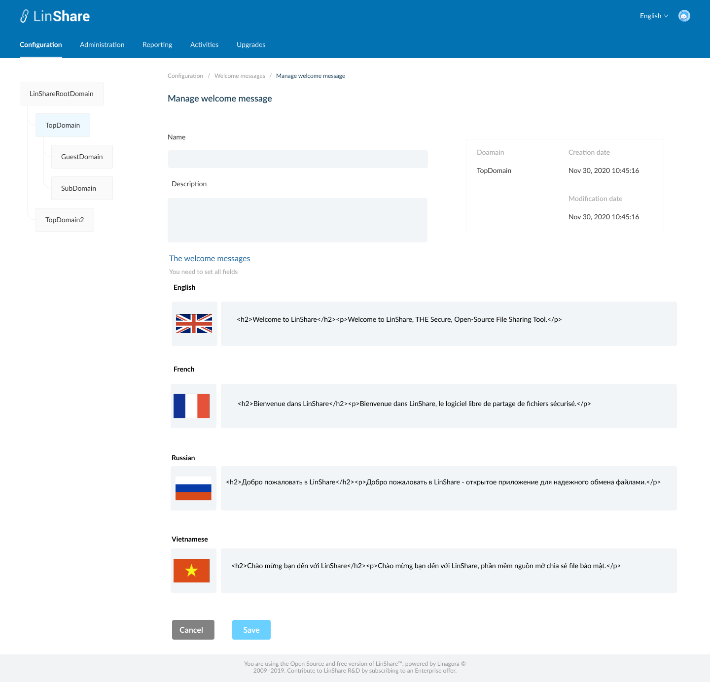
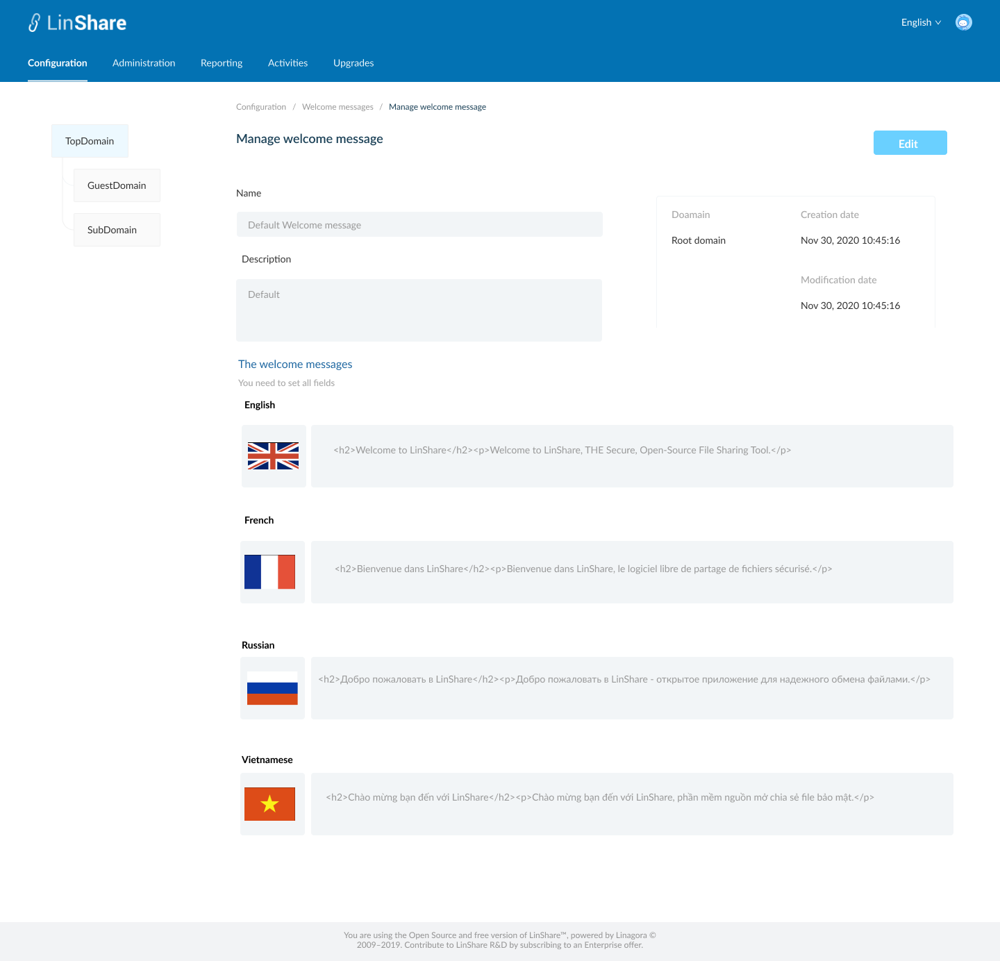
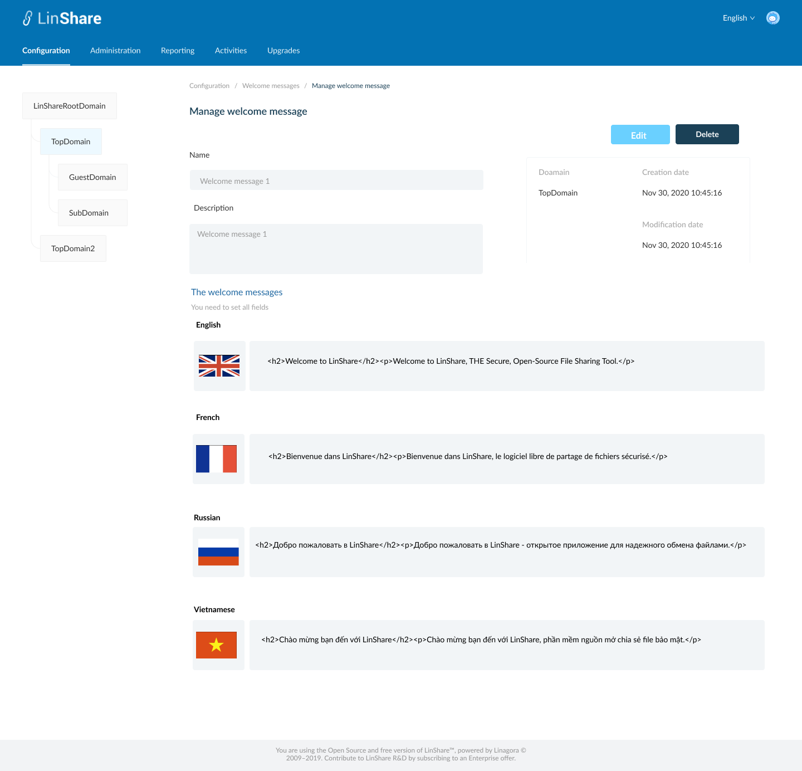
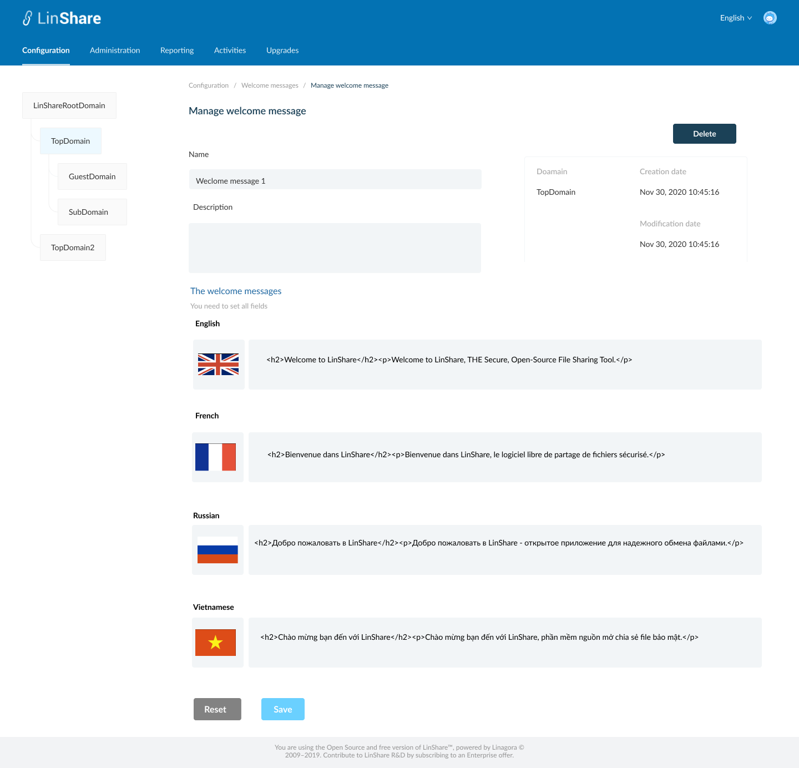
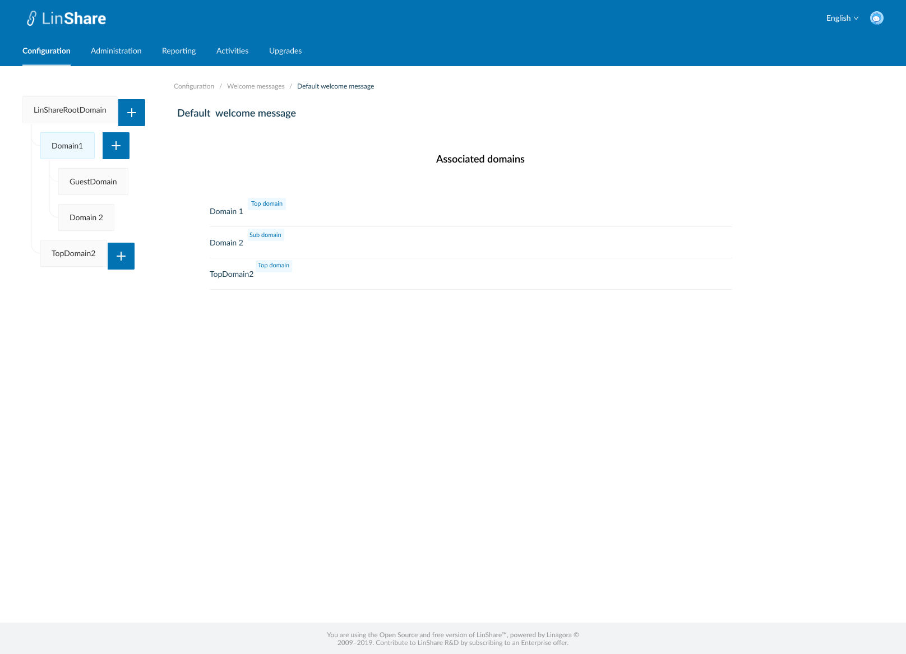
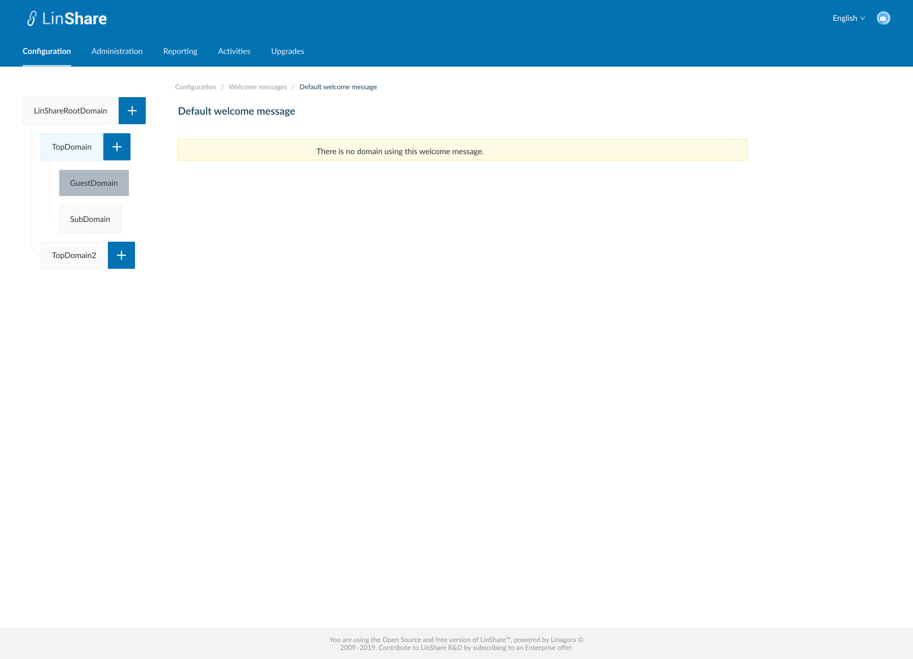

# Summary

* [Related EPIC](#related-epic)
* [Definition](#definition)
* [Screenshots](#screenshots)
* [Misc](#misc)

## Related EPIC

* [New admin portal](./README.md)

## Definition

#### Preconditions

- Given that i am super-admin/nested admin in LinShare 
- I logged-in to Admin portal successfully
- I select a domain in Domain tree and go to Configuration tab on top navigation bar
- I click on Welcome messages, the screen Welcome message list will be opened.
- If i am selecting root domain in domain tree, i can see the list of Welcome messages that i created. They can be used for any lower-level domains.
- If i am selecting a nested domain in the domain tree, i can see the list of Welcome messages that i created and the Welcome messages from higher level domain. 

#### Description

**UC1. Create a welcome message**
- On Welcome messages listing screen, i can click on create button 
- The screen Create Welcome message will be displayed.
- To create an Welcome message, i need to input fields:
   - Name: a text field and mandatory
   - Description: a text field and optional
- The non-editable fields incude:
   - Domain
   - Creation date
   -Modification date
- I can see 4 wecome message fields corresponding to 4 languages: English, French, Russia, Vietnamese
- I can fill in these field and click button Save.
- The system will validate if field "Name" is blank, it will be highlighted in red and a message:"[field name] cannot be blank"
- If there is no error, the new welcome message is created and there will be a successful notification, 
- I am redirected to the Screen welcome messages listing and the new created welcome message is displayed in the table
- If i click button Cancel, i am navigated to  Screen welcome message listing

**UC2. Edit welcome message**.
- If i am super-admin, i can edit all welcome message
- If i am nested admin, i can only edit the welcome messages created by me and my lower-level domain.
- There are 2 ways to access welcome message policy screen:
   - In the welcome message listing screen, i click on three dot-button of a welcome message and select option Edit from the drop-down list
   - Or i can click on the welcome message row in the welcome message listing table. 
- By default, the Welcome message detail screen will be in View mode 
- If i have permission to Edit, there will be button Edit, i click on this button, the Edit mode will be enabled
- I can edit all fields Name, Description and Message content then click button Save.
- The system will validate if field "Name" is blank, it will be highlighted in red and a message:"[field name] cannot be blank"
- If there is no error, the updates will be saved and there will be a successful toast message.
- If i click button Reset, all the updates will be reset to the before values.

**UC3. View welcome message**
- If i am nested admin, On Listing welcome messages screen,  when i click on three-dot button of a welcome message from higher level domain,
I can see the option "View"
- When i click on this button, the screen welcome message detail will be displayed in mode "view" 
- I can not update any field, and there is no button Delete, Save, Reset as Edit screen 
- I can click on Welcome messages in Breadcrumb to navigate back to Welcome messages listing screen. 

**UC4. Duplicate a Welcome message**

- On the Welcome messages listing screen, i click on thee-dot button of a Welcome messages and select option Duplicate from the drop-down list 
- The screen Create Welcome message will be opened.
- Except the field Name is blank, other fields will have the same value as the Welcome message that i selected to duplicate
- I input the field Name, and can edit other fields
- When i click button Save, the system will validate as UC 1, create a new Welcome message. 

**UC5. Delete an Welcome message**
- If i am nested admin I can only delete Welcome messages in my domain and my nested domain. I cannot delete welcome messages from higher-domain
- If i am super-admin, i can delete every  Welcome message. 
- There is no Delete button for Default welcome message.
- There are 2 ways to delete a Welcome message:
   - In the  Welcome messages listing screen, i click on three dot-button of an  Welcome message and select option Delete from the drop-down list
   - Or i can click an  Welcome message row on the listing table to go to  Welcome message detail screen. On this screen i can see the button Delete.
- When i click on button Delete:
   - If the  Welcome message is not associated with any domain, there will be an confirmation popup: "You are about to delete this  Welcome message , this procedure is irreversible. Do you want to proceed?" and Yes/No button
      - I choose Yes to confirm, the  Welcome message will be deleted.
      - System will prompt a deletion confirmation toast.
   - If the  Welcome message is associated with any domain, the system will display message: "This  Welcome message is associated with at least one domain. You cannot delete."

**UC6. Delete multiple Welcome message**

- On  Welcome message listing screen, i can select multiple Welcome messages on the list by tick the checkbox of each item
- There will be a top bar that indicates number of selected  Welcome message, an isolation icon, an Undo icon and a Delete icon. 
- When i click on Isolation icon, the screen only shows selected items 
- When i click on Undo icon, all the selected items are unselected 
- If i do not have permission to delete any of selected  Welcome message, the button Delete will be disabled. 
- When i click on button Delete:
   - If any of selected  Welcome message is not associated with any domain, there will be an confirmation popup: "You are about to delete [number of selected items]  Welcome messages, this procedure is irreversible. Do you want to proceed?" and Yes/No button 
      - I choose Yes to confirm, the selected  Welcome messages will be deleted.
      - System will prompt a deletion confirmation toast.
   - If any of selected  Welcome messages  is associated with any domain, the system will display message: " One of selected  Welcome messages is associated with at least one domain. You cannot delete."

**UC7. Assign a Welcome message**

- On  Welcome messages listing screen, i click on three-dot button on Action column.
- I select option "Assign"
- If the selected Welcome message is already assigned for the selected domain in left domain tree, there will be a message:" This  Welcome message is already assigned for [selected domain name]
- If not, the system will display message:" You are about to assign this  Welcome message for [selected domain name]. Do you want to proceed?" and Yes/No button
- If i choose Yes, the  Welcome message is assigned for selected domain on domain tree. 
- Each domain can only be assigned with one  Welcome message a time 
- The value in column "Assigned" of the old  Welcome message will be changed from Yes => No and the new assigned Welcome message will be changed to Yes. 
- When i hover the tooltip on column title "Assigned", there will be an explaination text: "If the Welcome message is used for the current selected domain in domain tree, the value will be Yes".

**UC8. View associated domains**

- On welcome message listing screen, i click on three-dot button on Action column.
- I select option "View associated domains"
- A new screen will be opened
- I can see the list of domain's name which are using this welcome message.
- There will be a label next to each domain's name that indicating domain type of that domain
- When i click one domain on the list, i am navigated to Welcome messages listing screen of that domain.
- If the welcome message is not associated with any domain, there will be a text message: " There is no domain using this welcome message. "
- If i am the nested admin, i can only view associates domains which are under my administration permission. 

#### Postconditions

[Back to Summary](#summary)

## UI Design

#### Mockups

#### Final design

[Back to Summary](#summary)
## Misc

[Back to Summary](#summary)
