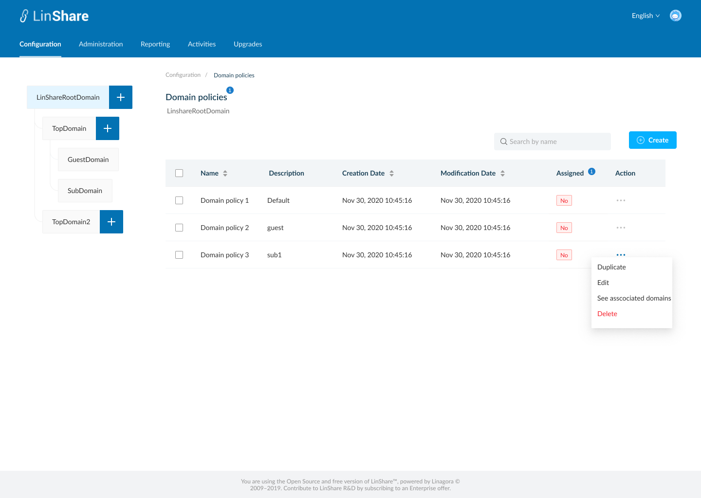
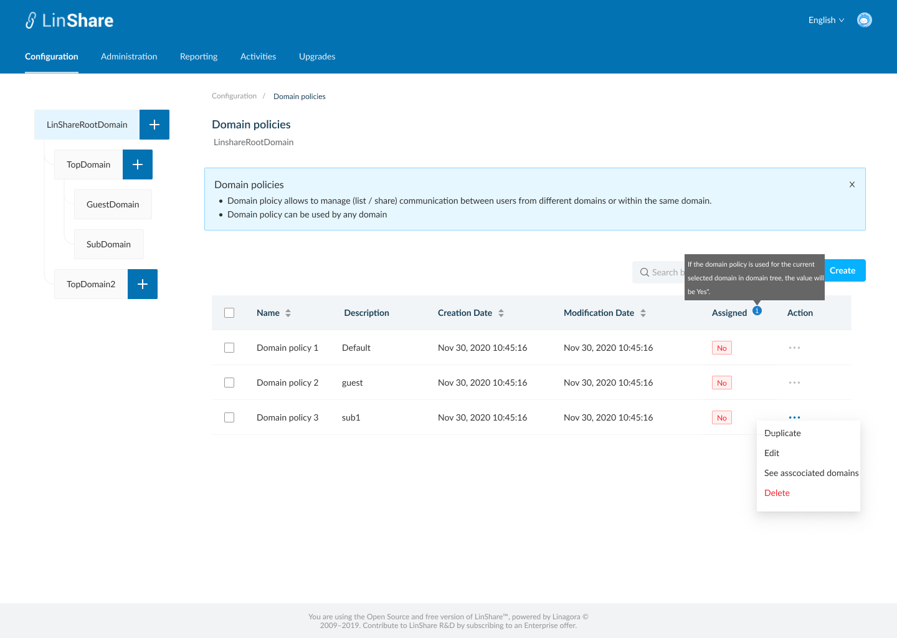
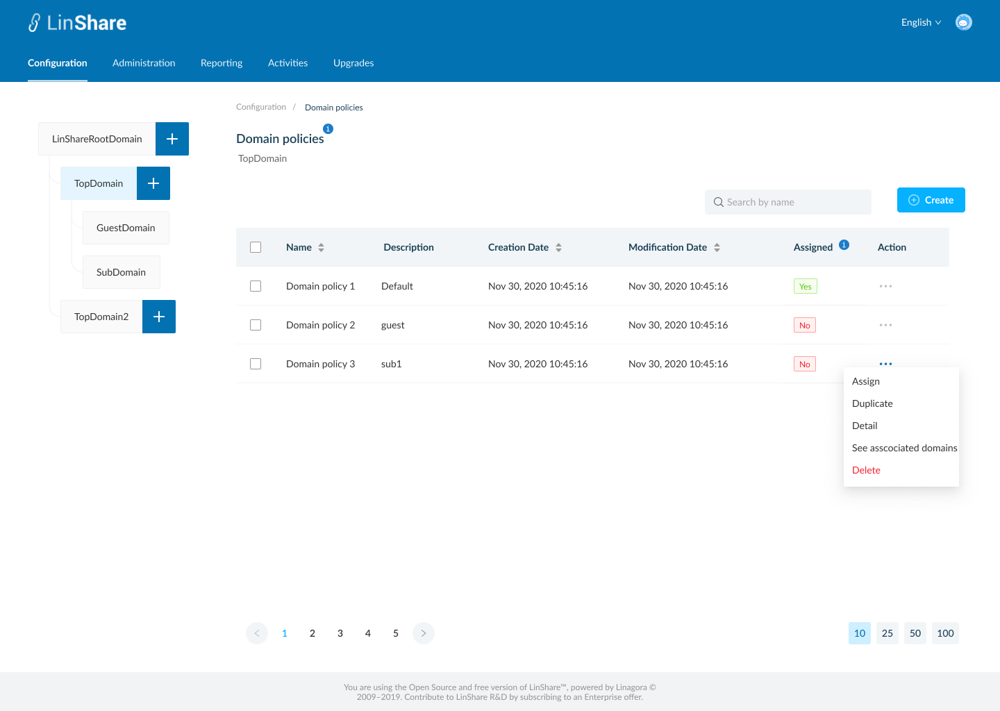

# Summary

* [Related EPIC](#related-epic)
* [Definition](#definition)
* [Screenshots](#screenshots)
* [Misc](#misc)

## Related EPIC

* [New admin portal](./README.md)

## Definition

#### Preconditions

* Given that i am super-admin in LinShare 
* I logged-in to Admin portal successfully

#### Description

- I select a domain in Domain tree and go to Configuration tab on top navigation bar
- I click on Domain policies, the screen Domain policies listing screen will be opened.

**UC1.Super-admin view the list of domain policies**
- I can see the list of domain policies that i created in the table 
- I can see a tooltip icon on screen name, which i can click on and see the explaination text. 
- The domain policies list includes columns:
   - Name
   - Description
   - Creation date
   - Modification date
   - Assigned: Yes/No. This column indicates which domain policy is used for the current selected domain in the domain tree. Each domain can use only 1 domain policy a time 
   - Action: When i click on three-dot button, i can see actions: 
      - If the selected domain is root domain, the actions are: Duplicate, Edit, Delete, See associated domain
      - If the selected domain is a nested domain (top domain/Sub domain/Guest domain), the actions are: Assign, Duplicate, Edit, Delete, See associated domain.
      - If the domain policy is currently used for selected domain in domain tree, the option "Assign" is disabled. 

#### Postconditions

- I can sort by columns: Name, Creation date, Modification date
- Default sort is last modification date
- The domain policies list is paginated and the default number of displayed items is 25, I can change this number at the bottom of page
- I can see a search bar and typing in, the system will search by Domain policy's name and display corresponding result in the table below
- When i click on column name "Assign",there will be a help text message. 
- When i click button "Create", the screen Create new domain policy screen will be opened.
- If i log-in as nested admin, i can not see the Domain policies menu in Configuration screen. 

[Back to Summary](#summary)

## UI Design

#### Mockups

#### Final design

[Back to Summary](#summary)
## Misc

[Back to Summary](#summary)

