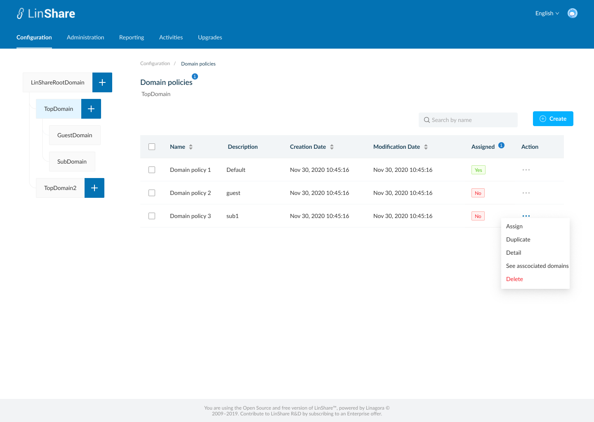
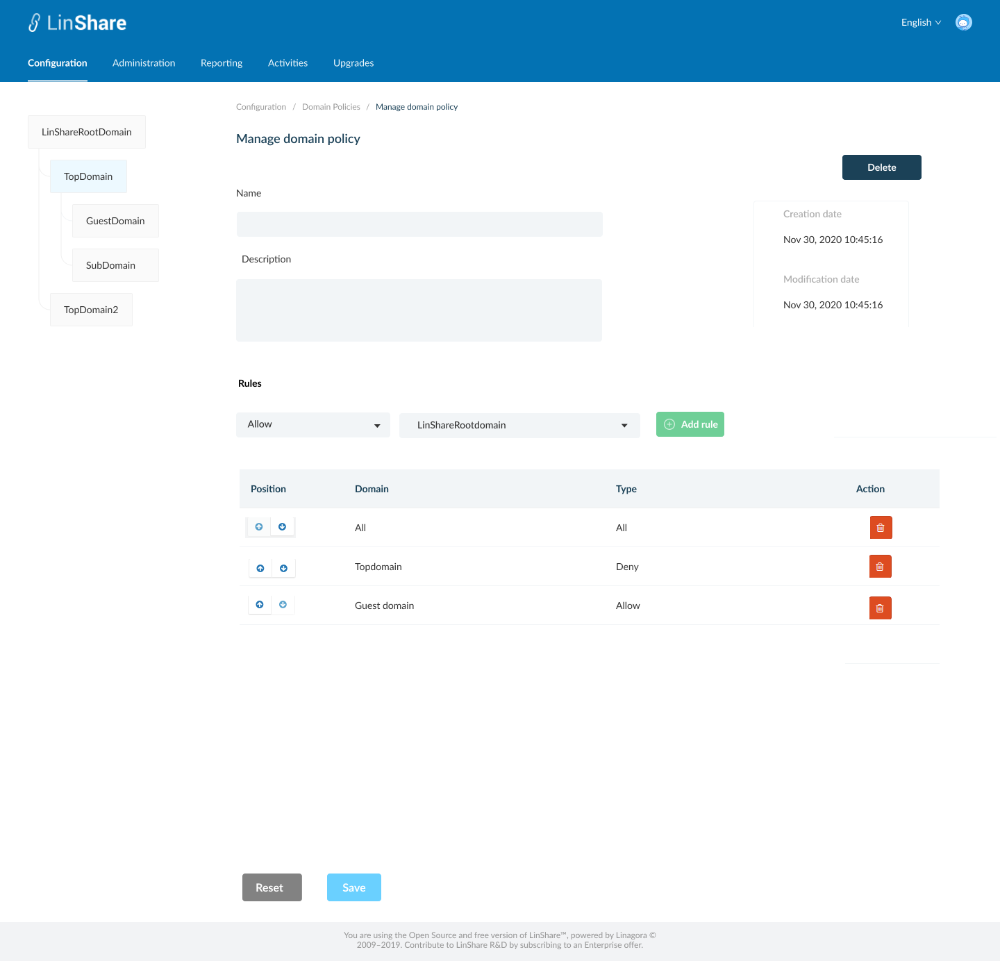
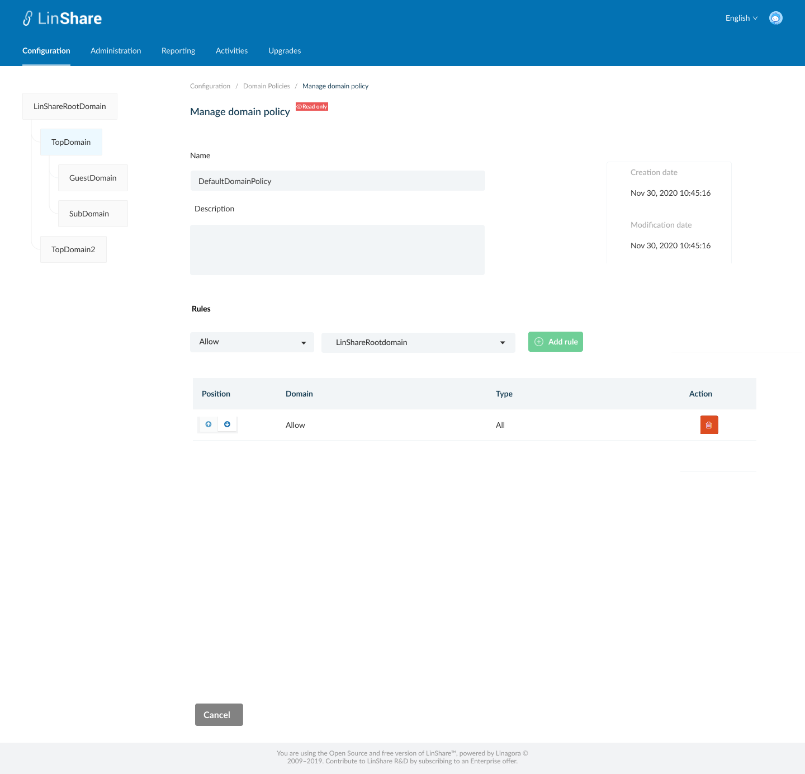
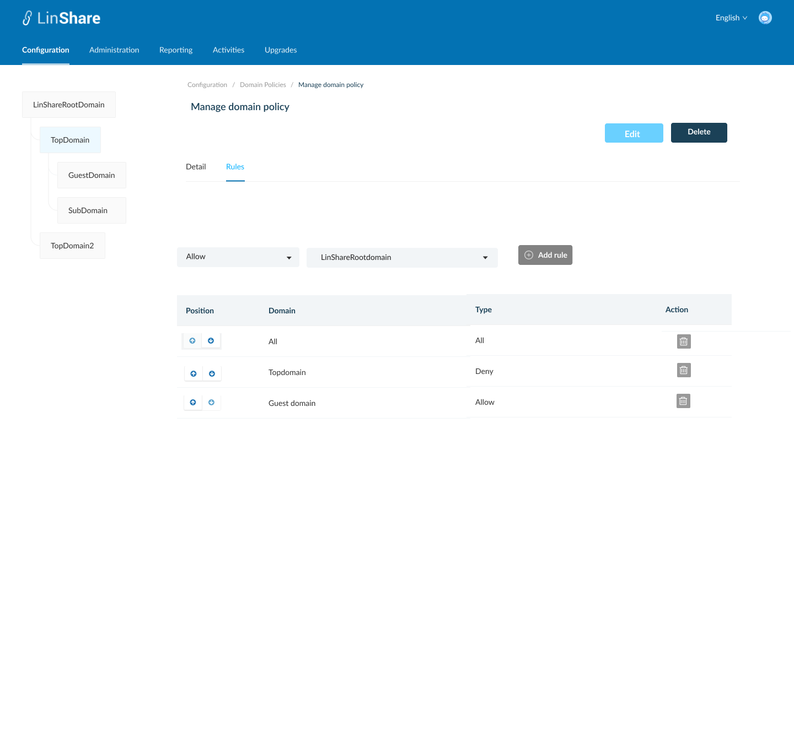
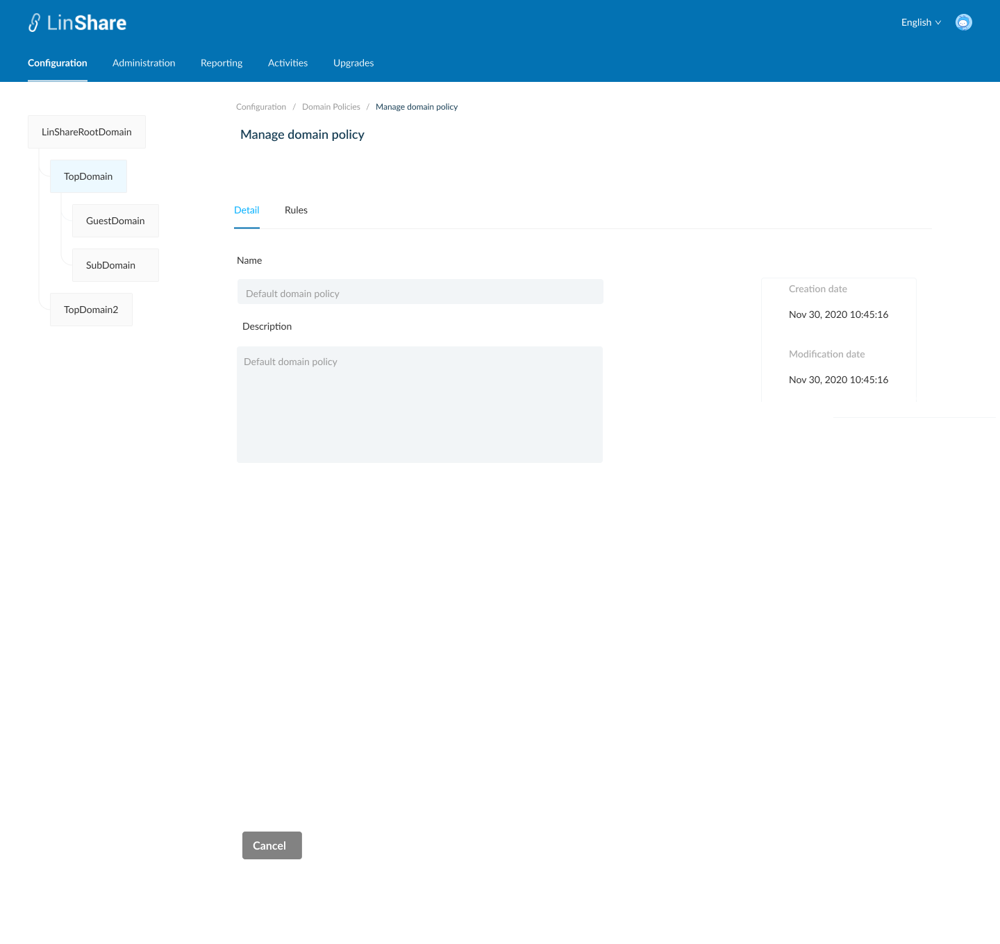
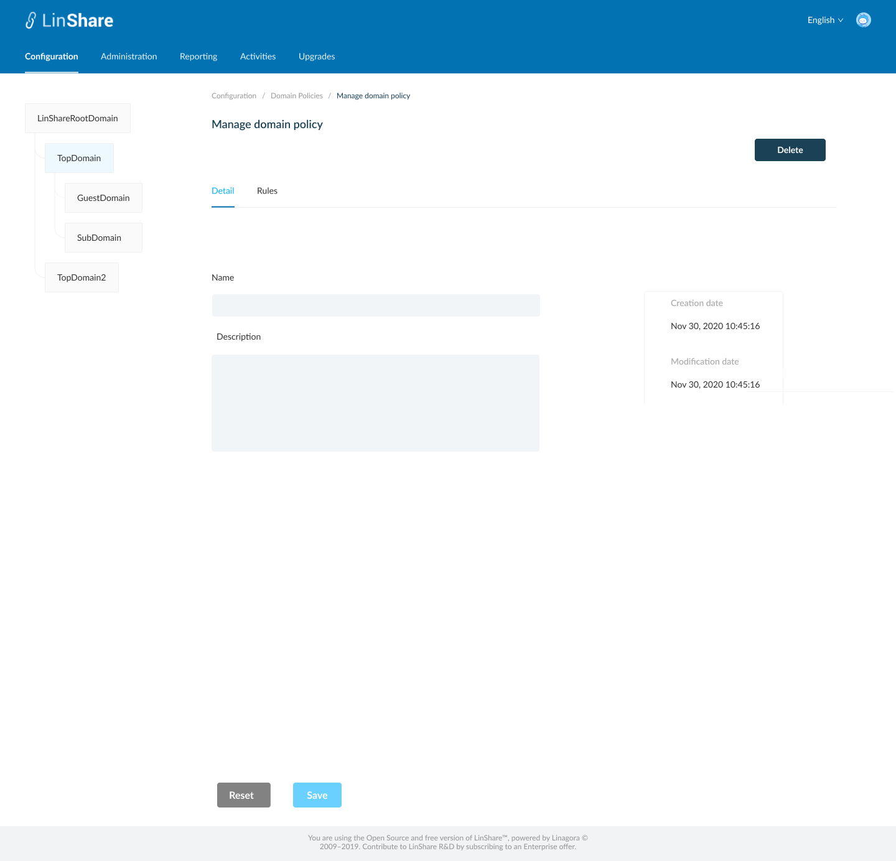
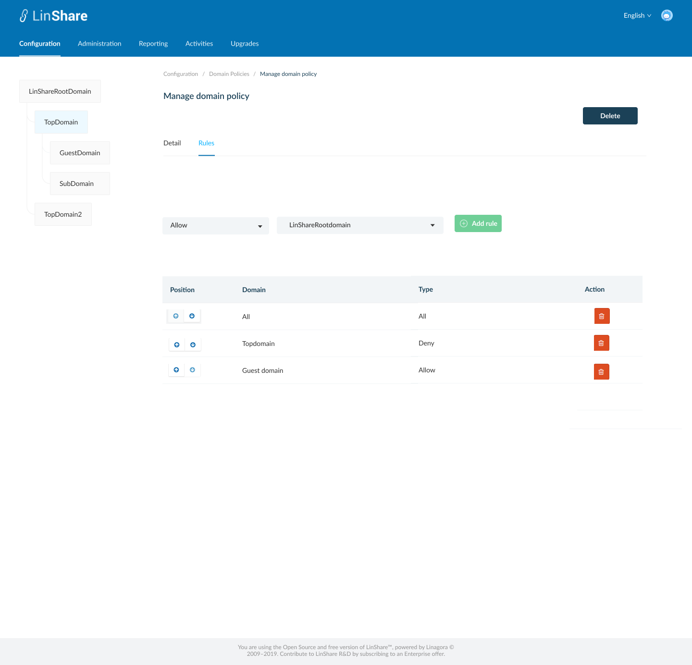

# Summary

* [Related EPIC](#related-epic)
* [Definition](#definition)
* [Screenshots](#screenshots)
* [Misc](#misc)

## Related EPIC

* [New admin portal](./README.md)

## Definition

#### Preconditions

- Given that i am super-admin in LinShare 
- I logged-in to Admin portal successfully
- I click on Domain policies, the screen Domain policy list will be opened.

#### Description

**UC1. Create a domain policy**
- On Domain policies listing screen, i can click on create button 
- The screen Create Domain ploicy will be displayed.
- I can see 2 tabs: Detail and Rules
- In Detail tab, i need to input fields:
   - Name: a text field and mandatory
   - Description: a text field and optional
- Then i can Add rules in second tab:
   - I can select type and domain from the drop-down list and click button Add
      - Type: Allow/Deny
      - Domain: List of current domains and an option "All"
- The new rule will be added to the Rule table below 
- Rule table includes:
   - Position: there are 2 arrows up and down. I can click on these arrows to change the position of the rule to the higher (or lower) than the row above (or below)
   - Domain: The domain i selected when adding this rule
   - Type: The type i selected when adding rule. 
   - Action: Delete: When i click on this button, there will be an confirmation message. If i choose Yes, the rule will be removed from the table. 
- After adding rules, i click button Save 
- The system will validate if field "Name" is blank, it will be highlighted in red and a message:"[field name] cannot be blank" 
- If there is no error, the new domain policy is created and there will be a successful notification, 
- I am redirected to the Screen Domain policies listing 
- If i click button Cancel, i am navigated to Screen Domain policies listing

**UC2. Edit domain policy**.
- As super-admin, i can edit all domain policies, except for the Default Domain policy. 
- There are 2 ways to access domain policy screen:
   - In the domain policy listing screen, i click on three dot-button of a domain policy and select option Detail from the drop-down list
   - Or i can click on the domain policy row in the domain policies listing table. 
- By default, the Domain policy detail screen will be in View mode 
- If the Domain policy is Default Domain policy, there is only button Cancel to navigate back to listing domain policies screen 
- If i have permission to Edit the domain policy, there will be button Edit, i click on this button, the Edit mode will be enabled 
- I can edit all fields Name, Description and Add/remove rules then click button Save.
- The system will validate if field "Name" is blank, it will be highlighted in red and a message:"[field name] cannot be blank"
- If there is no error, the updates will be saved and there will be a successful toast message.
- If i click button Reset, all the updates will be reset to the before values.

**UC3. Duplicate a domain policy**

- On the domain policies listing screen, i click on thee-dot button of a Domain policy and select option Duplicate from the drop-down list 
- The screen Create Domain policy will be opened.
- Except the field Name is blank, other fields will have the same value as the Domain policy that i selected to duplicate
- I input the field Name, and can edit other fields
- When i click button Save, the system will validate as UC 1, create a new Domain policy. 

**UC4. Delete a Domain policy**

- As super-admin, I have delete permission to delete every Domain policy except for the Default domain policy by system. There is no Delete button for this Domain policy.
- There are 2 ways to delete a Domain policy :
   - In the Domain policy listing screen, i click on three dot-button of an Domain policy and select option Delete from the drop-down list
   - Or i can click an Domain policy row on the listing table to go to  Domain policy  detail screen. On this screen i can see the button Delete.
- When i click on button Delete:
   - If the Domain is not associated with any domain, there will be an confirmation popup: "You are about to delete this Domain policy , this procedure is irreversible. Do you want to proceed?" and Yes/No button
      - I choose Yes to confirm, the domain policy will be removed..
      - System will prompt a deletion confirmation toast.
   - If the Domain policy is associated with any domain, the system will display message: "This  Domain policy is associated with at least one domain. You cannot delete." and a link "See associated domain". If i click on this link. i am navigated to the Screen Associated domain of this domain policy.

**UC5. Delete multiple domain policies**

- On Domain policies listing screen, i can select multiple domain policies on the list by tick the checkbox of each item
- There will be a top bar that indicates number of selected  Domain policies, an isolation icon, an Undo icon and a Delete icon. 
- When i click on Isolation icon, the screen only shows selected items 
- When i click on Undo icon, all the selected items are unselected 
- If i do not have permission to delete any of selected domain policies, the button Delete will be disabled. 
- When i click on button Delete:
   - If any of selected Domain policy is not associated with any domain, there will be an confirmation popup: "You are about to delete [number of selected items]  Domain policies, this procedure is irreversible. Do you want to proceed?" and Yes/No button 
      - I choose Yes to confirm, the selected  domain policies will be deleted.
      - System will prompt a deletion confirmation toast.
   - If any of selected  Domain policy is associated with one domain, the system will display message: " One of selected domain policies is associated with at least one domain. You cannot delete."

**UC6. Assign a Domain policy**

- On domain policy listing screen, i click on three-dot button on Action column.
- I select option "Assign"
- If the selected domain policy is already assigned for the selected domain in left domain tree, there will be a message:" This Domain policy is already assigned for [selected domain name]
- If not, the system will display message:" You are about to assign this Domain policy for [selected domain name]. Do you want to proceed?" and Yes/No button
- If i choose Yes, the Domain policy is assigned for selected domain on domain tree. 
- Each domain policy can only be assigned for one Domain a time. 
- The value in column "Assigned" of the old Domain policy will be changed from Yes => No and the new assigned Domain policy will be changed to Yes. 
- When i hover the tooltip on column title "Assigned", there will be an explaination text: "If the Domain policy is used for the current selected domain in domain tree, the value will be Yes".
- I cannot assign a domain policy for Root domain: If i am selecting Root domain on Domain tree and click thee-dot button of a domain policy, the option assign will be hidden. 

**UC7. View associated domain**

- On Domain policies listing screen, i click on three-dot button on Action column.
- I select option "View associated domains"
- A new screen will be opened
- I can see the list of domain's name which are using the Domain policies.
- There will be a label next to each domain's name that indicating domain type of that domain
- When i click one domain on the list, i am navigated to Domain detail page of that domain.
- If the Domain policy is not associated with any domain, there will be a text message: " There is no domain using this Domain policy. "

#### Postconditions

[Back to Summary](#summary)

## UI Design

#### Mockups

#### Final design

[Back to Summary](#summary)
## Misc

[Back to Summary](#summary)
