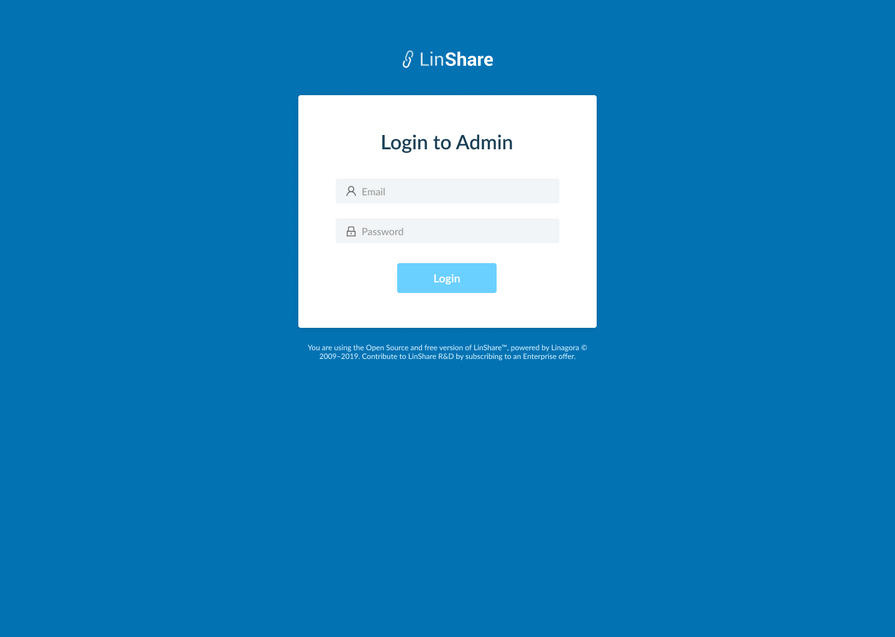
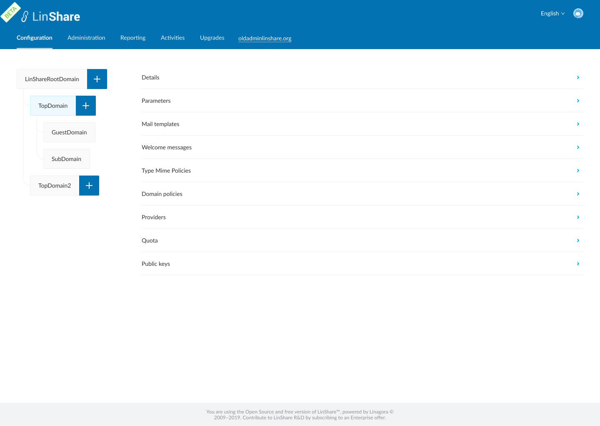
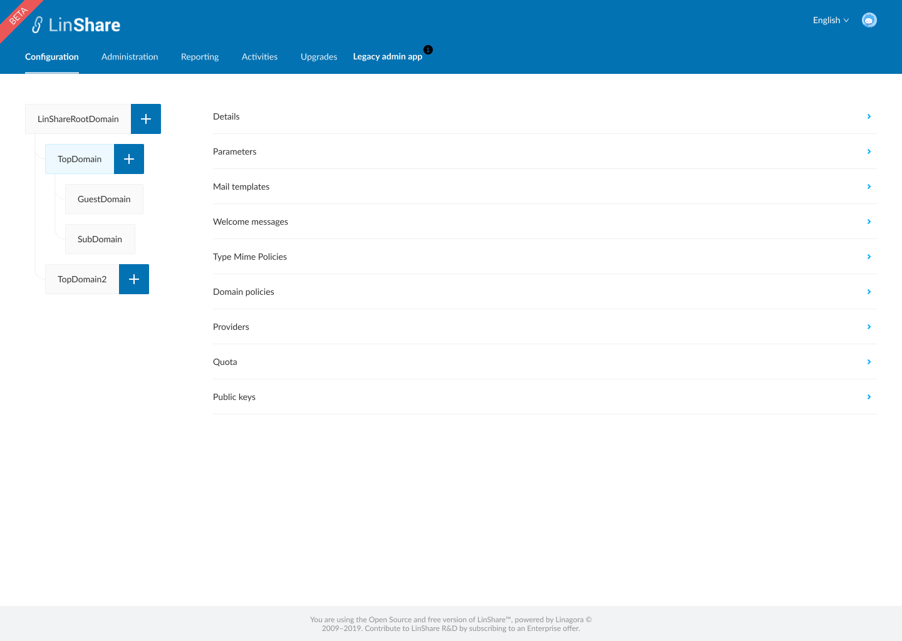

# Summary

* [Related EPIC](#related-epic)
* [Definition](#definition)
* [Screenshots](#screenshots)
* [Misc](#misc)

## Related EPIC

> Links to the epic document in the epic folder, normally README.

* [New admin portal](./README.md)

## Definition

#### Preconditions

- Given that i am admin of Linshare 

#### Description

**UC1. Log-in and log-out**
- If i access the new admin URL, i can see the log-in screen
- I input  Email, Password and click button to log-in
- If the credentials are correct, i log-in successfully
- If i access to the old admin portal and I'm not authenticated, i am redirected to login-screen of the New UI admin 
- Then i can continue log-in process as above 
- When i log-in to the new admin portal successfylly, i am also automatically authenticated to the old admin app.
- When i click button to log-out in old admin app, i am also log-out of new admin portal and navigated to log-in page of new admin-portal.

**UC2. Navigate between new admin interface and old admin interface**
- After log-in sucessfully to the new admin app, i can see a link to the old admin app on the menu "Legacy admin app"
- When i hover this link, i can see the an explanation text :"The development of this new interface is in progress, you can use the old version for all configuration menus."
- when i click on that link, i am navigated to the hompage of the old admin interface and can use every functions. 
- On the old admin interface, i can see a link to the new admin interface above the Search bar "New admin app"
- When i hover this link, i can see an explaination text :"Try our new admin app."
- When i click on that link, i am navigated to the Home page of new admin portal.

**UC3. Navigate between functions of old admin and new admin app**

- When i click on a menu link in new admin UI that has not been implemented, there will be a popup displaying:" This function has not been available on this version. Do you want to access the old version to continue ?"
- If i choose Yes, i am navigated to the Home page of the old admin UI
- when i click on a menu link of a function which is not implemented in old Admin and not ready in new admin, there will be a toast message :"This function is not available now and will coming soon."

##### Matching menu links between old new app and old admin app

|New admin UI               | Old admin UI            | 
|------------------------------------|------|
| Configuration > Details           |  Domains > Manage domains   |   
| Configuration > Parameters         | Domains > Functionalities   |   
| Configuration > Email Templates    |  Mails > Mail Configuration |  
| Configuration > Welcome Messages   |  Domains > Welcome messages  |   
| Configuration > Type Mime Policies |  Domains > Mime policies   |   
| Configuration > Domain Policies    |   Domains > Inter-domains communication rules |    
| Configuration > Remote servers          |   Domains > LDAP connections  |    
| Configuration > Remote filters > User filters          |  Domains > Domain patterns   |    
| Configuration > Remote filters > Group filters          |  Domains > Workgroup patterns   |    
| Configuration > Remote filters > Drive filters          | X  |    
| Configuration > Providers > User Providers         |   Domains > Manage domains  |    
| Configuration > Providers > Group Providers         |   Domains > Manage domains   |    
| Configuration > Providers > Drive Providers         |  Domains > Manage domains    |    
| Configuration > Quota Management   |  Domains > Manage domains quota  |  
| Configuration > Public keys        |  X  |   
|  |  |  |
| Administration > Users             |  Users > Manage users   |   
| Administration > Drives/Workgroups |  Workgroups  |   
| Administration > Contact Lists     |  Contact lists   |   
| Administration > Inconsistent Users|  Users > Inconsistent user    |  
| Administration > Loggers          |   x  |   
|  |  |  |
| Reporting      |  X   |   
|  |  |  |
| Activities                |  History   |   
|  |  |  |
| Upgrades               |  Upgrade tasks   |   

#### Postconditions

[Back to Summary](#summary)

## UI Design

#### Mockups

#### Final design

[Back to Summary](#summary)
## Misc

[Back to Summary](#summary)

