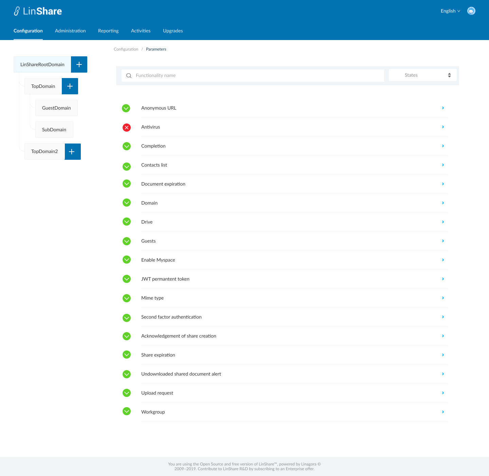

# Summary

* [Related EPIC](#related-epic)
* [Definition](#definition)
* [UI Design](#ui-design)
* [Misc](#misc)

## Related EPIC

* [New admin portal](./README.md)

## Definition

#### Preconditions

- Given that i am superadmin/nested admin of LinShare
- After log-in successfully, i go to Configuration tab and select Parameters
#### Description
- I select a domain in domain tree, the screen list of functionalities of that domain will be displayed.
- Root domain can see all functionalities and nested domain can only see the functionalities if its parent domain allow:
   - If a parent domain disable 2 toggles of a functionalities: "Enable functionality" and "Allow nested admin to change "Enable functionalities", this functionality will disappear on the functionalities list of the nested domain. 
- Each functionality will be displayed in a row with its status icon enable or disable. 
- I can click on each row to go to detail setting screen of that functionality
- I can search functionality by name by inputting in the search bar, the matches will be shown instantly below. 
- I can sort the functionalities by the state
#### Postconditions  
- If i am super-admin, i can see the functionalities list of all domains
- If i am nested admin, i can see functionalities list of my domain and my nested domain

[Back to Summary](#summary)

## UI Design

#### Mockups

#### Final design

[Back to Summary](#summary)
## Misc

[Back to Summary](#summary)

