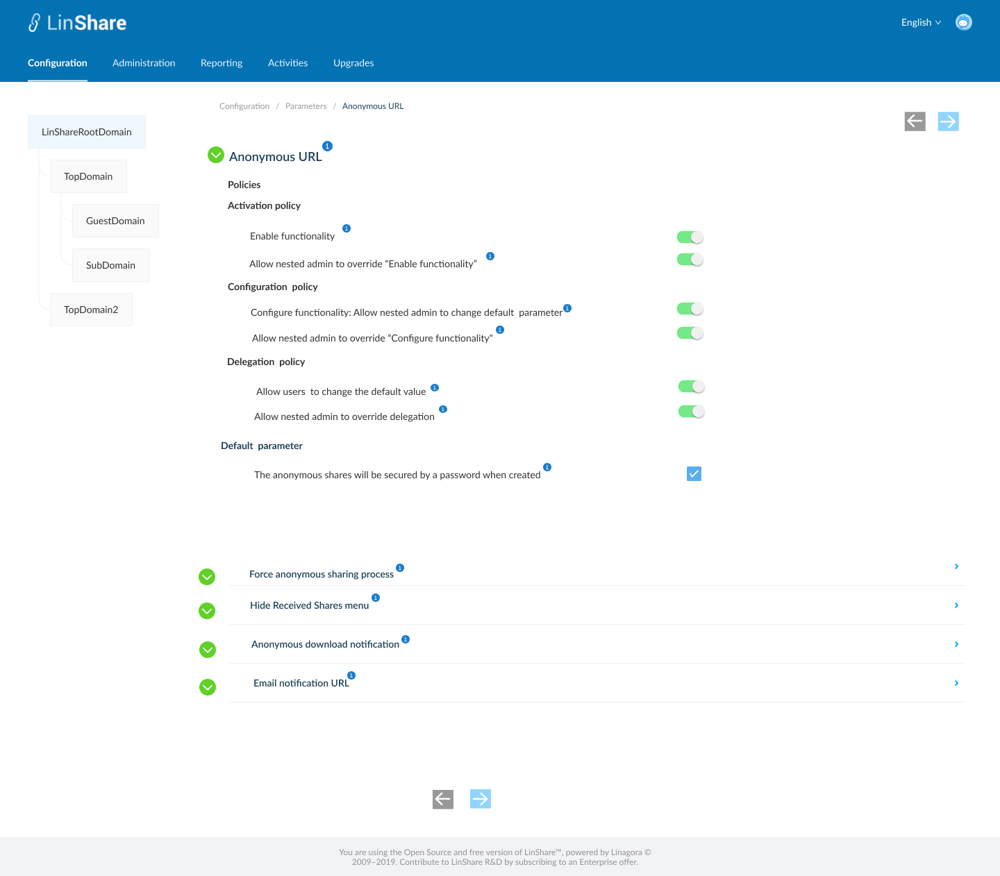
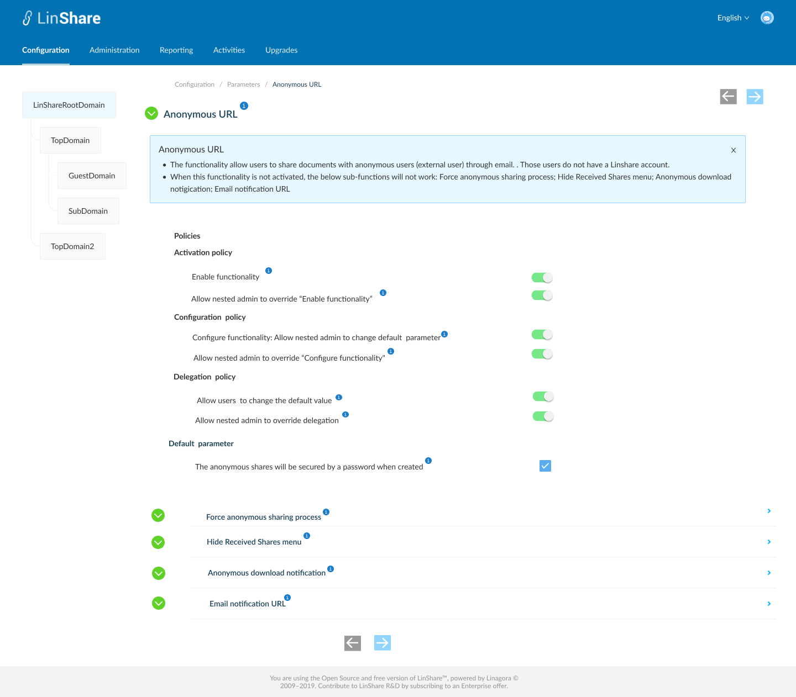
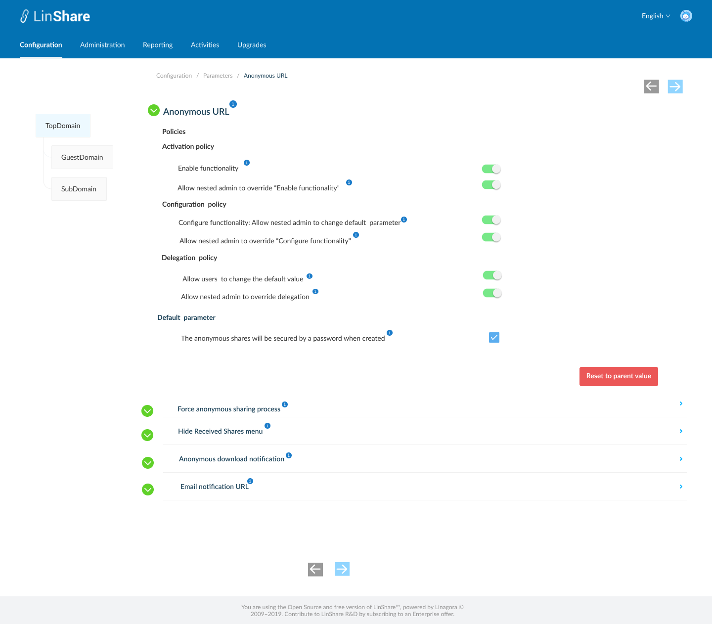

# Summary

* [Related EPIC](#related-epic)
* [Definition](#definition)
* [UI Design](#ui-design)
* [Misc](#misc)

## Related EPIC

* [New admin portal](./README.md)

## Definition

#### Preconditions

- Given that am super admin or nested admin of LinShare admin
- After log-in successfully, I go to Configuration Tab
- I click on Parameters, then select Anonymous URL, the screen setting for this feature will be opened.
#### Description
- I can see there are 4 settings in this screen:
   - Anonymous URL is the original function: I can click on the icon "i" to see a collapsible legend :"The functionality allow users to share documents with anonymous users (/external) through email. When this functionality is not activated, the below sub-functions will not work"
   - And when I click icon "i": next to "Anonymous URL", all below legends will be expanded too. 
   - 4 Sub-functions include: 
      - Force anonymous sharing process
      - Hide Received Shares menu
      - Anonymous download notification
      - Email notification URL
- In anonymous URL setting, there are 3 policies and 1 default parameter :
- Activation policy includes 2 toggles:
   - (1.1) Enable functionality: When I click on the icon "i", I can see a collapsible legend: " Once activated, the user can share a file with an anonymous user."
      - If this toggle is switched on, user of this domain can share file with external users in LinShare UI User
      - If the toggle is disabled, end user of this domain cannot share file with an external users  in LinShare UI User
   - (1.2) Allow nested admin to override "Enable functionality": When I click on the icon "i", I can see a collapsible legend: " Once activated, nested admin can override the activation for his own domain. When disabled, the value of setting "Enable functionality" is applied for all nested domains and nested admin cannot update"
      - If the toggle is switched on, the nested admin can enable/disable the setting "Enable functionality"  for his domain. 
      - If the toggle is off, the nested admin can see but cannot change the setting of "enable functionality" for his domain. When I update "enable functionality" toggle on or off for my domain, it is also applied for my nested domains. In lower-level domain, this setting is inherited from parent domain and displayed in read only mode (the toggle is in grey)
      - When the 2 toggles (1.1) , (1.2) are both disabled, the other settings of this functionality are hidden. This functionality disappear on every lower domains.
      - When toggle (1.1) is on and (1.2) is off, in nested domain I can only see the toggle (1.1) in read only mode and toggle (1.2) disappears. 
      - When toggle (1.1) and (1.2) are both on, or when toggle (1.1) is off and (1.2) is on, in nested domain I can see and update these toggles.
- Configuration policy includes 2 toggles:
   - (2.1) Configure functionality: Allow nested admin to change the default parameter :  When I click on the icon "i", I can see a collapsible legend: "By enabling, you allow your nested domain admin to change default parameter in his domain".
      - If the toggle is on in a parent domain, the nested admin can change the value of default parameter field for his domain. 
      - If the toggle is off, the nested admin can see but cannot change the value of default parameter field. The default parameter of nested domain is inherited from it's parent domain and displayed in read only mode.
   - (2.2) Allow nested to override "Configure functionality": When I click on the icon "i", I can see a collapsible legend:"By enabling, nested admin can re-enable the Configure functionality toggle and then change the default parameter"
      - If the toggle is on in parent domain, then nested admin can see and update both toggles for his domain. 
         - If default value of toggle "2.1" in nested domain is disabled, the default parameter field is non-editable. Nested Admin can re-enable toggle 2.1 and the field default parameter is editable now.
      - If this toggle is off in parent domain, and toggle (2.1) is on, then in nested domain, admin see the toggle (2.1) in read only mode and toggle (2.2) disappear. I can edit default parameter field.
      - When 2 toggles (2.1) and (2.2) are both disabled, they also disappear on nested domains, the default parameter is in read only mode and inherited from parent domain. 
- Delegation policy includes 2 toggles:
   - (3.1) Allow user to change default parameter:  When I click on the icon "i", I can see a collapsible legend:
      - If the toggle is on, when a user share a file with an anonymous user, he can see a checkbox "Secure sharing". He can enable or disable this option. 
      - If the toggle is off, user cannot change value of checkbox "Secure sharing"
   - (3.2) Allow nested admin to override delegation :  When I click on the icon "i", I can see a collapsible legend: " Once activated, nested admin can override the setting "Allow user to change default parameter" for his own domain. When disabled, the value of setting "Allow user to change default parameter" is applied for all nested domains and nested admin cannot update"
      - If the toggle is on, the nested admin can change the setting "Allow user to change default parameter" for his domain.
      - If the toggle is off:the nested admin can see but cannot change the setting "Allow user to change default parameter" for his domain. When I update "enable functionality" toggle on or off for my domain, it is also applied for my lower-level domains. In lower-level domain, this setting is inherited from parent domain and displayed in read only mode. The toggle "Allow nested admin to override delegation" is hidden in nested domain.
      - When 2 toggles (3.1) and (3.2) are both disabled, they also disappear on nested domains.
   - Default parameter: A checkbox. When I click on the icon "i", I can see a collapsible legend:" User will see a checkbox "Secure sharing" on sharing form. This setting decides how to show this checkbox by default"
       - If the checkbox is selected, the text displays "The anonymous shares will be secured by a password when created." Which means there will be a password generated when user creates anonymous shares.
       - If the checkbox is not selected, the texts displays "The anonymous shares will not be secured by a password when created." Which means The anonymous shares will be sent without a protected password
  
#### Postconditions

- Root admin can configure this functionality for every domain 
- Nested admin can configure the functionality for his domain and his nested domain if the parent domain admin allows it 
- There will be no toggle : "Allow nested admin to override ..." in sub-domain and guest domain setting 
- I can click on Parameters on Breadcrumb to go back to functionality listing screen
- I can click on arrow back or forth at the bottom and top of screen to navigate to next/previous parameter setting 
- When I hover these arrows, I can see an explanation tooltip "Next functionality"/"Previous functionality"
- In nested domain there is a button Reset to parent domain. When settings in nested domain is same as it's parent domain, this button is disabled.
- When  setting in nested domain is different from it's parent domain's value, this button will be enabled. 
- When I click on this button, the all the settings in this nested domain will be updated from it's parent domain.  
- When I open this screen, by default all the legends will be expanded.

[Back to Summary](#summary)

## UI Design

#### Mockups

#### Final design

[Back to Summary](#summary)
## Misc

[Back to Summary](#summary)

