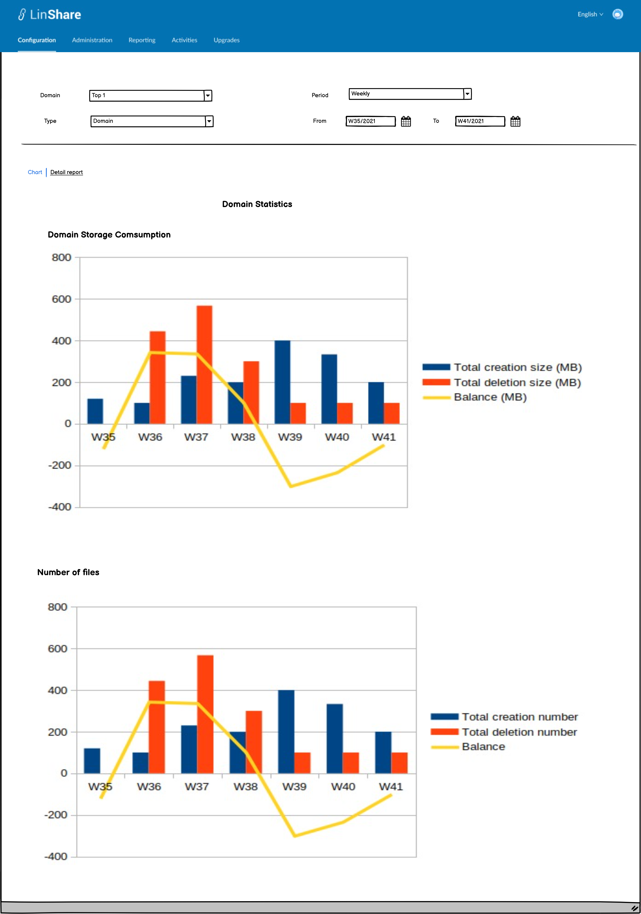
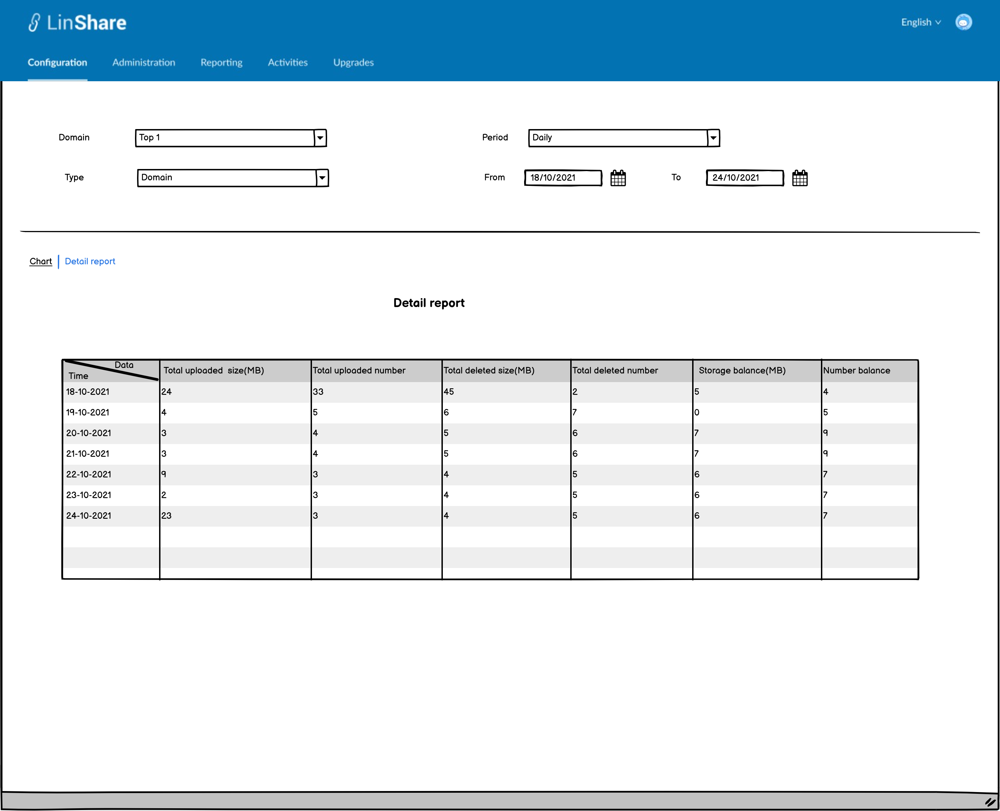
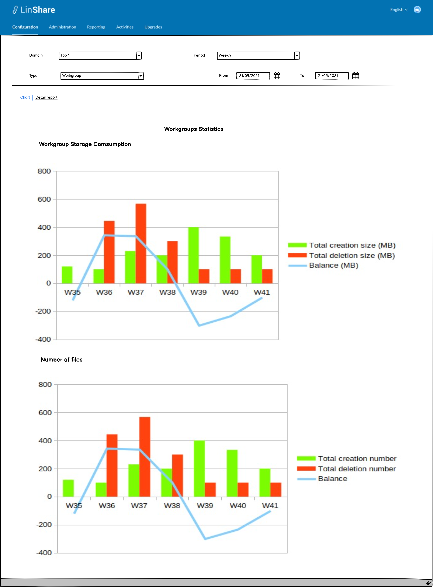
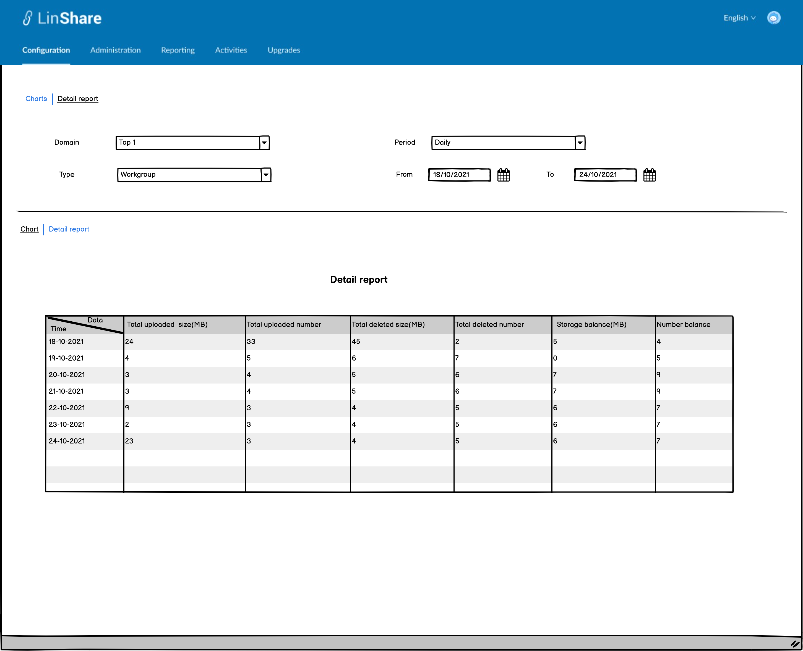
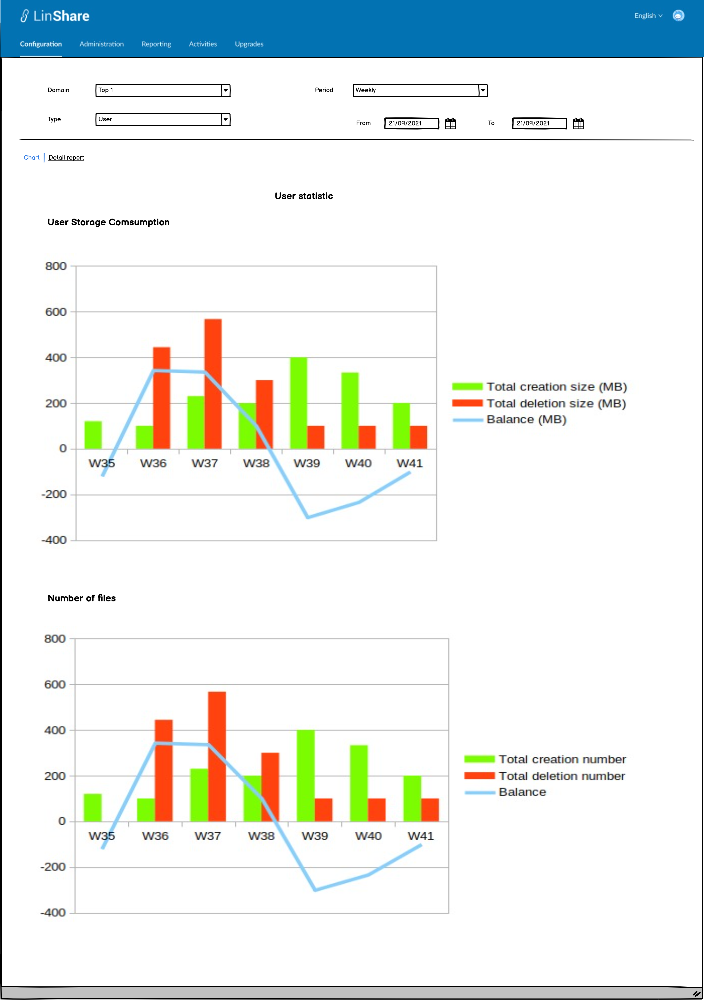
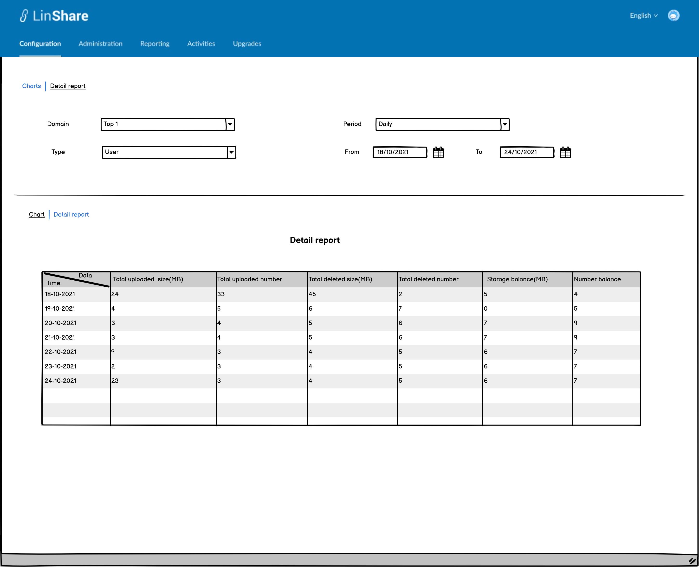

# Summary

* [Related EPIC](#related-epic)
* [Definition](#definition)
* [UI Design](#ui-design)
* [Misc](#misc)

## Related EPIC

* [New admin portal](./README.md)

## Definition

#### Preconditions

- Given that am super admin or nested admin of LinShare
- After log-in successfully, I go to  Tab Reporting
- I click on Resource activities report, a new screen will be opened.
- I can see 3 tabs on the screen: Home, Charts, Detailed Reports
- On the first tab, I can a link "View more detail" below Storage Consuming chart 
- I click on this link, a new screen will be opened 

#### Description

- I can see 2 tabs : charts and detail report
- On the first tab, I can see the filters and the charts below:
    - Filters include:
        - Domain: A combo-box.
            - If I am root domain, I can see the list of all domains .
            - If I am nested admin, I can see list of domains in which I have administration right.
            - Default option is "All".
        - Type: A combo-box with options: Domain, Workgroup, User. This field is only displayed if option "All" is not selected in field "Domain".
        - Period: A combo-box
           - When click on this field, I can see the list of options: Daily, Monthly, weekly, yearly. Default value is monthly, time frame is 1 year
           - The field "From" and "To" will be displayed corresponding: If I selected monthly period, I can only select From[month/year] to [month/year]. If I select weekly, I can only select From [week/year] to [week/year].  If I select yearly, I can only select From [Year] to [Year]
           - The max period for type "monthly" is 12 months, the max period for type "weekly: is 12 weeks, the max period for type "daily": is 12 days and the max period for type "yearly" is 12 years
           - Default type is monthly, time frame is 1 year from current month.
- A Top Domain's quota contains 3 parts: Personal spaces quota and Sharedspace quota and sub-domains quota 
- A subdomain's quota contains Personal spaces quota and Sharedspace quota

##### UC1. Statistics per domain

- When I select one Domain in the field "Domain" then select "Domain" in field Type and time then click Enter, the charts and detail report below will reflect data of the selected domain in selected time
    - First tab includes 2 Charts :
        - Domain storage consumption: This is a mixed graph between 2 bars chart and a line chart
            - The horizontal axis is display time period with the unit is selected from the filters above
            - The vertical axis displays size (MB) 
            - 2 bars represent for total size of creation (upload files) and total size of deleted files on the domain 
            - A line chart reflects the balance between creation and deletion and is defined as [total creation size] - [total deletion size]
        - Number of files: This is a mixed graph between 2 bars and a line chart 
           - The horizontal axis is display time period with the unit is selected from the filters above
           - The vertical axis displays number
           - 2 bars represent for total number of creation (upload files) and total number of deleted files on the domain
           - A line chart reflects the balance between creation and deletion number and is defined as [total creation number] - [total deletion number]
    - Second tab is detail report: This tab displays the detail report in table:
       - There are columns: 
          - Time - which is displayed according to selection in filter fields and can be day/week/month/year 
          - Total uploaded size (MB)
          - Total uploaded number
          - Total deleted size(MB)
          - Total deleted number 
          - Storage balance (MB)
          - Number balance
       
##### UC2. Statistics of workgroup

- When I select one Domain in the field "Domain" then select "Workgroup" in field Type and time then click Enter, the charts and detail report below will reflect data of all workgroups of the selected domain in selected time
    - First tab includes 2 Charts :
        - Workgroup storage consumption: This is a mixed graph between 2 bars chart and a line chart
            - The horizontal axis is display time period with the unit is selected from the filters above
            - The vertical axis displays size (MB)
            - 2 bars represent for total size of creation (upload files) and total size of deleted files of all workgroups in selected domain 
            - A line chart reflects the balance between creation and deletion and is defined as [total creation size] - [total deletion size]
        - Number of files: This is a mixed graph between 2 bars and a line chart
            - The horizontal axis is display time period with the unit is selected from the filters above
            - The vertical axis displays number
            - 2 bars represent for total number of creation (upload files) and total number of deleted files of all workgroups in selected domain
            - A line chart reflects the balance between creation and deletion number and is defined as [total creation number] - [total deletion number]
    - Second tab is detail report: This tab displays the detail report in table:
        - There are columns:
            - Time - which is displayed according to selection in filter fields and can be day/week/month/year
            - Total uploaded size (MB)
            - Total uploaded number
            - Total deleted size(MB)
            - Total deleted number
            - Storage balance (MB)
            - Number balance

##### UC3. Statistics of user

- When I select one Domain in the field "Domain" then select "User" in field Type and time then click Enter, the charts and detail report below will reflect data of all users in the selected domain in selected time
    - First tab includes 2 Charts :
        - User storage consumption: This is a mixed graph between 2 bars chart and a line chart
            - The horizontal axis is display time period with the unit is selected from the filters above
            - The vertical axis displays size (MB)
            - 2 bars represent for total size of creation (upload files) and total size of deleted files of all users in domain
            - A line chart reflects the balance between creation and deletion and is defined as [total creation size] - [total deletion size]
        - Number of files: This is a mixed graph between 2 bars and a line chart
            - The horizontal axis is display time period with the unit is selected from the filters above
            - The vertical axis displays number
            - 2 bars represent for total number of creation (upload files) and total number of deleted files of all users in domain
            - A line chart reflects the balance between creation and deletion number and is defined as [total creation number] - [total deletion number]
    - Second tab is detail report: This tab displays the detail report in table:
        - There are columns:
            - Time - which is displayed according to selection in filter fields and can be day/week/month/year
            - Total uploaded size (MB)
            - Total uploaded number
            - Total deleted size(MB)
            - Total deleted number
            - Storage balance (MB)
            - Number balance

#### Post-conditions

- In UC1 below, the statistics is calculated on all Personal spaces and Sharedspace of the domain and sub-domain quota (if any) is not included
- In UC2 below, the statistics is calculated on all Sharespace (all workgroups) of the domain
- In UC3 below, the statistics is calculated on Personal Spaces of all user of the domain
- When I change the filter condition, the charts and detail report are also changed accordingly.

[Back to Summary](#summary)

## UI Design

#### Mockups

#### Final design

[Back to Summary](#summary)
## Misc

[Back to Summary](#summary)

