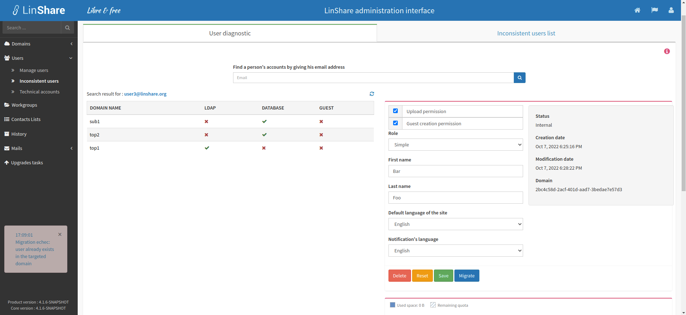

# Summary

* [Related EPIC](#related-epic)
* [Definition](#definition)
* [Screenshots](#screenshots)
* [Misc](#misc)

## Related EPIC

* [New admin portal](./README.md)

## Definition

#### Preconditions

*  Given that am an admin (super admin/ nested admin)

#### Description

* After log-in Admin portal successfully, I select Administration tab
* Then I select Inconsistent users
* On this screen, there will be 2 tabs: USer diagnostic and Inconsistent user list

**UC1. User diagnostic**
 - On this tab, I can see an help text: "For a given email address, this view shows a full report of the matching user on his presence in the LDAP with the associated domain and also in the database. So this view is useful when testing if a user is in the right domain or if he belongs to multiple domains in the same time, etc ...
 Furthermore, in this view you can show all related information to a user and edit them such as changing the user's domain to another."
 - I can see a text field below :"Find a person's accounts by giving his email address"
 - When I input text to this field, the auto-complete list will be displayed and I can select one email address from the list 
 - Then the system will search for that email in the whole platform then show the result in the below.
 - Each row is a domain that user is currently belongs to:
 - The table includes columns:
   - Domain name: Name of the domains that user is currently associated to 
   - LDAP: If this column is tick, it means that the user exists in the LDAP of the domain  on the first column. If it is marked red, it means that the user is currently not belongs to LDAP of the domain on the first column
   - Database: If this column is tick, it means that the user exists in the DB of the domain on the first column. If it is marked red, it means that the user is currently not belongs to DB of the domain on the first column
   - GUEST:  If this column is tick, it means that the user exists in the GUEST DB of the domain on the first column. If it is marked red, it means that the user is currently not belongs to GUEST DB of the domain on the first column
 - In the result report of an email , when I click on 1 row:
   - If the email exists in DB/GUEST, the user profile page in the domain of selected row will be displayed. 
   - If the email exists in LDAP server but not exist in DB/GUEST, there will be a message: "This user does not have a LinShare profile. Would you like to create it in the database ?". If I choose Yes, user'profile will be created in DB and the Profile page of user will be displayed. If I choose No, the popup closes and I will not see the User profile in that domain.
 
**UC2 Migrate a user to another domain**
- In the result report of an email, when I click on one row and the profile page of user in the domain of selected row is shown, I can manage that user as normally and a new button "Migrate"
- When I click on button Migrate, a popup "Migration of Users' domain" will be displayed
- There will be a field "New domain" with a drop-down list of all available top domains and sub-domains.
- I select one domain in the list and click button Apply 
- If the selected domain is current domain, or the user already exists in the targeted domain, there will be a notification message: "user already exists in the targeted domain"
- If the user has not existed in the targeted domain, the user will be migrated to the new domain and no longer exists in the old domain. There will be a successful notification message.
- In the user's profile page, the domain name will be updated to new domain. 
- When I click on Reload button in the domain report of the user, the new domain will be updated in the result table.

[Back to Summary](#summary)

## UI Design

#### Screenshots

#### Final design

[Back to Summary](#summary)
## Misc

[Back to Summary](#summary)
