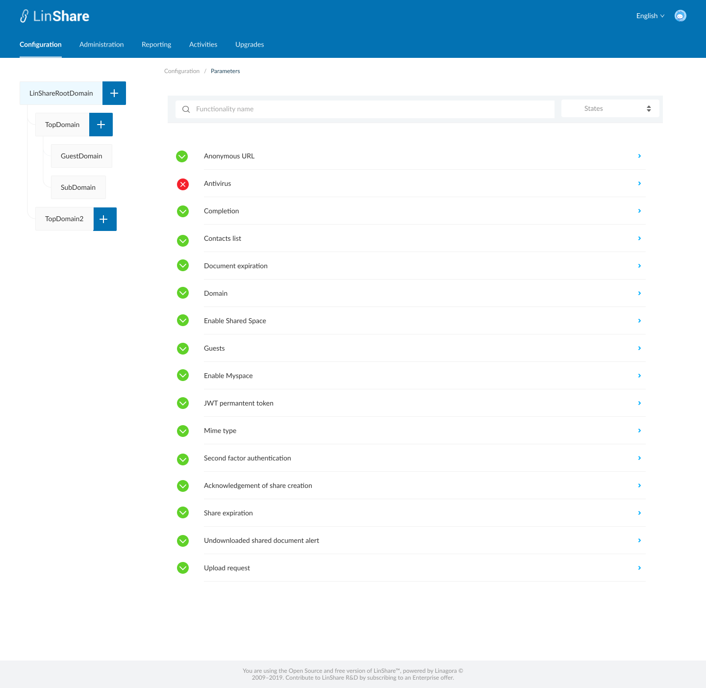
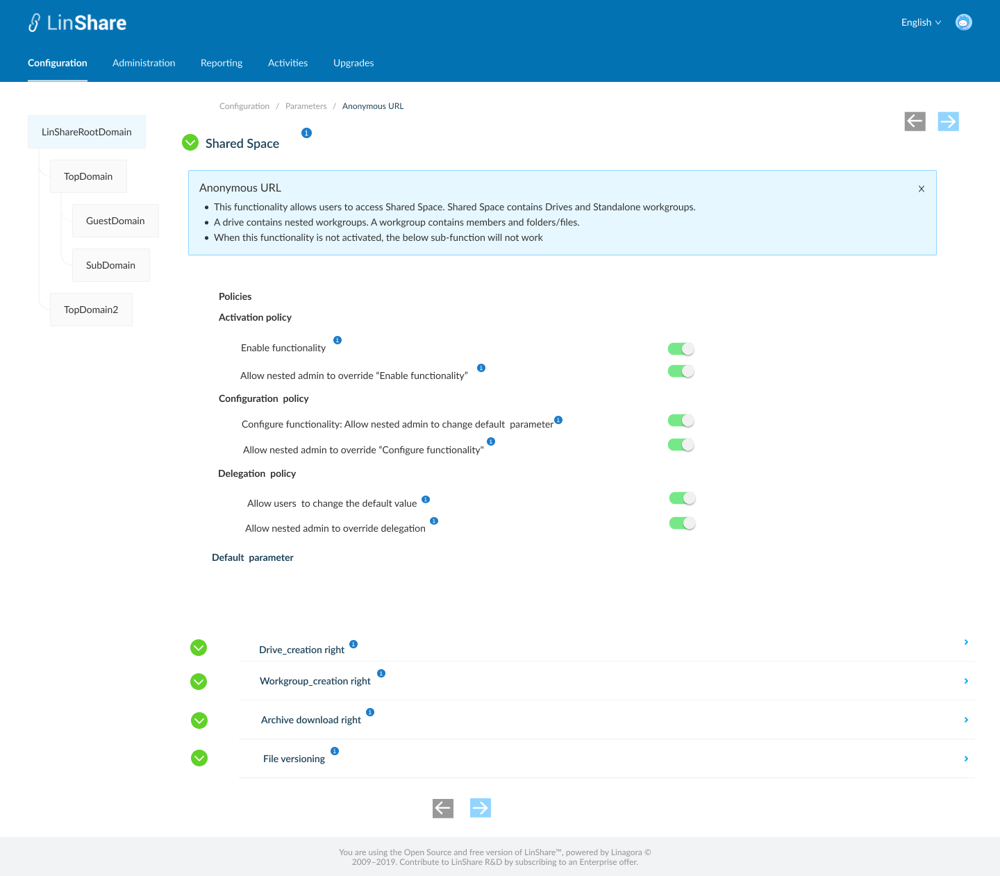

# Summary

* [Related EPIC](#related-epic)
* [Definition](#definition)
* [UI Design](#ui-design)
* [Misc](#misc)

## Related EPIC

* [New admin portal](./README.md)

## Definition

#### Preconditions

- Given that am super admin or nested admin of LinShare admin
- After log-in successfully, I go to Configuration Tab
- I click on Parameters, then select Shared Space, the screen setting for this feature will be opened.

#### Description

- There are 4 settings in this screen: "Shared Space" is the original function and 4 sub-functions.

**Original function: Shared Space**

- When I can click on the icon "i" next to "Shared Space", I see a collapsible legend: "This functionality allows users to access Shared Space. Shared Space contains Drives and Standalone Workgroups. A drive contains members with their roles and nested Workgroups. A Workgroup contains members with their roles and some content (folders/files/versions). When this functionality is not activated, the below sub-function will not work"
- There is only Activation policy, including 2 toggles:
    - Enable functionality: When I click on the icon "i", I can see a collapsible legend:
        - If this toggle is switched on, when user of this domain access his LinShare account, he can see the menu Shared Space
        - If the toggle is disabled, user cannot see the menu Shared Space.
    - Allow nested admin to override "Enable functionality": Toggle. When I click on the icon "i", I can see a collapsible legend: " Once activated, nested admin can override the setting "Enable  functionality" for his own domain. When disabled, the value of setting "Enable functionality" is applied for all nested domains and nested admin cannot update"
        - The rule is as same as toggle (1.2) in story 43. Admin manage function anonymous URL

**Sub-function 1. Creation right-Drive**
- When I click on the icon "i" next to "Creation right", I see a collapsible legend: " This functionality allows users to create Drives. The main goal of Drives is to gather Workgroups together and to define default membership and roles for a bunch of users. You may see Workgroups as projects and Drive as team, a team who handle these projects. "
- I can see 2 policies:
    - Activation policy includes 2 toggles
        - Enable functionality: When I click on the icon "i", I can see a collapsible legend:
            - If this toggle is switched on, When user of this domain accesses his Shared Space and click Create button, he can see option: "Create drive"
            - If the toggle is disabled, when user accesses his shared Space and click Create button, he cannot see option "Create drive"
        - Allow nested admin to override "Enable functionality": When I click on the icon "i", I can see a collapsible legend: " Once activated, nested admin can override the setting "Enable functionality" for his own domain. When disabled, the value of setting "Enable functionality" is applied for all nested domains and nested admin cannot update"
        - The rule is as same as toggle (1.2) in story 43. Admin manage function anonymous URL
    - Configuration policy includes 2 toggles:
        - Configure functionality: Allow nested admin to change the default parameter. When I click on the icon "i", I can see a collapsible legend: "By enabling, you allow your nested domain admin to change default parameter field in his domain".
            - The rule is as same as toggle (2.1) in story 43. Admin manage function anonymous URL
        - Allow nested to override "Configure functionality": When I click on the icon "i", I can see a collapsible legend:"By enabling, nested admin can re-enable the Configure functionality toggle and then change the default parameter"
            - The rule is as same as toggle (2.2) in story 43. Admin manage function anonymous URL

**Sub-function 2. Creation right-standalone workgroup**
- When I can click on the icon "i" next to "Creation right", I see a collapsible legend: "In LinShare, there are 2 kinds of workgroups: Standalone workgroup and nested workgroup. Standalone workgroup is not under any Drive and nested workgroup is created inside a Drive. This setting is ony applied for Standalone workgroup. Creation right of nested workgroup depends on Drive user's role "
- There are 2 policies:
   - Activation policy which includes 2 toggles:
      - Enable functionality: When I click on the icon "i", I can see a collapsible legend:
         - If this toggle is switched on, when user of this domain access menu Shared space, he can click the button "+" on the top left of screen to create a new standalone workgroup.
         - If the toggle is disabled, the button "+" to create standalone workgroup will be disabled.
      - Allow nested admin to override "Enable functionality": Toggle. When I click on the icon "i", I can see a collapsible legend: " Once activated, nested admin can override the setting "Enable  functionality" for his own domain. When disabled, the value of setting "Enable functionality" is applied for all nested domains and nested admin cannot update"
      - The rule is as same as toggle (1.2) in story 43. Admin manage function anonymous URL
   - Configuration policy includes 2 toggles: 
      - Configure functionality: Allow nested admin to change the default parameter. When I click on the icon "i", I can see a collapsible legend: "By enabling, you allow your nested domain admin to change default parameter field in his domain".
      - The rule is as same as toggle (2.1) in story 43. Admin manage function anonymous URL
   - Allow nested to override "Configure functionality": When I click on the icon "i", I can see a collapsible legend:"By enabling, nested admin can re-enable the Configure functionality toggle and then change the default parameter"
       - The rule is as same as toggle (2.2) in story 43. Admin manage function anonymous URL

**Sub-function 3. Archive download right**
- When I can click on the icon "i" next to "Archive download right", I see a collapsible legend: "By enabling this functionality, users will be allowed to download the content of a folder as an archive." "
- There are 2 policies and 1 parameter:
    - Activation policy: Includes 2 toggles:
        - Enable functionality: When I click on the icon "i", I can see a collapsible legend:
            - If this toggle is switched on, user can see the option "Download" of a folder in workgroup.
            - If the toggle is disabled, the option "Download" of folder in workgroup will be hidden. User need to download each file in that folder.
        - Allow nested admin to override "Enable functionality": Toggle. When I click on the icon "i", I can see a collapsible legend: " Once activated, nested admin can override the setting "Enable  functionality" for his own domain. When disabled, the value of setting "Enable functionality" is applied for all nested domains and nested admin cannot update"
            - The rule is as same as toggle (1.2) in story 43. Admin manage function anonymous URL
    - Configuration policy: Includes 2 toggles:
        - Configure functionality: Allow nested admin to change the default parameter. When I click on the icon "i", I can see a collapsible legend: "By enabling, you allow your nested domain admin to change default parameter field in his domain".
            - The rule is as same as toggle (2.1) in story 43. Admin manage function anonymous URL
        - Allow nested to override "Configure functionality": When I click on the icon "i", I can see a collapsible legend:"By enabling, nested admin can re-enable the Configure functionality toggle and then change the default parameter"
            - The rule is as same as toggle (2.2) in story 43. Admin manage function anonymous URL
    - Parameter: Max size
        - When I click on icon "i",  I can see a collapsible legend:"This parameter contains the maximal size of the archive to download, it can be edited relating to your need, (manage with precaution)."
        - A text field that only accepts number with a drop-down list contains options: Kilobyte, Megabyte, Gigabyte

**Sub-function 4. File versioning right**
- When I can click on the icon "i" next to "File versioning right", I see a collapsible legend:"By enabling this functionality, it will enable file versioning feature in workgroups.".
- There are 3 policies and 1 parameter:
    - Activation policy includes 2 toggles:
        - Enable functionality: When I click on the icon "i", I can see a collapsible legend:
            - If this toggle is switched on, the checkbox "Versioning enable" will be shown in workgroup detail
            - If the toggle is disabled, the checkbox versioning will not be shown in workgroups which are created after the toggle is disabled. For the workgroups which are created before, If the versioning was enabled and used, the checkbox status is kept in read mode with a badge legend: "Only for uploaded files when versioning was enabled".
        - Allow nested admin to override "Enable functionality": Toggle. When I click on the icon "i", I can see a collapsible legend: " Once activated, nested admin can override the setting "Enable functionality" for his own domain. When disabled, the value of setting "Enable functionality" is applied for all nested domains and nested admin cannot update"
            - The rule is as same as toggle (1.2) in story 43. Admin manage function anonymous URL
        - Configuration policy includes 2 toggles:
            - Configure functionality: Allow nested admin to change the default parameter. When I click on the icon "i", I can see a collapsible legend: "By enabling, you allow your nested domain admin to change default parameter field in his domain".
                - The rule is as same as toggle (2.1) in story 43. Admin manage function anonymous URL
            - Allow nested to override "Configure functionality": When I click on the icon "i", I can see a collapsible legend:"By enabling, nested admin can re-enable the Configure functionality toggle and then change the default parameter"
                - The rule is as same as toggle (2.2) in story 43. Admin manage function anonymous URL
    - Delegation policy includes 2 toggles:
        - Allow user to change default parameter:  When I click on the icon "i", I can see a collapsible legend:
            - If the toggle is on, when user edit a workgroup, he can select/un-select the checkbox "File versioning".
            - If the toggle is off, user cannot change value of this checkbox.
        - Allow nested admin to override Delegation:  When I click on the icon "i", I can see a collapsible legend: " Once activated, nested admin can override the setting "Allow user to change default parameter" for his own domain. When disabled, the value of setting "Enable functionality" is applied for all nested domains and nested admin cannot update"
            - The rule is as same as toggle (3.2) in story 43. Admin manage function anonymous URL
    - Parameter: A checkbox
        - When I click on the icon "i", I can see a collapsible legend:" This parameter will decide the default value of the checkbox "File versioning" of a new created workgroup
            - If the checkbox is selected, the text displays: "	Versioning will be enabled by default when creating a new workgroup." When a new workgroup is created, the checkbox "File versioning" will be enabled by default. User can see the option "Manage version" of file inside that workgroup.
            - If the checkbox is un-selected, the text displays: "Versioning will be disabled by default when creating a new workgroup.". When a new workgroup is created, the checkbox "File versioning" will be disabled by default. Option "Mange version" is hidden in drop-down list of actions of file inside that workgroup.
          
#### Post-conditions
            
The rule is as same as Post-condition of Story 43. Admin manage function anonymous URL.

**UI User**
- If versioning is enabled and:
    - Workgroup is newly created: Every file inside will have option Manage version. Each version will have options: Detail, Preview, Download, Restore, Copy, Delete
    - Workgroup is created and disabled versioning before: Every old or new file of that workgroup will have option Manage version with options: Detail, Preview, Download, Restore, Copy, Delete
- If versioning is disabled and:
    - Workgroup is newly created: The checkbox versioning is not shown and every file inside the workgroup will not have option Manage version
    - Workgroup is created and disabled versioning before: The checkbox versioning is not shown and every file inside the workgroup will not have option Manage version
    - Workgroup is created and enabled versioning before: The checkbox versioning is shown in read mode and:
        - If current file inside has a revisions, it still has option Manage version with options: download, copy, delete, preview and detail.
        - If current file do not have any revision, the option Manage version will not be shown.
        - For new uploaded files: Do not have option Manage version

[Back to Summary](#summary)

## UI Design

#### Mockups

#### Final design

[Back to Summary](#summary)

## Misc

[Back to Summary](#summary)

