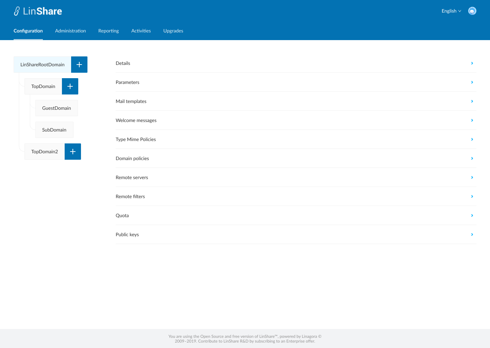
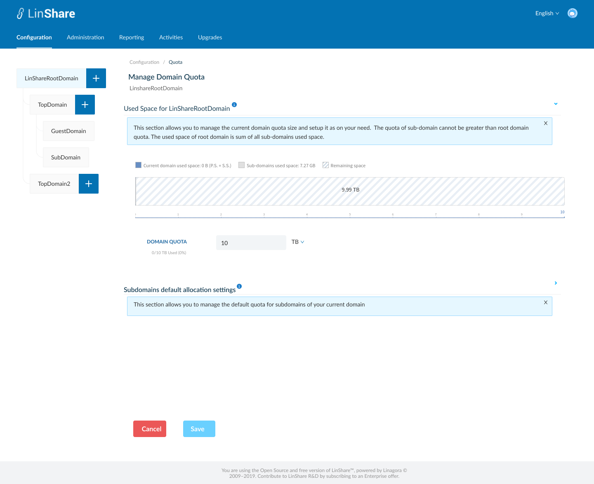
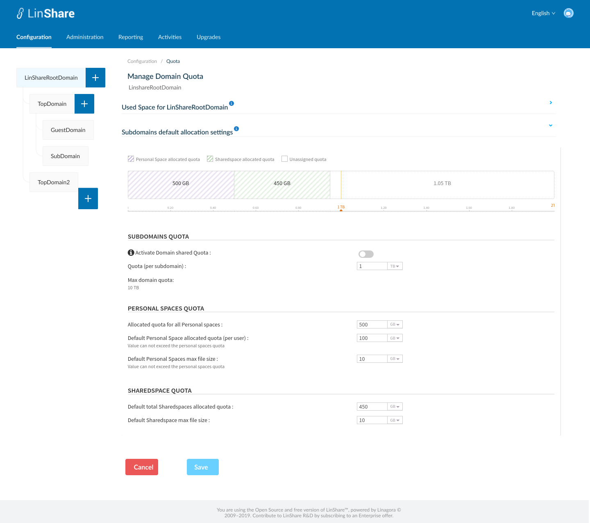
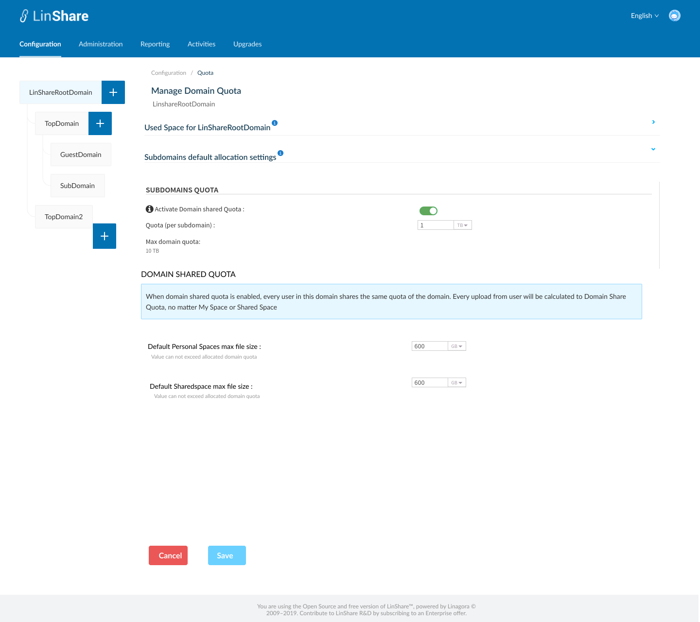

# Summary

* [Related EPIC](#related-epic)
* [Definition](#definition)
* [UI Design](#ui-design)
* [Misc](#misc)

## Related EPIC

* [New admin portal](./README.md)

## Definition

#### Preconditions

- Given that I am Root admin of LinShare
- I logged in to LinShare new admin portal 
- I select Root domain in Domain tree and go to Configuration tab on top navigation bar.
- I click on Quota, the screen setting domain quota for root domain will be opened.

#### Description

- On Screen Manage domain quota for root domain, I can see 2 sections:

1.Used Space for LinShareRootDomain

- When I click on icon "i", there will be a collapsible legend: "This section allows you to manage the current domain quota size and setup it as on your need.  The quota of sub-domain cannot be greater than root domain quota. The used space of root domain is sum of all sub-domains used space".
- Domain quota [DQ-ROOT]: I can input only number that >0 and select size unit from the drop-down list: B/KB/MB/GB/TB/PB/EB/ZB/YB
   - When I change the size unit, the number is also updated accordingly. For e.g the field is currently 1 TB. I change the unit to "GB", then the number is automatically changed to "1000". We have 1TB = 1000 GB.
   - Value of this field is used as the max value of max domain quota in Subdomains default allocation settings section below.
  
2.Subdomains default allocation settings

- When I click on icon "i", there will be a collapsible legend:"This section allows you to manage the default values for nested domains of your current domain"
- I can see a toggle: "Activate domain Shared quota": When I click on icon "i", I can see an explanation tooltip: "Activation of this mode exempt from setting each container's quota of this domain (Personal Space and Shared Space). The user will see global consumption of all users of the domain."

2.1 When the toggle "Activate domain Shared quota" is disabled, I can see a chart and three setting parts:

  - Sub-domain quota: 
     - Default quota value for all sub-domain [DQ-SUB] : I can input only number that >0 and select size unit from the drop-down list: B/KB/MB/GB/TB/PB/EB/ZB/YB
     - Max domain quota = [DQ-ROOT]: None-editable field. When[DQ-ROOT] is updated, this field is also updated accordingly.
     - When I input [DQ-SUB] > max domain quota, there will be an error message. 
  - Personal space quota: 
    - Allocated quota for all Personal spaces [PSQ-SUB]: This is the total quota of all users's personal space (My space) in this sub-domain
       - I can input only number that >0 and select size unit from the drop-down list: B/KB/MB/GB/TB/PB/EB/ZB/YB
       - When I input a value > [DQ-SUB], there will be an error message: "The value should be below or equal to: [DQ-SUB]"
    - Default Personal Space allocated quota (per user): [PSQ]
       - I can input only number that >0 and select size unit from the drop-down list: B/KB/MB/GB/TB/PB/EB/ZB/YB
       - There is an instruction text below: Value can not exceed the personal spaces quota
       - When I input a value > [PSQ-SUB], there will be an error message: "The value should be below or equal to: [PSQ-SUB]"
    - Default Personal Spaces max file size: 
       - I can input only number that >0 and select size unit from the drop-down list: B/KB/MB/GB/TB/PB/EB/ZB/YB
       - There is an instruction text below: Value can not exceed Default Personal Space allocated quota (per user)
       - When I input a value > [PSQ], there will be an error message: "The value should be below or equal to: [PSQ]"
  - Sharedspace quota:
    - Default total Sharedspaces allocated quota [SSQ-SUB]: This is the total quota of all users's sharedspaces in this sub-domain
       - I can input only number that >0 and select size unit from the drop-down list: B/KB/MB/GB/TB/PB/EB/ZB/YB
       - When I input a value > [DQ-SUB], there will be an error message: "The value should be below or equal to: [DQ-SUB]"
    - Default Sharedspace max file size :
       - I can input only number that >0 and select size unit from the drop-down list: B/KB/MB/GB/TB/PB/EB/ZB/YB
       - There is an instruction text below: Value can not exceed [SSQ-SUB]
       - When I input a value > [SSQ-SUB], there will be an error message: "The value should be below or equal to: [SSQ-SUB]"
  - Chart: This chart represents Personal Space allocated quota, Sharedspace allocated quota and Unassigned quota on a same bar
     - Sub-domain quota =  Personal Space allocated quota + Sharedspace allocated quota + Unassigned quota
     - When Personal Space allocated quota + Sharedspace allocated quota > Sub-domain quota, I can see the over limit amount on the chart 
     - When I update any of the quota, the charts is updated accordingly

2.2 When the toggle "Activate domain Shared quota" is enabled:

   - I can see a text displayed:" When domain shared quota is enabled, every user in this domain shares the same quota of the domain. Every upload from user will be calculated to Domain Share Quota, no matter My Space or Shared Space".
   - "Default Personal Spaces max file size" field:
     - I can input only number that >0 and select size unit from the drop-down list: B/KB/MB/GB/TB/PB/EB/ZB/YB
     - There is an instruction text below: Value can not exceed allocated domain quota
     - When I input a value > [DQ-SUB], there will be an error message: "The value should be below or equal to:  [DQ-SUB] "
   - Default Sharedspace max file size :
      - I can input only number that >0 and select size unit from the drop-down list: B/KB/MB/GB/TB/PB/EB/ZB/YB
      - There is an instruction text below: Value can not exceed allocated domain quota
      - When I input a value > [DQ-SUB], there will be an error message: "The value should be below or equal to:  [DQ-SUB]]"
    
#### Postconditions

- When I click button Save, If there is no error, there will be a successful notification
- The updated information will be saved and applied for nested domains.
- If after updating, the settings in root domain conflicts with current setting of nested domain, the error symbol will be shown in domain tree and in every detail setting.
- I can click on the link :"Allocate quota for specific user", then I am navigated to User list screen
- I can find a user then set up quota for that user. Otherwise, the quota of each user will be inherited from its domain setting.

[Back to Summary](#summary)

## UI Design

#### Mockups

#### Final design

[Back to Summary](#summary)
## Misc

[Back to Summary](#summary)
