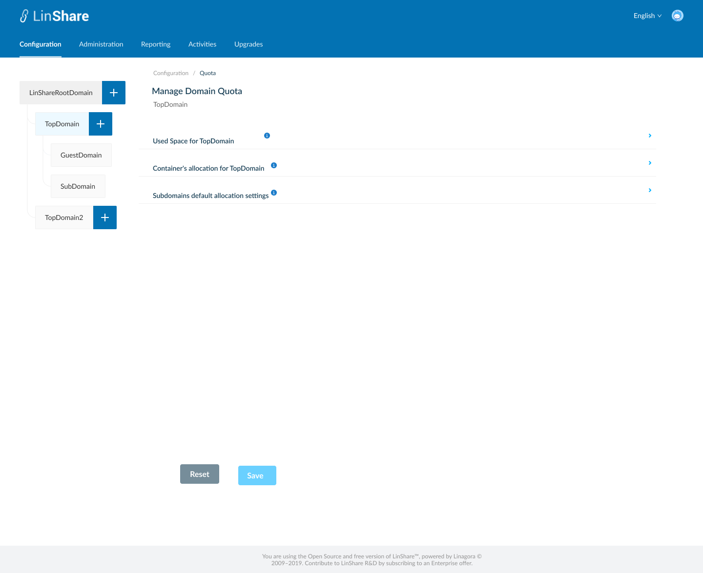
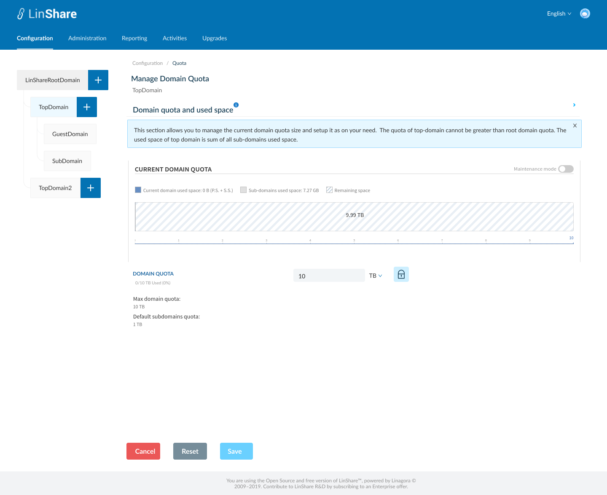
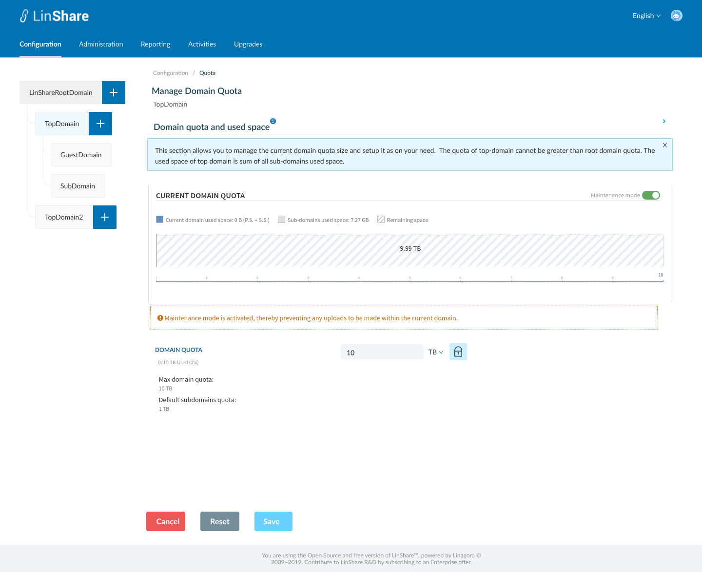
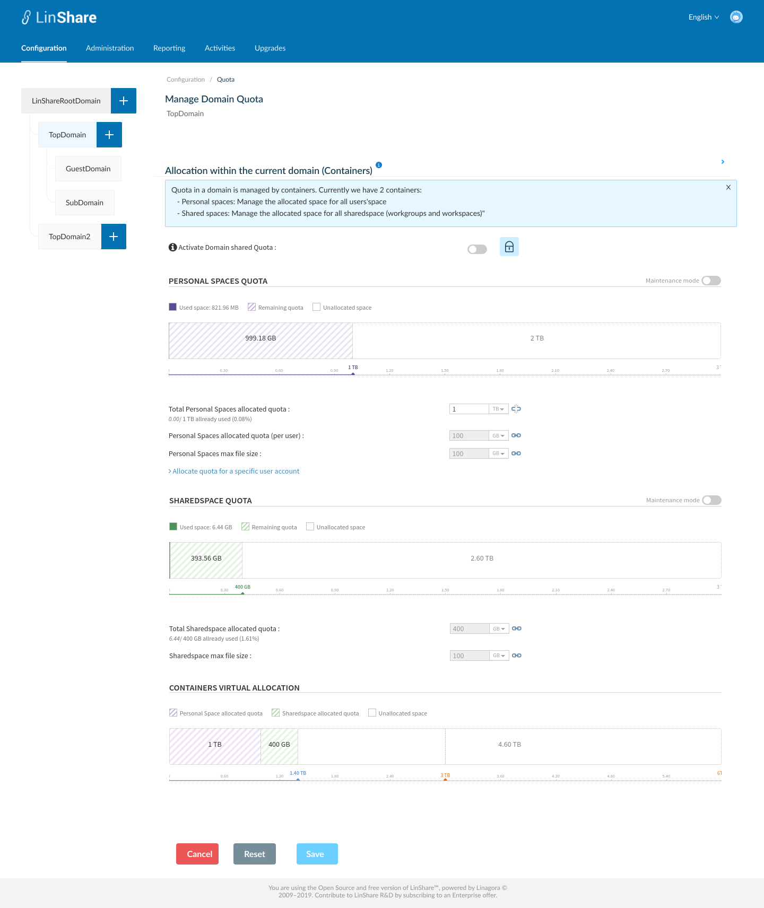
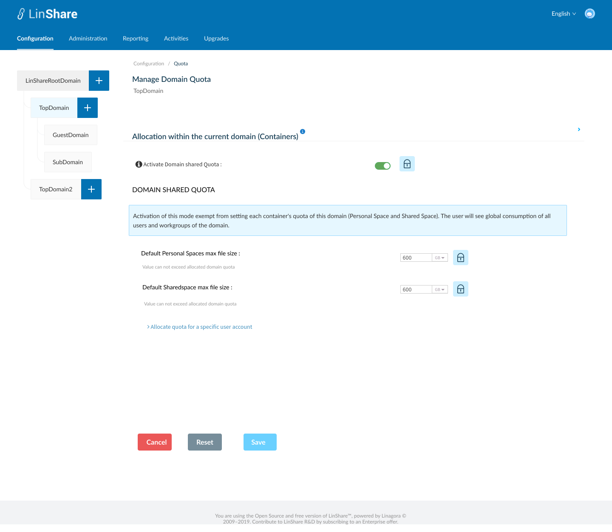
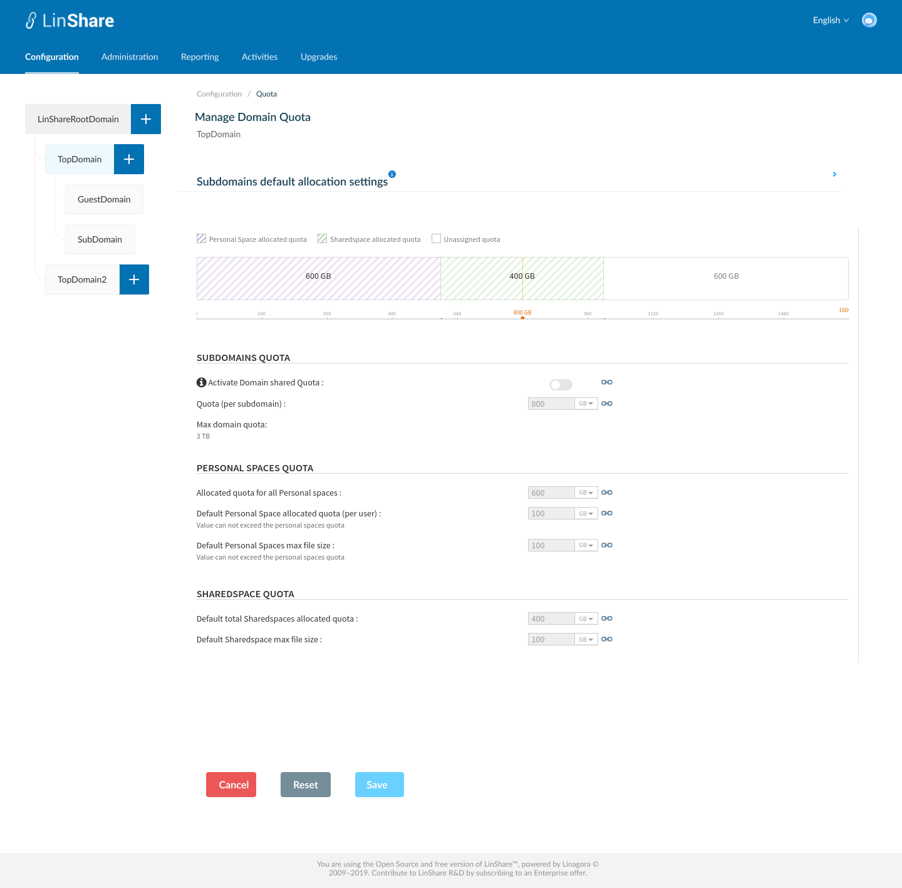
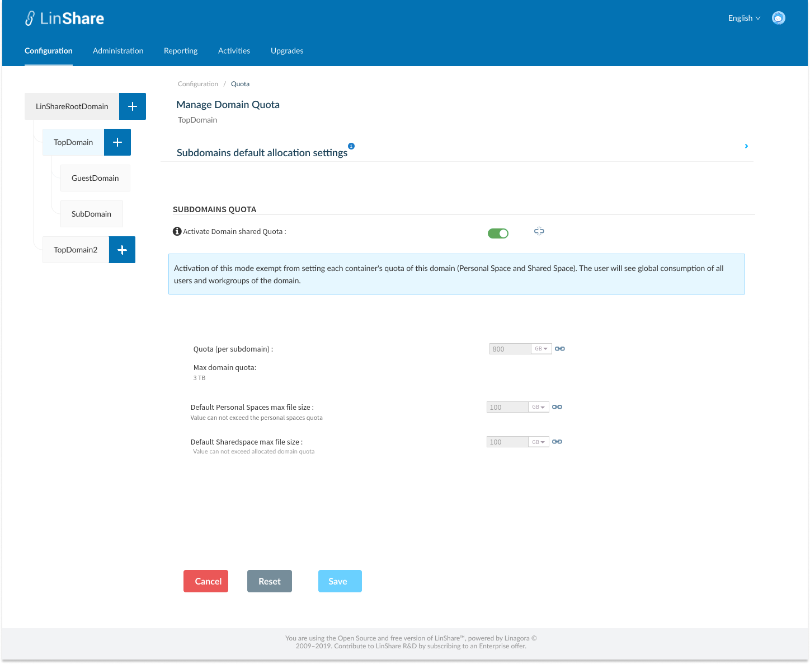

# Summary

* [Related EPIC](#related-epic)
* [Definition](#definition)
* [UI Design](#ui-design)
* [Misc](#misc)

## Related EPIC

* [New admin portal](./README.md)

## Definition

#### Preconditions

- Given that I am Root admin of LinShare
- I logged in to LinShare new admin portal
- I select Top domain in Domain tree and go to Configuration tab on top navigation bar.
- I click on Quota, the screen setting domain quota for top domain will be opened.

#### Description

- On Screen Manage domain quota for top domain, I can see 3 links to 3 seperate pages :

1. Domain quota and used space
- When I click on icon "i", there will be a collapsible legend: "This section allows you to manage the current domain quota size and setup it as on your need.  The quota of top-domain cannot be greater than root domain quota. The used space of top domain is sum of all sub-domains used space.".
- Domain quota [DQ-TOP]: The default value will be inherited from default allocation setting of root domain. I can click on icon break to edit the default setting. 
- I can input only number that >0 and select size unit from the drop-down list: B/KB/MB/GB/TB/PB/EB/ZB/YB
    - When I change the size unit, the number is also updated accordingly. For e.g the field is currently 1 TB. I change the unit to "GB", then the number is automatically changed to "1000". We have 1TB = 1000 GB.
    - Value of this field is used as the max value of max domain quota in Subdomains default allocation settings section below.
- I can see the text that displays max domain quota and default subdomain quota 
- Chart: This chart presents 3 components of Domain quota: Current domain used space, Sub-domains used space, Remaining space and unallocated space
- Maintenance mode: When this is activated, user cannot upload file to this Domain, both in Myspace and Shared Space.

2.  Allocation within the current domain (Containers)
- When I click on icon "i", there will be a collapsible legend: "Quota in a domain is managed by containers. Currently we have 2 containers: 
   - Personal spaces: Manage the allocated space for all users'space
   - Shared spaces: Manage the allocated space for all sharedspace (workgroups and workspaces)"
- I can see a toggle: "Activate domain Shared quota": When I click on icon "i", I can see an explanation tooltip: "Activation of this mode exempt from setting each container's quota of this domain (Personal Space and Shared Space). The user will see global consumption of all users and workgroups of the domain."
- All settings in this section are inherited from the Sub-domain default allocation setting of root domain. I can click on icon break to edit default settings.

2.1 When the toggle "Activate domain Shared quota" is disabled, I can see a chart and three setting parts:

- Personal space quota:
    - Total Personal spaces allocated quota [PSQ-TOP]: This is the total quota of all users's personal space (My space) in this top domain
        - I can input only number that >0 and select size unit from the drop-down list: B/KB/MB/GB/TB/PB/EB/ZB/YB
        - When I input a value > [DQ-TOP], there will be an error message: "The value should be below or equal to: [DQ-TOP]"
    - Personal Space allocated quota (per user): [PSQ-USER]
        - I can input only number that >0 and select size unit from the drop-down list: B/KB/MB/GB/TB/PB/EB/ZB/YB
        - When I input a value > [PSQ-TOP], there will be an error message: "The value should be below or equal to: [PSQ-TOP]"
    - Personal Spaces max file size:
        - I can input only number that >0 and select size unit from the drop-down list: B/KB/MB/GB/TB/PB/EB/ZB/YB
        - When I input a value > [PSQ-USER], there will be an error message: "The value should be below or equal to: [PSQ-USER]"
    - A chart: Presents the utilization of domain's personal spaces quota, including 3 values: Used Space , Remaining quota (= [PSQ-TOP]-used space), Unallocated space (= [DQ-TOP]- [PSQ-TOP])
    - Toggle "Maintenance mode": When this toggle is enabled, there will be a text:"Maintenance mode is activated, thereby preventing any uploads to be made within the Personal Spaces."
- SharedSpace quota:
    - Total ShareSpaces allocated quota [SSQ-TOP]: This is the total quota of all users's sharedSpaces in this top domain
        - I can input only number that >0 and select size unit from the drop-down list: B/KB/MB/GB/TB/PB/EB/ZB/YB
        - When I input a value > [DQ-TP], there will be an error message: "The value should be below or equal to: [DQ-TOP]"
    - SharedSpaces max file size :
        - I can input only number that >0 and select size unit from the drop-down list: B/KB/MB/GB/TB/PB/EB/ZB/YB
        - There is an instruction text below: Value can not exceed [SSQ-TOP]
        - When I input a value > [SSQ-TOP], there will be an error message: "The value should be below or equal to: [SSQ-TOP]"
    - A Chart present utilization of this top domain's sharedSpace quota, including 3 values: Used Space, Remaining quota (=[PSQ-TOP]-used space), Unallocated space (= [DQ-TOP]- [SSQ-TOP])
    -  Toggle "Maintenance mode": When this toggle is enabled, there will be a text:" Maintenance mode is activated, thereby preventing any uploads to be made within the SharedSpace".
- Container virtual allocation:
   - Chart: This chart represents Personal Space allocated quota, SharedSpace allocated quota and unallocated quota on a same bar
    - Top domain quota =  Personal Space allocated quota + SharedSpace allocated quota + Unallocated space
    - When Personal Space allocated quota + SharedSpace allocated quota > Top-domain quota, I can see the over limit amount on the chart
    - When I update any of the quota, the charts is updated accordingly

2.2 When the toggle "Activate domain Shared quota" is enabled:

- I can see a text displayed:" When domain shared quota is enabled, every user in this domain shares the same quota of the domain. Every upload from user will be calculated to Domain Share Quota, no matter My Space or Shared Space".
- Personal Spaces max file size" field:
    - I can input only number that >0 and select size unit from the drop-down list: B/KB/MB/GB/TB/PB/EB/ZB/YB
    - There is an instruction text below: Value can not exceed allocated domain quota
    - When I input a value > [DQ-TOP], there will be an error message: "The value should be below or equal to:  [DQ-TOP] "
- SharedSpace max file size :
    - I can input only number that >0 and select size unit from the drop-down list: B/KB/MB/GB/TB/PB/EB/ZB/YB
    - There is an instruction text below: Value can not exceed allocated domain quota
    - When I input a value > [DQ-TOP], there will be an error message: "The value should be below or equal to: [DQ-TOP]]"

3. Subdomains default allocation settings 
- Subdomains default allocation settings in top domain is inherited from Subdomains default allocation settings of Root domain
- The same rules are also applied
- In each setting, I can click icon break to edit the default setting

#### Postconditions

- When I click button Save, If there is no error, there will be a successful notification
- The updated information will be saved and applied for nested domains.
- If after updating, the settings in root domain conflicts with current setting of nested domain, the error symbol will be shown in domain tree and in every detail setting.
- After I override default setting, I can click icon break next to that setting to reset it to default setting.
- When I click button Reset, all default settings from parent domain will be applied for current domain.
- I can click on the link :"Allocate quota for specific user", then I am navigated to User list screen
- I can find a user then set up quota for that user. Otherwise, the quota of each user will be inherited from its domain setting.

[Back to Summary](#summary)

## UI Design

#### Mockups

#### Final design

[Back to Summary](#summary)
## Misc

[Back to Summary](#summary)
