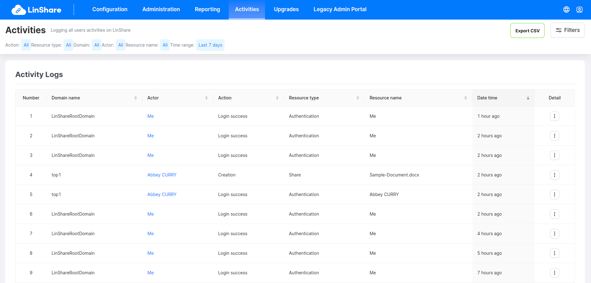

# Summary

* [Related EPIC](#related-epic)
* [Definition](#definition)
* [UI Design](#ui-design)
* [Misc](#misc)

## Related EPIC

* [New admin portal](./README.md)

## Definition

#### Preconditions

- Given that I am Nested admin or Root admin of LinShare
- After log-in successfully to  Admin Portal, I select Activities Tab

#### Description

**1. Filter audit log**

In this view, I can see default filters: Action, Ressource type, Domain, Actor, Resource name, Time Range:

1. Filters audit log include:
- Domain: A drop-down list
- Time range: A drop-down list and a date rage
- Resource type: A drop-down list listing all resource groups of audit logs
- Resource name: An auto-complete listing all resource name of audit logs
- Actor: An auto-complete listing all auth user by email or uuid
- Action: An auto-complete listing all logs actions

- I can filter audit logs by one of above criteria or combine them
- Each search criteria in the search bar is seperated by a delete icon. I can click this icon to delete the criteria
- I can also click button Clear filter to delete all current selected filter

**2. Display the result**

- After selecting filter, I click button Enter, the system will execute searching audit logs with selected filter conditions and display the result below, including columns:
    - Order
    - Domain
    - Actor: When I hover actor name, his email is showned 
    - Action
    - Resource type
    - Resource name
    - Date time: When I hover the date, there will be a popover that displays detail date - time
    - Details: When I click on 3-dot button, a detail popup of audit log is shown
- The filters are handled by back-end.
- In the result table, if the resource type are: File, Share, Workgroup file, Workgroup file (version), then there will be a column "Size" in the result table to display file size 
- If the resource type: "Share" is included in the filters, in result screen I can see recipient's email column: Recipient 

#### Postconditions

- With filters Resources type and Action, user can select multiple options and the search operator for these 2 filters is "Or"
- With filter Actor and Resource name, user can only search by one option
- The audit logs list will be paginated with default row is 25, I can change the number at the bottom of page.
- In the audit log table, I can sort ascending and descending in each column
- Default sort is latest date time column
- If I select option All domains, the result will show logs of my domain and my all nested domains

[Back to Summary](#summary)

## UI Design

#### Mockups

#### Final design

[Back to Summary](#summary)
## Misc

[Back to Summary](#summary)
