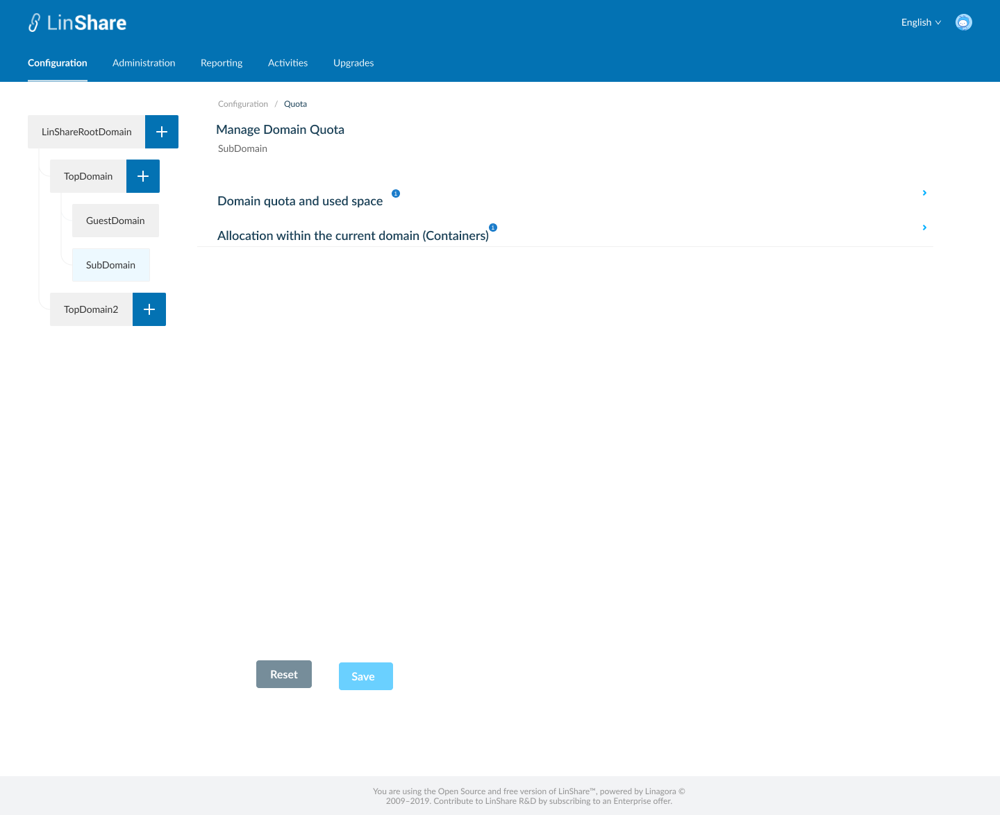
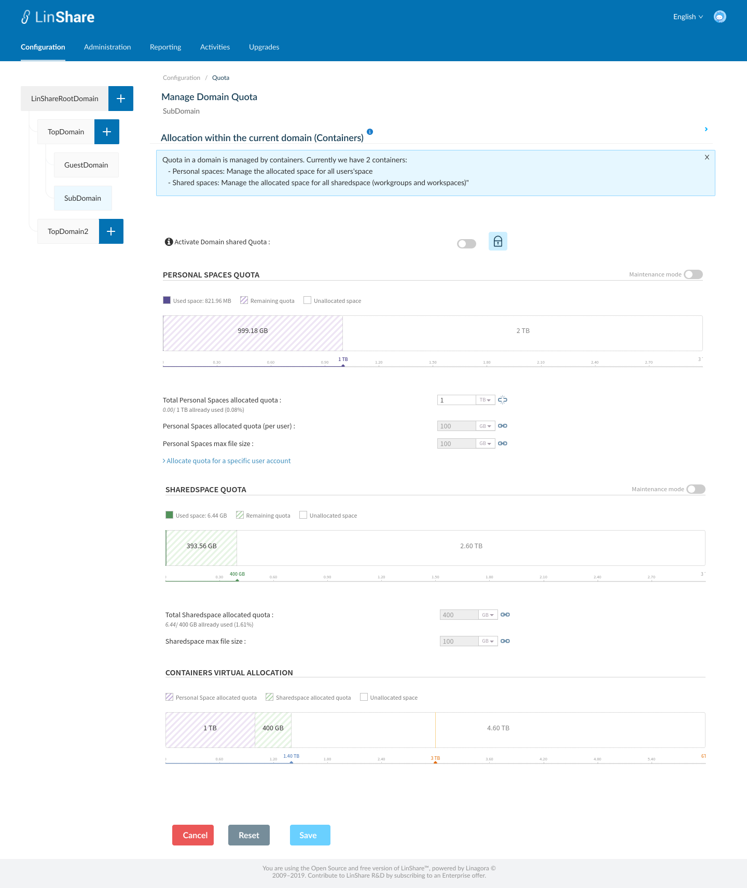
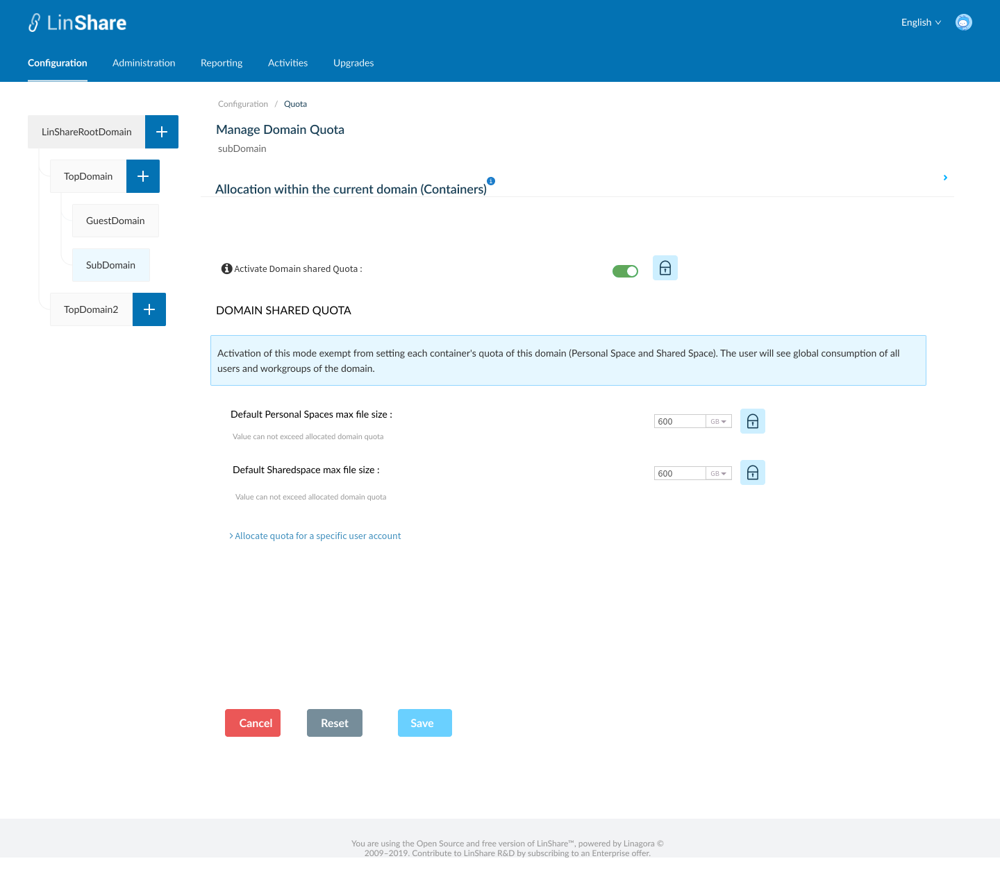

# Summary

* [Related EPIC](#related-epic)
* [Definition](#definition)
* [UI Design](#ui-design)
* [Misc](#misc)

## Related EPIC

* [New admin portal](./README.md)

## Definition

#### Preconditions

- Given that I am Root admin of LinShare
- I logged in to LinShare new admin portal
- I select Sub domain or Guest domain in Domain tree and go to Configuration tab on top navigation bar.
- I click on Quota, the screen setting domain quota for sub-domain/Guest domain will be opened.

#### Description

- On Screen Manage domain quota for sub-domain, I can see 2 links to 2 seperate screens: 

1.Domain quota and used space

- When I click on icon "i", there will be a collapsible legend: "This section allows you to manage the current domain quota size and setup it as on your need.  The quota of sub-domain cannot be greater than top domain quota.".
- Domain quota [DQ-SUB]: The default value will be inherited from default allocation setting of root domain. I can click on icon break to edit the default setting.
- I can see the text that displays max domain quota [DQ-TOP] 
- Chart: This chart presents 3 values: Current domain used space Remaining space and unallocated space
- Maintenance mode: When this is activated, user cannot upload file to this Domain, both in Myspace and Shared Space.

2. Allocation within the current domain (Containers)
- The setting rules are as same as Top domain settings 

#### Postconditions

- When I click button Save, If there is no error, there will be a successful notification
- The updated information will be saved
- After I override default setting, I can click icon break next to that setting to reset it to default setting.
- When I click button Reset, all default settings from parent domain will be applied for current domain.
- The setting for Guest domain is as same as setting for Sub-domain
- I can click on the link :"Allocate quota for specific user", then I am navigated to User list screen
- I can find a user then set up quota for that user. Otherwise, the quota of each user will be inherited from its domain setting.

[Back to Summary](#summary)

## UI Design

#### Mockups

#### Final design

[Back to Summary](#summary)
## Misc

[Back to Summary](#summary)
