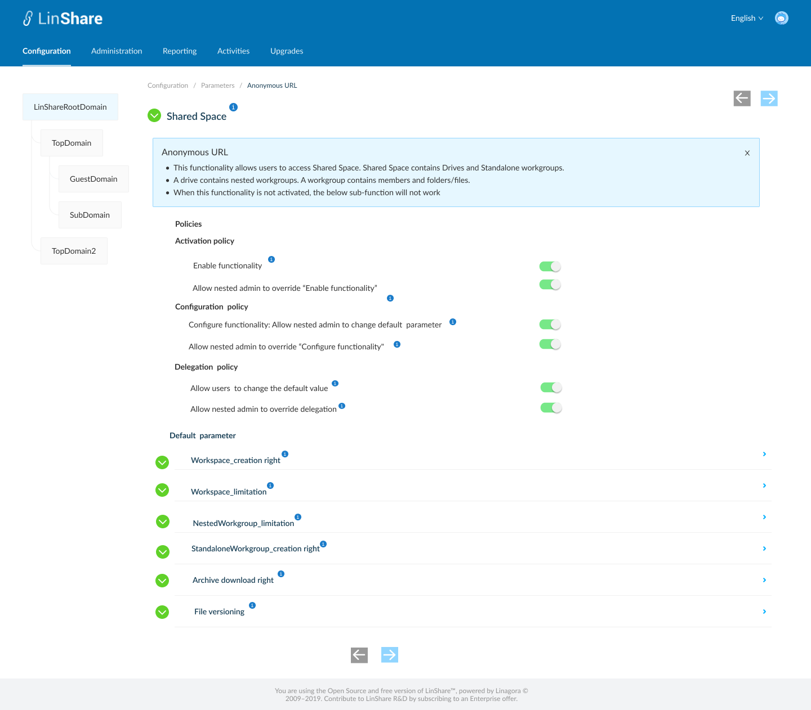

# Summary

* [Related EPIC](#related-epic)
* [Definition](#definition)
* [UI Design](#ui-design)
* [Misc](#misc)

## Related EPIC

* [New admin portal](./README.md)

## Definition

#### Preconditions

- Given that am super admin or nested admin of LinShare admin
- After log-in successfully, I go to Configuration Tab
- I click on Parameters, then select Shared Space, the screen setting for this feature will be opened.

#### Description

- In Share Space, there are 6 sub-functions. 4 current sub-functions are described in story [story 470](story-470-admin-can-manage-Drives-and-Standalone-workgroups-in-Shared-Space-Functionality.md)
- There is a new sub-function: Nested Workgroup limitation

**Sub-function: Nested Workgroup limitation**

- On the screen title, I can see a collapsible legend:" This functionality allows admin to set limitation for number of nested Workgroups that can be created inside a workspace in this domain"
- There are 2 policies and 1 parameter:
    - Activation policy includes 2 toggles:
        - Enable functionality: When I click on the icon "i", I can see a collapsible legend:
            - If this toggle is switched on, the number of nested workgroups that can be created inside a workspace in this domain will be limited. This limitation is counted by total number of nested workgroups inside a workspace in this domain. The limitation number will be set in the below parameter.
                - If the toggle is disabled, the number of nested workgroups that can be created inside a workspace in this domain will not be limited. Default behavior.
        - Allow nested admin to override "Enable functionality": Toggle. When I click on the icon "i", I can see a collapsible legend: " Once activated, nested admin can override the setting "Enable functionality" for his own domain. When disabled, the value of setting "Enable functionality" is applied for all nested domains and nested admin cannot update"
            - The rule is as same as toggle (1.2) in story 43. Admin manage function anonymous URL
    - Configuration policy includes 2 toggles:
        - Configure functionality: Allow nested admin to change the default parameter. When I click on the icon "i", I can see a collapsible legend: "By enabling, you allow your nested domain admin to change default parameter field in his domain".
            - The rule is as same as toggle (2.1) in story 43. Admin manage function anonymous URL
        - Allow nested to override "Configure functionality": When I click on the icon "i", I can see a collapsible legend:"By enabling, nested admin can re-enable the Configure functionality toggle and then change the default parameter"
            - The rule is as same as toggle (2.2) in story 43. Admin manage function anonymous URL
    -  Parameter: a text field, named "Max workgroups count"
        - When I click on icon "i",  I can see a collapsible legend: "Max number of nested workgroups that can be created inside a workspace in this domain".
        - I can only input number in this field. Default value : 5 

#### Post-conditions

- The rule is as same as Post-condition of Story 43. Admin manage function anonymous URL.
- On UI for user, When the number of nested workgroups inside a workspace in this domain reaches the limitation,  and a user clicks button Create new workgroup, there will be a message: "You have reached maximum number of workgroups inside this workspace. "
- At the time admin set the limitation of nested workgroups, if current number of workgroups inside a workspace exceeded the limitation, user cannot create new workgroup.

[Back to Summary](#summary)

## UI Design

#### Mockups

#### Final design

[Back to Summary](#summary)
## Misc

[Back to Summary](#summary)

