# Summary

* [Related EPIC](#related-epic)
* [Definition](#definition)
* [UI Design](#ui-design)
* [Misc](#misc)

## Related EPIC

* [New admin portal](./README.md)

## Definition

#### Preconditions

- Given that I am Nested admin or Root admin of LinShare
- After log-in successfully to  Admin Portal, I select Activities Tab

#### Description

**1. Filter audit log**
- In new view I can see 2 default filters: Domain and Date range:
  - Domain: A drop-down list
    - Default selection is All domains
    - When I click on the field, a drop-down list is displayed:
       - If I am a nested admin, the drop-down list contains my domain and my nested domain 
       - If I am root admin, the drop-down list contains all domains. 
    - I can see all of my nested domains and select any of them
  - Date range:
    - When I click on this field, I can select pre-defined period : Today, Yesterday, Last seven days, Last 2 weeks, Last 30 days, Last month, This month, Last 6 months
    - Or I can customize the start date and end date
- When I click on button Add filters, I can select additional filters: Resource type, Resource name, Action, Actor
- Resource groups: 
  - when I select this filter, there will be a drop-down list listing all resource groups of audit logs
  - There are 8 groups and each groups can contain multiple resource types:
     - Shared Space: Workspace, Workgroup, Workspace member, Workgroup member, Workgroup document, Workgroup folder, Workgroup revision
     - Myspace: Document
     - Upload request: Upload request, Upload request Group, Upload request URL, Upload request document
     - Share: Share entry, Anonymous share
     - Guest: Guest, Reset password 
     - Contact: Contact, Contact list
     - User: Account, Authentication, JWT token. 
     - Administration: Domain, User filter, Workgroup filter, Workspace filter, Functionality
  - I can select one or multiple resource types from the list, then it will be displayed as a filter criteria in the row below as: "Resource type: [ selected option1 ] or [selected option2 ] or ..." and a delete icon next to it.
  - If I click enter, the system will search all the audit logs that belong to selected resource type.
- Resource name:
  - When I select this filter, there will be a dialog that allow me to input text amd click button Apply
  - Then it will be displayed as a filter criteria in the row below: "Resource name: inputted text" and a delete icon next to it.
  - If I click  Enter, the system will search all the audit logs that  has resource name contains inputted text.
- Action:
  - when I select this filter, there will be a drop-down list listing all actions of audit logs
  - I can select one action from the list, then it will be displayed as a filter criteria in the row below as: "Action: [ selected option1 ] or [ selected option2 ] or ..." and a delete icon next to it.
  - If I click enter, the system will search all the audit logs that belong to selected action
- Actor:
  - When I select this filter, there will be a dialog with a search field
  - when I input some characters in the search field, the system will display suggestion list and I can select one actor from the list. The actor list will include normal user, administrator, system
  - I can search actor by email or uuid
  - Then it will be displayed as a filter criteria in the row below: "Actor: selected user" and a delete icon next to it.
  - If I click  Enter, the system will search all the audit logs that were executed by the selected actor
- Auth user:
   - When I select this filter, there will be a dialog with a search field 
   - when I input some characters in the search field, the system will display suggestion list and I can select one auth user from the list.
   - I can search auth user by email or uuid
   - Then it will be displayed as a filter criteria in the row below: "Auth user: selected user" and a delete icon next to it.
   - If I click  Enter, the system will search all the audit logs which have auth user as selected.

- I can filter audit logs by one of above criteria or combine them
- Each search criteria in the search bar is seperated by a delete icon. I can click this icon to delete the criteria
- I can also click button Clear filter to delete all current selected filter

**2. Display the result**

- After selecting filter, I click button Enter, the system will execute searching audit logs with selected filter conditions and display the result below, including columns:
  - Domain
  - Actor
  - Action
  - Resource type
  - Resource name
  - Date: When I hover the date, there will be a popover that displays detail date - time 
  - Details

#### Postconditions

- With filters Resources type and Action, user can select multiple options and the search operator for these 2 filters is "Or" 
- With filter Actor and Resource name, user can only search by one option 
- The audit logs list will be paginated with default row is 25, I can change the number at the bottom of page.
- In the audit log table, I can sort ascending and descending in each column
- Default sort is latest date time column
- If I select option All domains, the result will show logs of my domain and my all nested domains

[Back to Summary](#summary)

## UI Design

#### Mockups

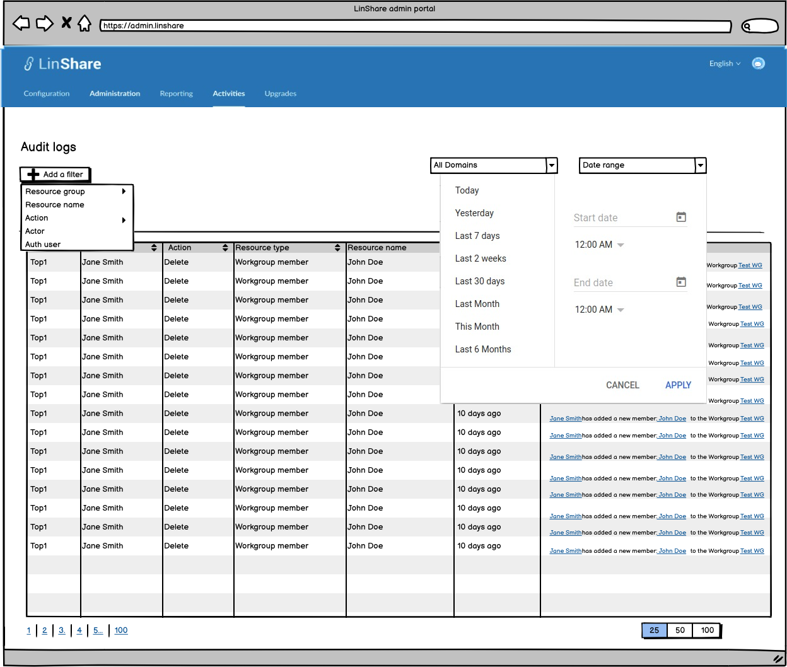
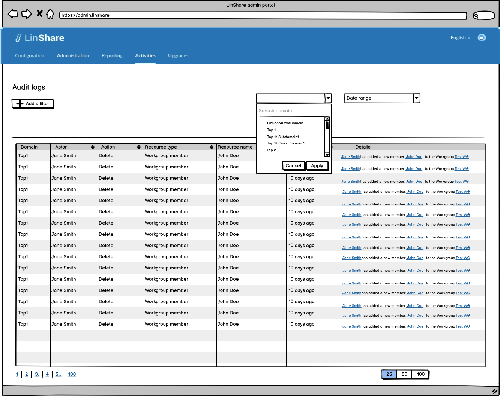
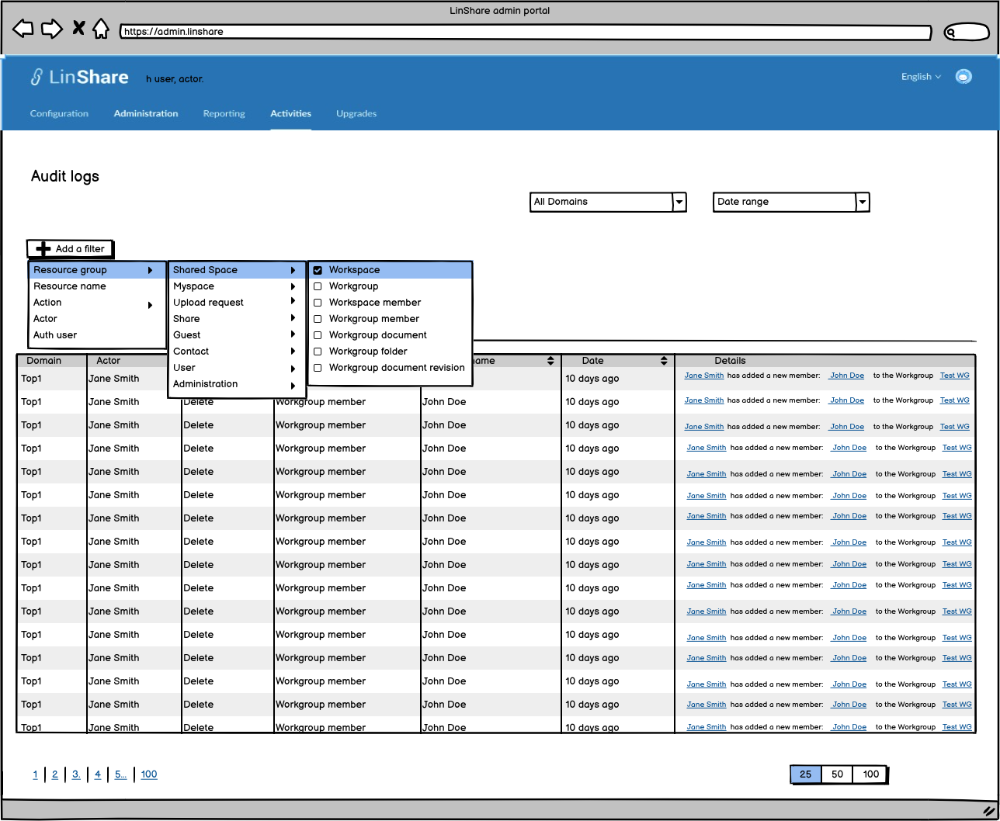
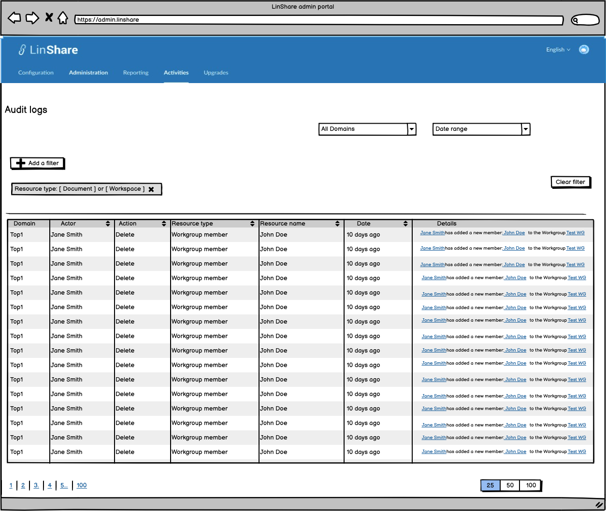
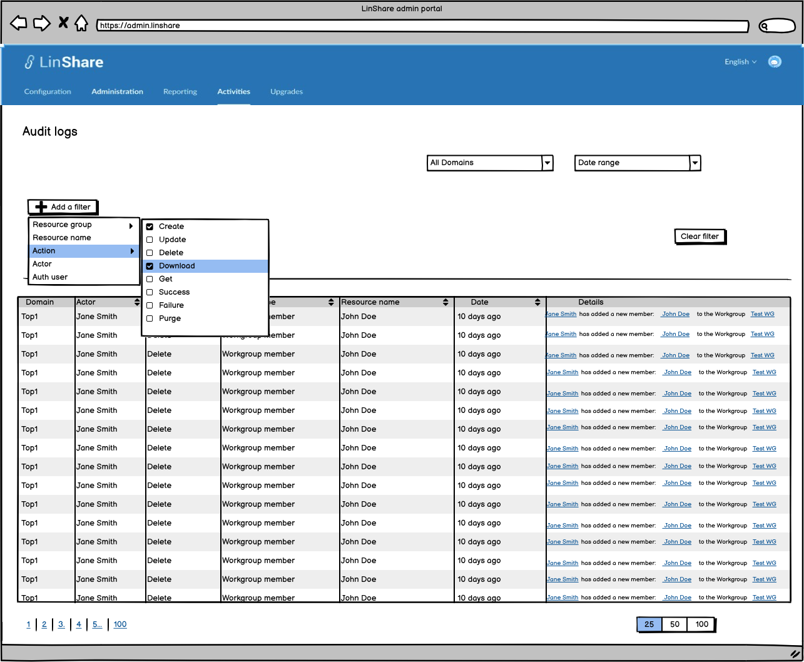
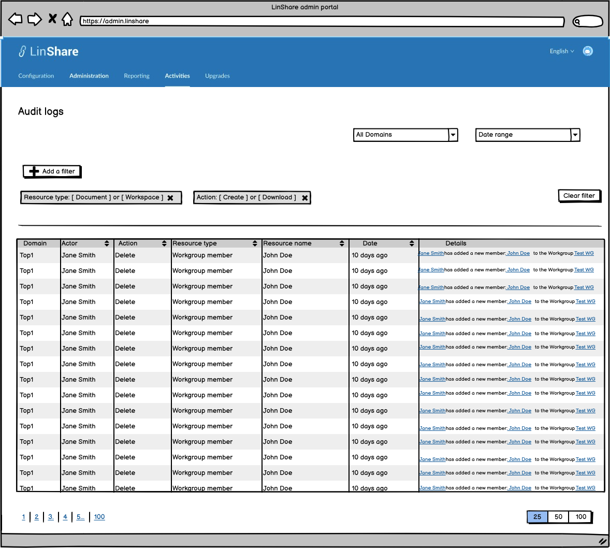
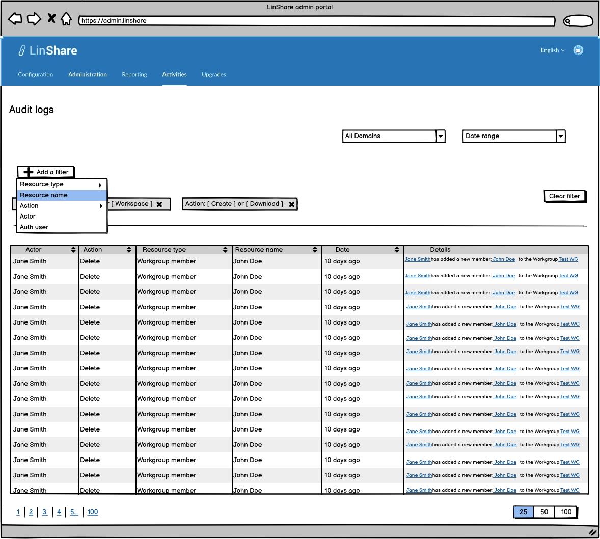
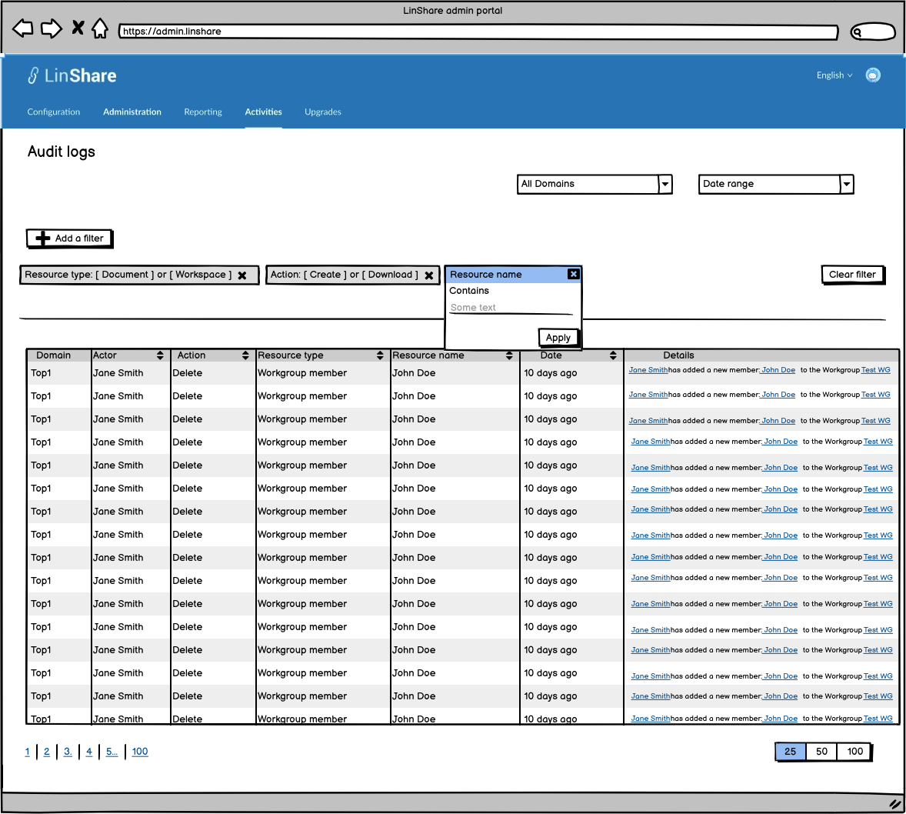
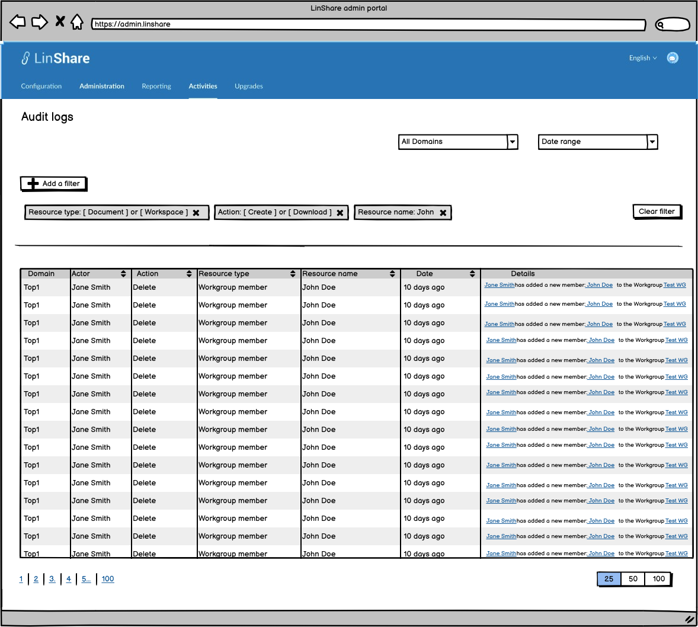
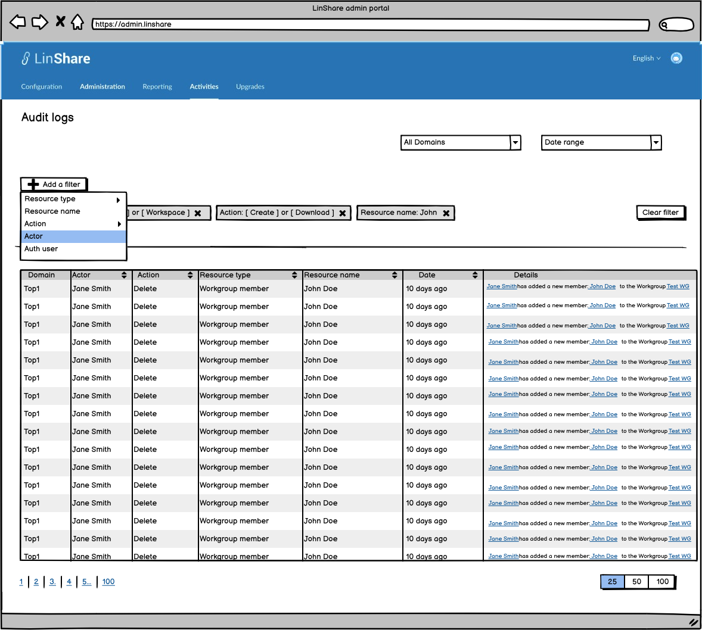
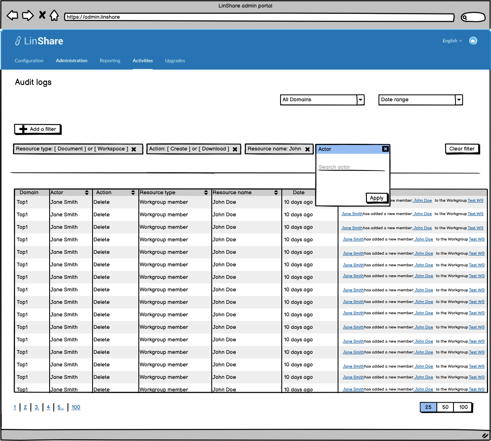

#### Final design

[Back to Summary](#summary)
## Misc

[Back to Summary](#summary)
