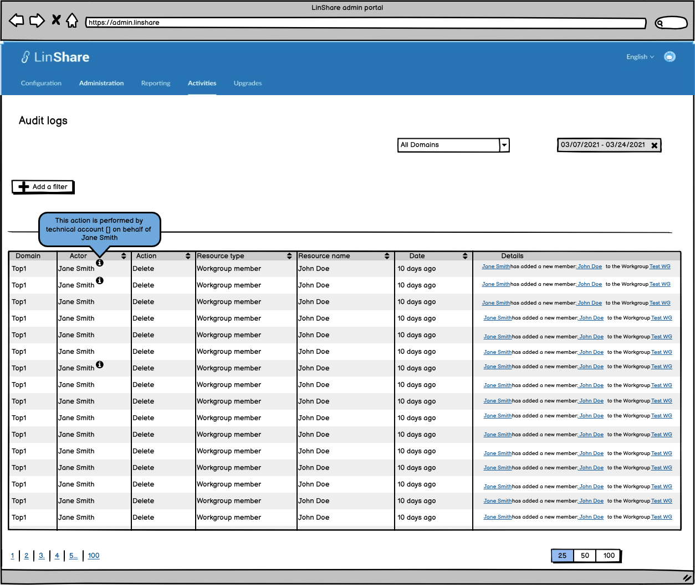

# Summary

* [Related EPIC](#related-epic)
* [Definition](#definition)
* [UI Design](#ui-design)
* [Misc](#misc)

## Related EPIC

* [New admin portal](./README.md)

## Definition

#### Preconditions

- Given that I am Nested admin or Root admin of LinShare

#### Description

- After log-in successfully to  Admin Portal, I selec History tab 
- I input some filter criteria and click enter
- The result will be displayed in the list below
- In column "Actor", I can see the name of the actor
- In LinShare, one action can be performed by:
   - A user who logs-in his account in User UI and perform the action on his own. The actor field will display user's name
   - An Administrator who logs in his Admin UI anf perform an action. In this case, the actor field will display "Administrator" 
   - A Technical account who performs the action on behalf of a user that he has been delegated. In this case, auth user will be different with actor.
- When an action is performed by a technical account, the actor displayed in the trace list is the name of the user. There will be an information icon next to actor name, 
If I hover/click on this icon, there will be a popover:" This action is performed by [technical account's name] on behalf of [user name]

#### Postconditions

[Back to Summary](#summary)

## UI Design

#### Mockups

#### Final design

[Back to Summary](#summary)
## Misc

[Back to Summary](#summary)
