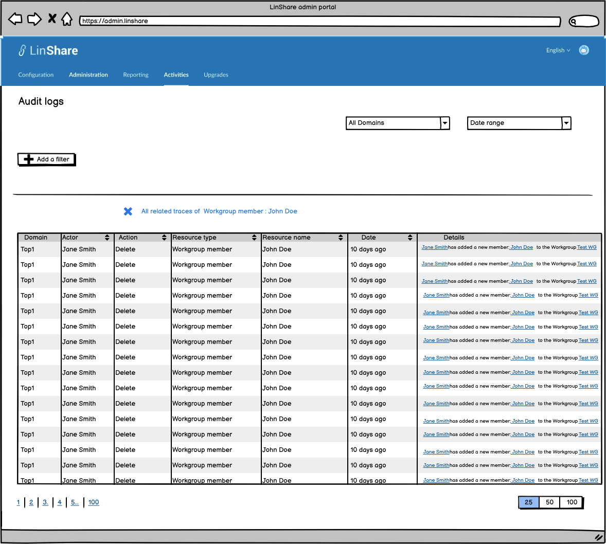

# Summary

* [Related EPIC](#related-epic)
* [Definition](#definition)
* [UI Design](#ui-design)
* [Misc](#misc)

## Related EPIC

* [New admin portal](./README.md)

## Definition

#### Preconditions

- Given that I am Nested admin or Root admin of LinShare

#### Description

- After log-in successfully to  Admin Portal, I select Activities tab
- I input some filter criteria and click enter
- The result will be displayed in the list below
- On Detail description column, the actor and resource name are hyper-link, when I click on the link, it will open resource detail (if any). 
- When I click on a specific resource or hover the resource, there will be a popover with option: "View all related traces "
- When I select this option, the system will search and display all related traces of that specific resource:
   - The condition for the trace to appear on this list is because some other resources consider this resource as related (see 'relatedResources' backend field)
    - For example: When a guest account is updated the name from "A" to "B"
      - Currently, in the Activities list, If user search for resource name "A", he only sees the traces that have resource name "A" and he cannot see all events of that guest after the guest's name is changed
      - Now, when user click "View all related activities" of guest "A', he can see any activity related to that resource ID, no matter that the guest's name has changed.
    
#### Postconditions

- When I select option :"View all related traces", all current filters will be cleared
- On result screen View all related traces of the resource, I can click the button Close to back to the default screen.

[Back to Summary](#summary)

## UI Design

#### Mockups

#### Final design

[Back to Summary](#summary)
## Misc

[Back to Summary](#summary)
