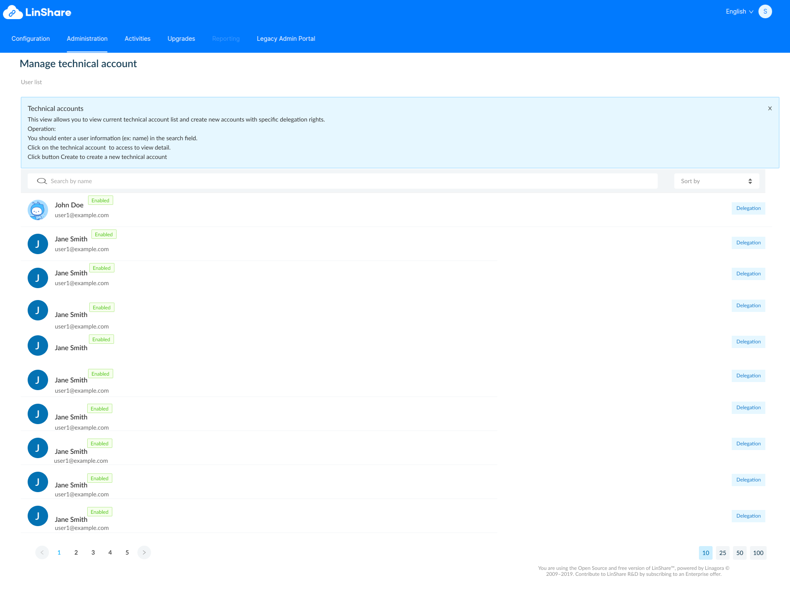
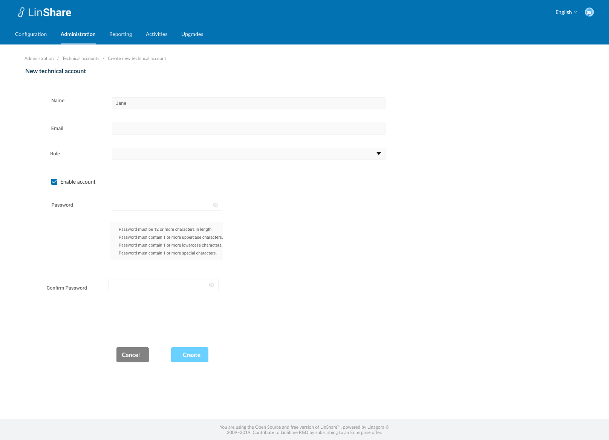
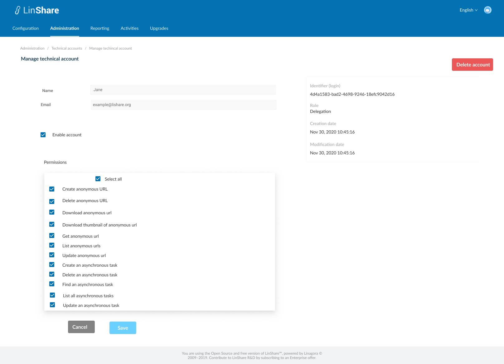
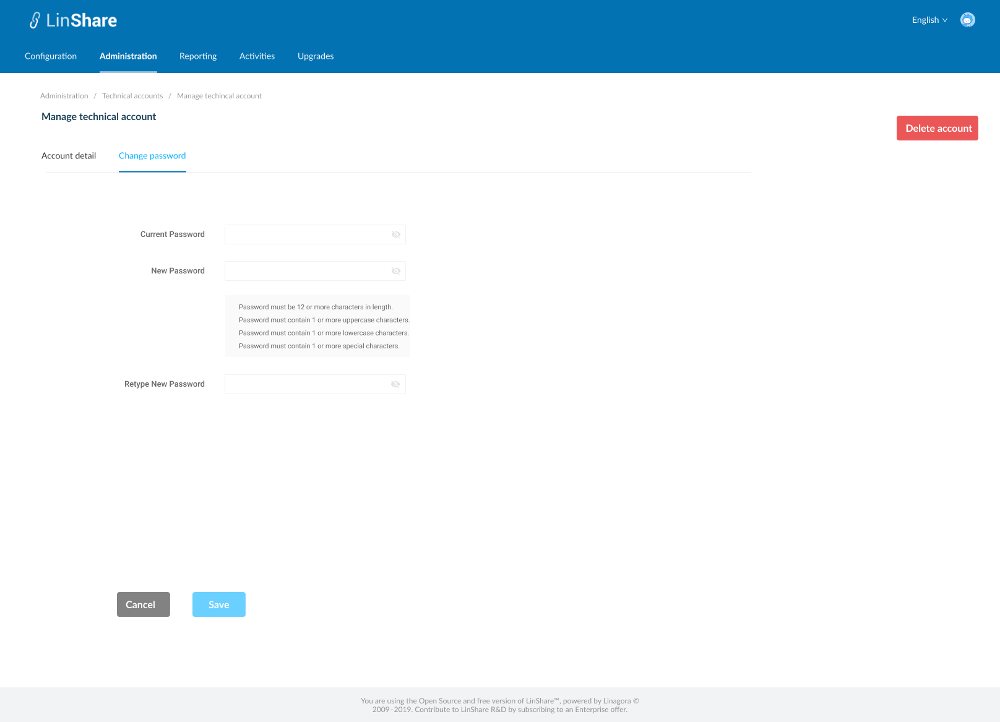

# Summary

* [Related EPIC](#related-epic)
* [Definition](#definition)
* [UI Design](#ui-design)
* [Misc](#misc)

## Related EPIC

* [New admin portal](./README.md)

## Definition

#### Preconditions

* Given that I am root admin of LinShare
* After log-in successfully to Admin portal, I select menu Administration => Technical account 
* The screen listing technical accounts will be displayed 

#### Description

**UC1. View and filter technical account list**

*  In The screen Technical account  list, I can see:
    * Information tooltip: When I click on the icon information, a page description will be shown, then I click on the icon again, the description will be collapsed.
    * Technical account list including:
        * User icon
        * Name 
        * Email 
        * Status: Enabled or disabled
        * Role: Currently there is only 1 role : Delegation
        * Locked account: If the account has been locked, there will be a label. 
* A search bar
* A sort field
* When I click on the search bar, there will be a drop-down list of search criteria including:
    * Status: When select this search criteria, the search bar will display: Status = "dropdown list" The options are: Enabled/Disabled. I select one status, the search tag is completed with a delete icon.Then I click enter the system will search technical account which have selected status.
    * Name: When I select this search criteria, the search bar will display: Name contains = "text input". I click Enter, the search tag is completed and an icon Delete. Then I click enter the system will search technocal accounts which have field Name contains text inputted.
    * Identifier: When I select this search criteria, the search bar will display: Id = "text input". I click Enter, the search tag is completed and an icon Delete. Then I click enter the system will search technical accounts which have id contains  inputted text. 
    * Locked account : When I select this search criteria, the search bar will display: Locked account  = "dropdown list". with options Yes/No. I select one option, the search tag is completed with a delete icon.Then I click enter the system will search technical account which have been locked or unlocked.
* When I start typing on search bar, the system will show default search criteria is email 
- I can search technical account by one of above criteria or combine them
- Each search criteria in the search bar is seperated by a delete icon. I can click this icon to delete the criteria
- After select one criterion in search bar, that option is hidden in the dropdown list of search criteria.
* When I click on Sort field, there will be drop-down list containing sort criteria: Name, Email, Creation date, Modification date.
* I can select sort criteria from the list and use the arrow up and down to change order of sorting.
* The default number of displayed items is 25, I can change the number of items at the bottom of page.

**UC2. Create a technical account**

- On listing technical account screen, I click on button "Create", the screen Create new technical account will be displayed.
- On this screen, I can input fields:
   - Name: Mandatory, text field 
   - Email: Mandatory, text field
   - Role: A drop-down list. Currently, there is only 1 role: Delegation and it is selected by default 
   - Checkbox: Enable/Disable account
   - Password field: A text field. When I finish inputting this field, the system will check if the password is in compliance with the rules and display error messages if any.
   - Confirm password: This field must be as same as Value of field Password above 
- After I input all field and click button Create, system will validate, if there is no error, the account is created successfully with a toast message 
- If there is any blank field, it will be highlighted in red with an error message
- If the email is already existing in the system, there will be an error message
- If the password is not correct, the help message will be highlighted in red 
- If the value of  "Confirm password" is not matched with "Password", there will be an error message 

**UC3 Edit a technical account**

- On the technical account list, I select one account then the screen Account detail will be opened 
- On this screen I can see 2 tabs: Account detail and Change password
- On the first tab Account detail, I can see: 
- None-editable information includes:
   - Identifier: This field is generated by the system and is used to log-in 
   - Role
   - Creation date
   - Modification date 
- Editable fields includes:
   - Name
   - Email
   - Checkbox: I can tick/un-tick the checkbox to enable/disable account
- Permissions: This includes a list of all available permissions for this user's role. I can select/unselect checkbox of each permission on the list 
- When I click button Save, the system will validate if there is no error, the updates are saved 
- On the second tab Change password, I can see 3 fields:
   - Current password
   - New password
   - Retype new password
   - After I input 3 fields and click button Save, the system will validate: 
     - If the current password is correct 
     - If the New password is complied with the rule above 
     - IF the Re-type new password is matched with New password 
   - If there is no error, the new password is saved and there will be a notification message 

**UC4. Delete a technical account**
- Delete 1 account: 
   - On Account detail screen, I can see a button Delete
   - When I click on this button, there will be a confirmation popup: You are about to delete this technical account, this procedure is irreversible. Do you want to proceed??"
   - If I choose Yes, the account is removed and I am back to the listing technical account screen.
- Delete multiple account:
   - On Listing account screen, I can select multiple account and see option Delete
   - When I select Delete, there will be a confirmation popup.
   - If I choose Yes, all selected account will be removed from the list

**UC5. Lock/unlock a technical account**

- When a technical account log-in unsuccessfully several times, the account will be locked by the rule:
   - After 3 attempts : account is locked for 10 minutes. 
   - After 6 attempts : account is locked for 20 minutes. 
   - After 9 attempts : account is locked for 60 minutes (1 hour)
   - After 12 attempts : account is locked for 1440 minutes (1 day)
   - After 15 attempts : account is locked indefinitely.

- After locking period, the account will be unlocked automatically, except fot the case locking indefinitely.
- Unlock a single account:
   - When a technical account is locked, when I open detail screen of that account on admin portal, I can see a message "This user is locked due to many failed login attempts" and a button Unlock
   - When I click on this button, the account is unlocked.

- Unlock multiple accounts: 
   - On listing account screen, If I select multiple locked accounts, the option Unlock will be enabled.
   - I select Unlock, all selected account will be unlocked. 

#### Postconditions

- When a technical account is created successfully, an identifier is generated for that account and user can use this information with password to log-in.
- This technical account can perform action on behalf of any user in the platform. The permissions can be edited after account creation. 
- After account deletion, user cannot use information of that account to log-in to LinShare on behalf of other user
- When an account is disabled, he cannot log-in to LinShare 

[Back to Summary](#summary)

## UI Design

#### Mockups

#### Final design

[Back to Summary](#summary)
## Misc

[Back to Summary](#summary)
