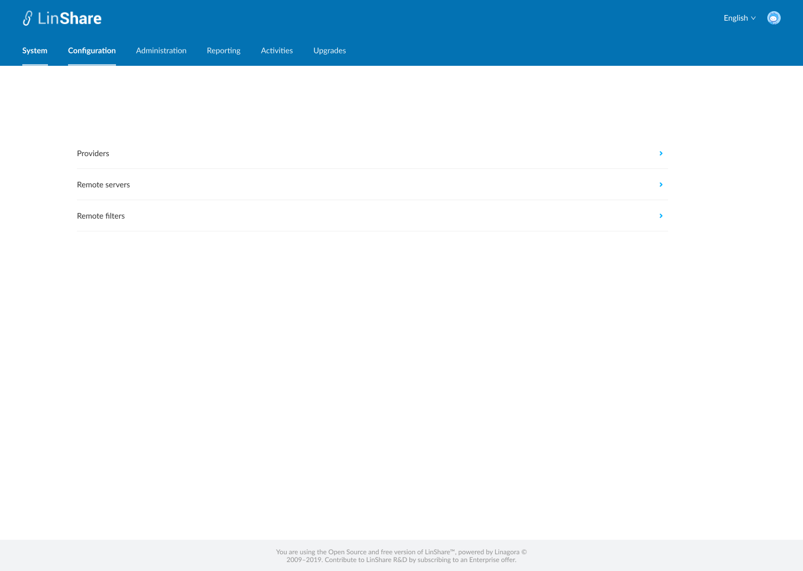
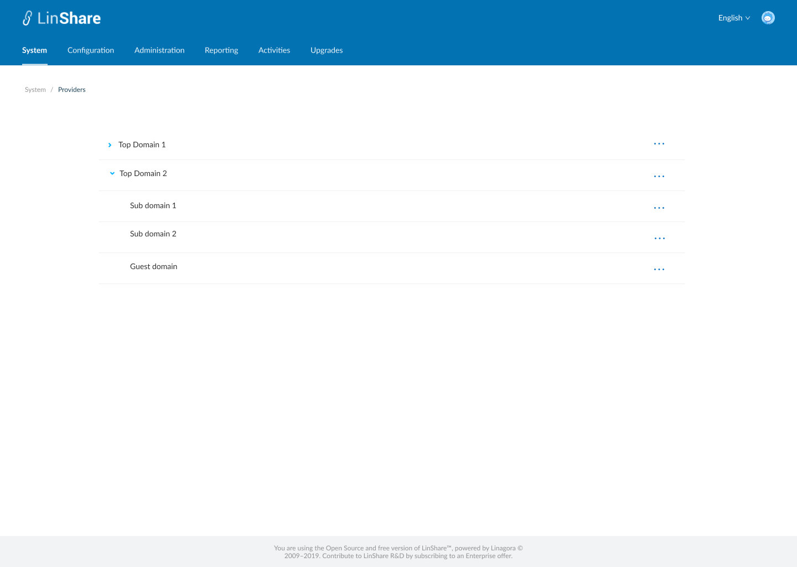

# Summary

* [Related EPIC](#related-epic)
* [Definition](#definition)
* [UI Design](#ui-design)
* [Misc](#misc)

## Related EPIC

* [New admin portal](./README.md)

## Definition

#### Preconditions

* Given that I am root admin of LinShare
* I log-in successfully to Admin portal

#### Description

- I can see a new menu tab: System
- When I click on this tab, I can see 3 items: Remote servers and Remote filters, Providers 
- When I select Remote servers, the screen listing remote servers will be opened and I can create, edit ,delete... remote servers as currently. 
- When I select Remote filters, I can see 3 options User filters, Group filters and Workspace filters. I can select one of them then go to that remote filter listing screen and I can create, edit ,delete... remote filters as currently.
- When I select Providers, I can see the list of Top domains:
   - I can click on chevron icon to see the nested domains 
   - On each domain in the lít, I can see an option "See Providers"
   - and when I click on this option, The screen Provider listing of that domain will be opened and I can create, edit ,delete... user providers/workgroup provider/workspaces providers as currently.

#### Postconditions

- The domain tree will not be available 
- Only root admin can see the tab: " System ", nested admin can not see/access to this tab 
-  
[Back to Summary](#summary)

## UI Design

#### Mockups

#### Final design

[Back to Summary](#summary)
## Misc

[Back to Summary](#summary)
