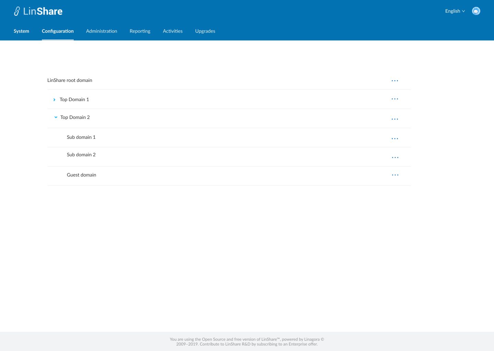

# Summary

* [Related EPIC](#related-epic)
* [Definition](#definition)
* [UI Design](#ui-design)
* [Misc](#misc)

## Related EPIC

* [New admin portal](./README.md)

## Definition

#### Preconditions

* Given that I am root admin or nested admin of LinShare
* I log-in successfully to Admin portal

#### Description

**UC1. See the list of child domains**

- I click on Configuration tab: 
- On this page, I can see the list of domains:
- If I am root admin, I can see every domain in the whole platform
- If I am nested admin, I can see my own domain and nested domain (if any)
- I can open/expand the domain list to see nested domains
- In each domain, I can see a three-dot button that when I click on, there are options:
   - View domain detail
   - Create a child domain: Only root admin can see this option
   - Settings

**UC2. Delete multiple domains**

- Only root admin can delete domains
- On the listing domain screen, I can select multiple domains 
- There will be a button "Delete"
- When I click on this button, there will be a confirmation popup.
- If I choose Yes, all selected domains will be removed from the list
- When I select a domain to delete, its nested domains must be selected too. 

#### Postconditions

[Back to Summary](#summary)

## UI Design

#### Mockups

#### Final design

[Back to Summary](#summary)
## Misc

[Back to Summary](#summary)
