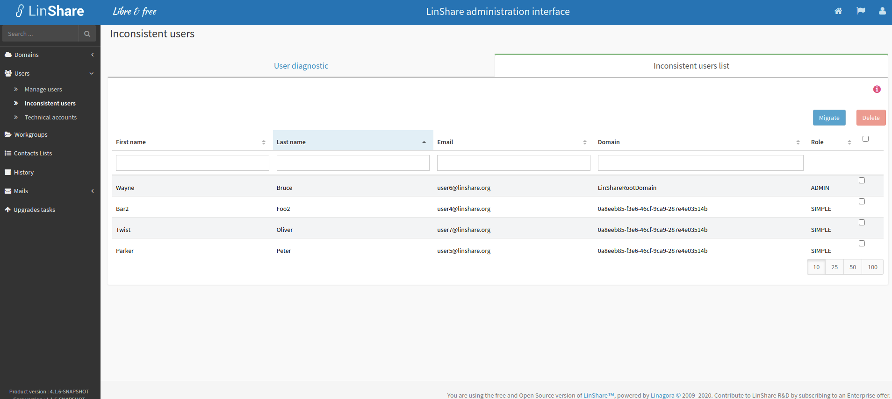

# Summary

* [Related EPIC](#related-epic)
* [Definition](#definition)
* [Screenshots](#screenshots)
* [Misc](#misc)

## Related EPIC

* [New admin portal](./README.md)

## Definition

#### Preconditions

*  Given that am root admin

#### Description

* After log-in Admin portal successfully, I select Administration tab
* Then I select Inconsistent users
* On this screen, there will be 2 tabs: USer diagnostic and Inconsistent user list, I select "Inconsistent users list"

**UC1. View the list of inconsistent users**
- On this tab, I can see a help text: " An inconsistent user is a user who is no longer in any LDAP associated to different domains. This view enables the domain of an inconsistent user so that he become a regular user.
Through a user's result, you can edit the information related to him. By selection of a group of users, you can delete them all at one or change their domain."
- A consistent user is a user that exists in DB of a domain but not exist in LDAP server of that domain
- All inconsistent users of the whole platform will be displayed in the below list:
- The list includes:
    - Full Name and email address of user
    - Domain name and ID: Name of the domain in DB that user is currently associated to

- In the result report of an email , when I click on 1 row:
    - If the email exists in DB/GUEST, the user profile page in the domain of selected row will be displayed.
    - If the email exists in LDAP server but not exist in DB/GUEST, there will be a message: "This user does not have a LinShare profile. Would you like to create it in the database ?". If I choose Yes, user'profile will be created in DB and the Profile page of user will be displayed. If I choose No, the popup closes and I will not see the User profile in that domain.
    - A user can exist ins different domains in DB

**UC2. Search inconsistent user**
- In the list of inconsistent users, I can see a Search field
- I can search by different criteria: First name, Last name, Email, Domain's name, domain ID
- After I select and input search criteria then click Enter, the result will be displayed in the list. 

**UC3 Migrate user to another domain**
- In the list of inconsistent user, I can select one or multiple user, then the actions bar will be enabled
- Action bar includes button Migrate, Delete, I select action Migrate 
- There will be a field "New domain" with a drop-down list of all available top domains and sub-domains.
- I select one domain in the list and click button Apply
- If the selected domain is current domain, or the user already exists in the targeted domain, there will be a notification message: "user already exists in the targeted domain"
- If the user has not existed in the targeted domain, the user will be migrated to the new domain and no longer exists in the old domain. There will be a successful notification message.
- In the user's profile page, the domain name will be updated to new domain.
- When a user is migrated to a new domain, if that email also exists in LDAP server of that new domain, he will no longer a consistent user and will be disappeared from the inconsistent user list

**UC4. Delete consistent user**

- In the list of inconsistent user, I can select one or multiple user, then the actions bar will be enabled
- Action bar includes button Migrate, Delete, I select action Delete
- There will be a confirmation popup
- If I choose Yes, the selected users will be deleted from the DB and will disappear from the inconsistent user list.

[Back to Summary](#summary)

## UI Design

#### Screenshots

#### Final design

[Back to Summary](#summary)

## Misc

[Back to Summary](#summary)
