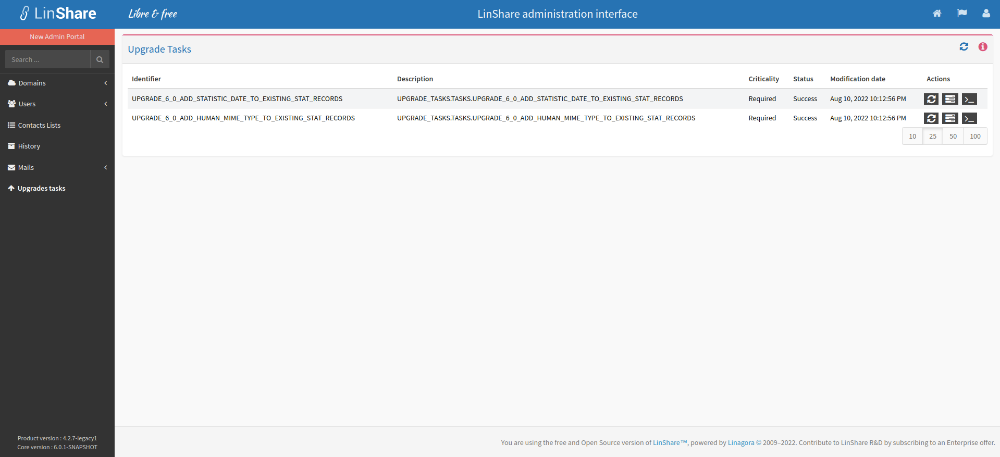
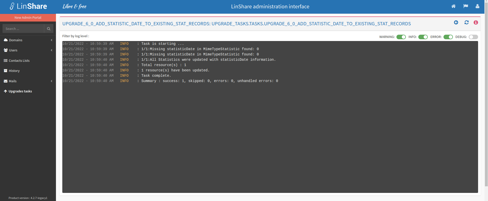

# Summary

* [Related EPIC](#related-epic)
* [Definition](#definition)
* [UI Design](#ui-design)
* [Misc](#misc)

## Related EPIC

* [New admin portal](./README.md)

## Definition

#### Preconditions

* Given that I am root admin of LinShare
* I log-in successfully to Admin portal

#### Description

**UC1. View the list of upgrade tasks**

- I click on Upgrade task
- There will be an explanation text about the upgrade task:
   - Utility: For upgrading from a minor version like 2.1.x to 2.2.x or a major version like 1.x to 2.0, it might be necessary to execute some additional tasks on the data in order to complete the software update. Remember: The update process always start by a SQL migration (exception of bugfix version, e.g.: 2.3.6).
   - Process : Those tasks shall be executed in order and finished in a success state.NB: A task can finish in a success state but some error might have appeared during the task execution. If so, it is required to check the execution logs displayed in the console view. If an error has appeared, it will be essential to view the Tomcat server logs for more details, resolve the issues and restart the task to continue.
   - Criticality: Every task have to be executed in order to complete the update. While some 'Mandatory' tasks are not done, it will be impossible for the users to use the system. While some 'Required' tasks are not done, the system will work in a downgraded mode. Some functionalities or data might not be accessible. Those tasks might be executed while the system is being used.
- A reload button on top of screen: When I click this button, the list will be reloaded.
- I can see the list of upgrade tasks in a table below with columns:
   - Identifier: The name of the task 
   - Description
   - Criticality: 
   - Status
   - Modification date
   - Actions: There are 3 actions: Retry upgrade task, Show previous execution, Show console
- When I click on Retry upgrade task, there will be a confirmation popup. If I choose Yes, the task will be run again in backend system.
- When the running task is finished, the log of that task will be displayed. 

**UC2. View the logs of an upgrade task**

- On the upgrade tasks list, I can click on Show console, it will display the latest console history of the task 
- When click action Show previous execution or click on one row/upgrade task on the table list, the screen that lists all executions of that task will be opened
- I can see an explanation helper text:
   - Migration task execution log: The logs of a migration task execution is logged here. With the console view, you can check the logs of it.
   Warning: It is simplified logs. To get the advanced details in case of errors, you will need to check the Tomcat server logs. A good practice is to set the LinShare software in debug mode before updating.
- I can also see buttons: Back to previous screen, Reload the list
- Each execution log will include information: Status, Creation date, Modification date, Duration, Action 
- On Action column, I click on button Show console
- Then the console log of that execution log will be displayed:
- I can see an explanation helper text: 
   - Migration task execution log.
     The logs of a migration task execution is logged here. With the console view, you can check the logs of it.
      Warning: It is simplified logs. To get the advanced details in case of errors, you will need to check the Tomcat server logs. A good practice is to set the LinShare software in debug mode before updating.
- I can also see buttons: Back to previous screen, Reload the screen
- The execution log will be displayed below with console view 
- I can filter by log level: WARNING, INFO, ERROR, DEBUG

#### Postconditions

[Back to Summary](#summary)

## UI Design

#### Screenshots

#### Final design

[Back to Summary](#summary)
## Misc

[Back to Summary](#summary)
