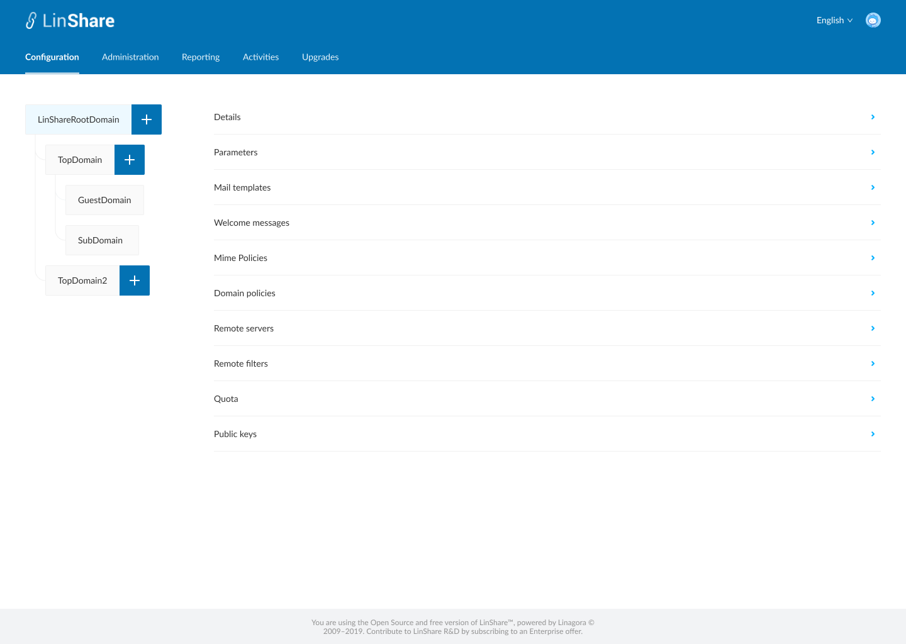
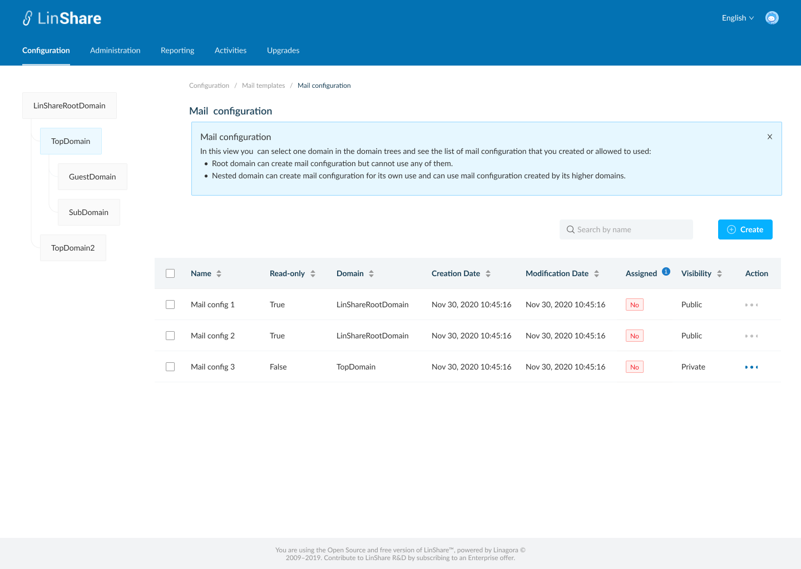
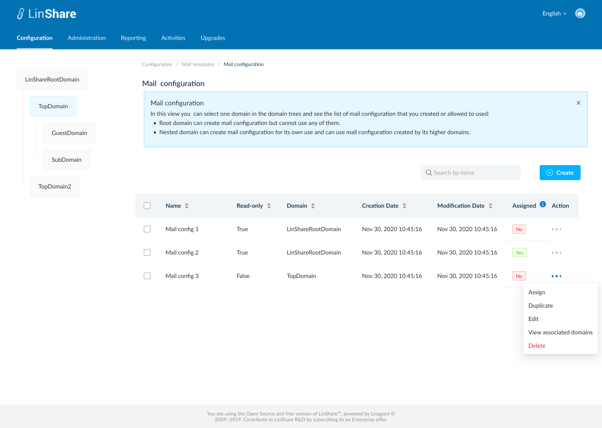

# Summary

* [Related EPIC](#related-epic)
* [Definition](#definition)
* [UI Design](#ui-design)
* [Misc](#misc)

## Related EPIC

* [New admin portal](./README.md)

## Definition

#### Preconditions

* Given that I am root admin or nested admin of LinShare
* I logged-in to the admin portal successfully

#### Description

- I select a domain and go to Configuration tab on top navigation bar
- I click on Email templates, a new screen will be opened with 5 categories: 
   - Mail configuration
   - Mail layout
   - Mail footer
   - Mail content
   - Mail activation 
- I select Mail configuration, the screen mail configuration listing will be opened. 
- I can click on tooltip and see explanation text:
- "This view allows you to create a mail template to your domains, from the entered information

   - 'Mail layout' allows to create a custom mail layout.
   - 'Mail footer' to edit the mail footer template.
   - 'Mail content' to manage mail notification content, sent to LinShare users.

  After your different mail templates you can in 'Domains configuration' (on creation/edition of your domain), choose a mail configuration."

**UC1.Super-admin view the list of Mail configurations**
- If I am selecting root domain , I can see the list of Mail configurations that I created. They can be used for any lower-level domains.
- If I am selecting a nested domain, I can see the list of Mail configurations created by that domain and the Mail configurations from higher level domain.
- I can see a tooltip icon on screen name, which I can click on and see the explanation text.
- The Mail configurations list includes columns:
    - Name
    - Read-only: True/False. If false, this Mail configuration is created by the selected domain. If true, this Mail configurations is created by the higher-level domain.
    - Domain: The name of domain that created the Mail configurations
    - Creation date
    - Modification date
    - Assigned: Yes/No. This column indicates which Mail configurations is used for the current selected domain. Each domain can use only 1 Mail configurations a time
    - Visibility: Public/Private. If the email configuration is public, lower level domain can use this. If private, lover-level domain cannot use this email configuration
    - Action: When i click on three-dot button, i can see actions:
        - If the selected domain is root domain, the actions are: Duplicate, Edit, Delete.
        - If the selected domain is a nested domain (top domain/Sub domain/Guest domain), the actions are: Assign, Duplicate, Edit, Delete
        - If the Mail configurations is currently used, the option "Assign" is disabled.

**UC2.Nested-admin view the list of Mail configurations**
- I can see the list of Mail configurations that created for selected domain, which can be used for lower-level domain, and Mail configurations from higher-level domain.
- The Mail configurations list includes columns:
    - Name
    - Read-only: True/False. If false, this Mail configurations is created by the selected domain. If true, this Mail configurations is created by the higher-level domain.
    - Domain: The name of domain that created the Mail configurations
    - Creation date
    - Modification date
    - Assigned: Yes/No. This column indicates which Mail configuration is used for the current selected domain. Each domain can use only 1 Mail configuration a time
    - Visibility: Public/Private. If the email configuration is public, lower level domain can use this. If private, lover-level domain cannot use this email configuration
    - Action: When I click on three-dot button, i can see actions:
       - If the Mail configuration is from my higher-level domain (eg: i am admin of Top domain and the Mail configuration is from Root domain), I can see the action: Assign, Duplicate, View
       - If the Mail configurations is from my domain or lower-level domain, I can see the action: Assign, Duplicate, Edit, Delete

#### Postconditions

- I can sort by columns: Name, Read only, Domain, Creation date, Modification date
- Default sort is last modification date
- The Mail configurations list is paginated and the default number of displayed items is 25, I can change this number at the bottom of page
- I can see a search bar and typing in, the system will search by Mail configurations's name and display corresponding result in the table below
- If I log-in as nested admin, I Mail configurations list of my domain and my nested  domains.

[Back to Summary](#summary)

## UI Design

#### Mockups

#### Final design

[Back to Summary](#summary)
## Misc

[Back to Summary](#summary)

