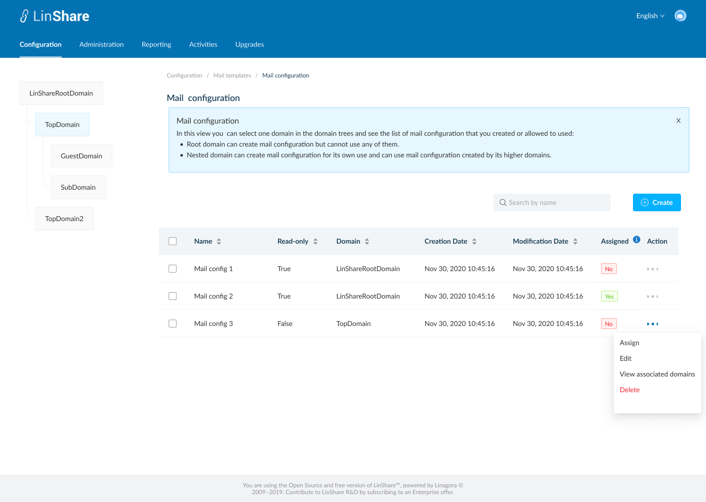
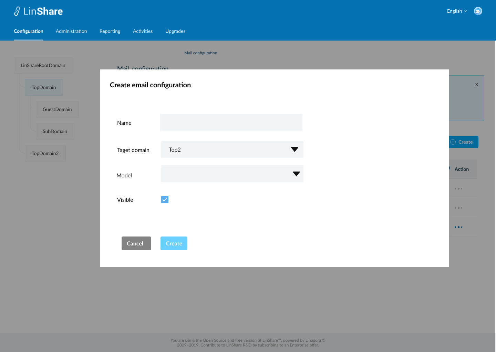
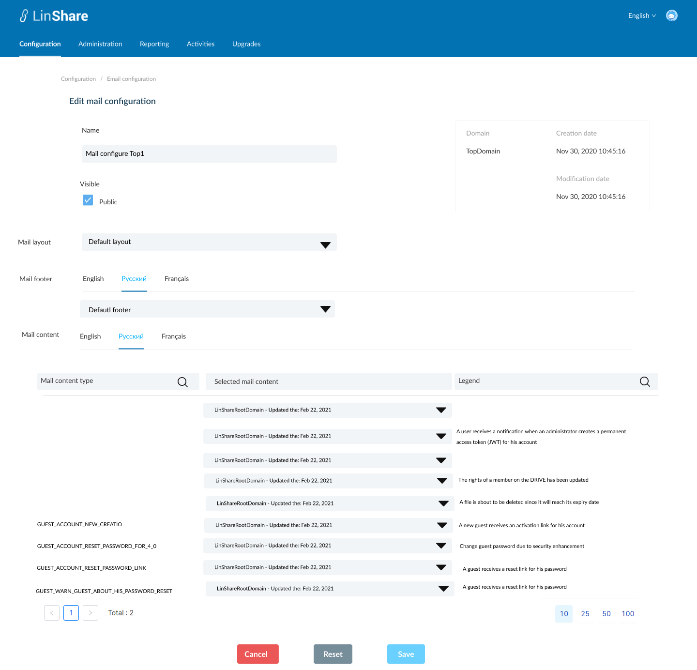

# Summary

* [Related EPIC](#related-epic)
* [Definition](#definition)
* [UI Design](#ui-design)
* [Misc](#misc)

## Related EPIC

* [New admin portal](./README.md)

## Definition

#### Preconditions

- Given that I am super-admin/nested admin in LinShare
- I logged-in to Admin portal successfully
- I select a domain and go to Configuration tab on top navigation bar
- I click on Mails => Mail configurations, the screen Mail configuration list will be opened.
- If I am seeing settings of root domain, I can see the list of Mail configurations that root admin created. They can be used for any lower-level domains.
- If I am seeing settings a nested domain in the domain tree, I can see the list of  Mail configurations that Nested admin created and the Mail configurations from higher level domain.

#### Description

**UC1. Create a mail configuration**
- On Mail configuration listing screen, I click on create button
- The screen Create Email configuration will be displayed.
- To create an Email configuration, I need to input fields:
    - Name: a text field and mandatory
    - Target domain: is the domain this mail configuration will belongs to. Default value is the current selected domain. I can click and select another target domain from the drop-downn list.
    - Duplicate from: A drop-down list of mail configurations that target domain has access right. This model will be used to duplicate for new configuration
    - Visible: This checkbox is to allow  subdomains to use this configuration or not. 
- After input above fields, I click button Create, if there is no blank field, the new mail configuration is created successfully with a toast message
- I am redirected to the Screen Mail configuration listing and the new created mail configuration is displayed in the table.

**UC2. Edit mail configuration**.
- If I am super-admin, I can edit all mail configuration
- If I am nested admin, I can only edit the mail configuration created by me and my lower-level domain.
- There are 2 ways to access a mail configuration screen:
    - In the mail configuration listing screen, I click on three dot-button of a mail configuration and select option Edit from the drop-down list
    - Or I can click on the mail configuration  row in the mail configuration listing table.
- By default, the mail configuration detail screen will be in View mode
- If I have permission to Edit, there will be button Edit, I click on this button, the Edit mode will be enabled
- I can edit all fields including:
   - Name 
   - Visible: checkbox 
   - Mail layout: a drop-down list of mail layouts that can be used for this domain : they are mail layouts created by this domain or mail layouts of higher-level domains.
   - Mail footer:  a drop-down list of mail footers that can be used for this domain : they are mail footers created by this domain or mail layouts of higher-level domains. There are 3 tabs for 3 languages: English, Русский, Français
   - Mail content: There are 3 tabs for 3 languages: English, Русский, Français. Each tab displays mail content type list in one language
      - In mail content list, there are 3 columns:
      - Mail content type: the list of content type is fixed. I can search for mail content type 
      - Selected mail content: Display the currently selected mail content. This selection is duplicated from mail configuration model by default. I can click on drop down list and select another mail content for this content type. The list of mail contents for this content type are the ones created by this domain or higher-level domains.
- The non-editable fields include:
    - Domain
    - Creation date
    -Modification date
- After editting I click button Save, The system will validate if field "Name" is blank, it will be highlighted in red and a message:"[field name] cannot be blank"
- If there is no error, the updates will be saved and there will be a successful toast message.
- If I click button Reset, all the updates will be reset to the before values.

**UC3. View email configuration**
- If I am nested admin, On email configuration screen,  when I click on three-dot button of a email configuration from higher level domain,
  I can see the option "View"
- When I click on this button, the screen email configuration detail will be displayed in mode "view"
- I can not update any field, and there is no button Delete, Save, Reset as Edit screen

**UC4. Duplicate an email configuration**
- On the Email configuration listing screen, I click on thee-dot button of an email configuration and select option Duplicate from the drop-down list
- The screen Create email configuration will be opened. (UC1)
- Except the field Name is blank, other fields will have the same value as the email configuration that I selected to duplicate
- I input the field Name, and can edit other fields
- When I click button Save, the system will validate as UC 1. 

**UC5. Delete an Email configuration**
- If I am nested admin I can only delete Email configuration in my domain and my nested domain. I cannot delete Email configuration from higher-domain
- If i am super-admin, i can delete every  Email configuration
- There is no Delete button for Default Email configuration.
- There are 2 ways to delete a Email configuration:
    - In the  Email configuration listing screen, I click on three dot-button of an Email configuration and select option Delete from the drop-down list
    - Or I can click an Email configuration row on the listing table to go to Email configuration detail screen. On this screen I can see the button Delete.
- When I click on button Delete:
    - If the Email configuration is not associated with any domain, there will be an confirmation popup: "You are about to delete this Email configuration, this procedure is irreversible. Do you want to proceed?" and Yes/No button
        - I choose Yes to confirm, the Email configuration will be deleted.
        - System will prompt a deletion confirmation toast.
    - If the Email configuration is associated with any domain, the system will display message: "This Email configuration is associated with at least one domain. You cannot delete."

**UC6. Delete multiple Email configurations**

- On Email configuration listing screen, I can select multiple Email configurations on the list by tick the checkbox of each item
- There will be a top bar that indicates number of selected Email configuration, an isolation icon, an Undo icon and a Delete icon.
- When I click on Isolation icon, the screen only shows selected items
- When I click on Undo icon, all the selected items are unselected
- If I do not have permission to delete any of selected Email configuration, the button Delete will be disabled.
- When I click on button Delete:
    - If any of selected Email configuration is not associated with any domain, there will be a confirmation popup: "You are about to delete [number of selected items] Email configuration, this procedure is irreversible. Do you want to proceed?" and Yes/No button
        - I choose Yes to confirm, the selected Email configuration will be deleted.
        - System will prompt a deletion confirmation toast.
    - If any of selected Email configuration is associated with any domain, the system will display message: " One of selected Email configurations is associated with at least one domain. You cannot delete."

**UC7. Assign an Email configuration**

- On Email configuration listing screen, I click on three-dot button on Action column.
- I select option "Assign"
- If the selected Email configuration is already assigned for the current selected domain, there will be a message:" This Email configuration is already assigned for [selected domain name]
- If not, the system will display message:" You are about to assign this Email configuration for [selected domain name]. Do you want to proceed?" and Yes/No button
- If i choose Yes, the Email configuration is assigned for currently selected domain. 
- Each domain can only be assigned with one Email configuration a time
- The value in column "Assigned" of the old Email configuration will be changed from Yes => No and the new assigned Email configuration will be changed to Yes.
- When I hover the tooltip on column title "Assigned", there will be an explanation text: "If the Email configuration is used for the current selected domain, the value will be Yes".

**UC8. View associated domains**

- On Email configuration listing screen, I click on three-dot button on Action column.
- I select option "View associated domains"
- A new screen will be opened
- I can see the list of domain's name which are using this Email configuration.
- There will be a label next to each domain's name that indicating domain type of that domain
- When I click one domain on the list, I am navigated to Email configuration listing screen of that domain.
- If the Email configuration is not associated with any domain, there will be a text message: " There is no domain using this Email configuration. "
- If I am the nested admin, I can only view associates domains which are under my administration permission.

#### Postconditions

[Back to Summary](#summary)

## UI Design

#### Mockups

#### Final design

[Back to Summary](#summary)
## Misc

[Back to Summary](#summary)
