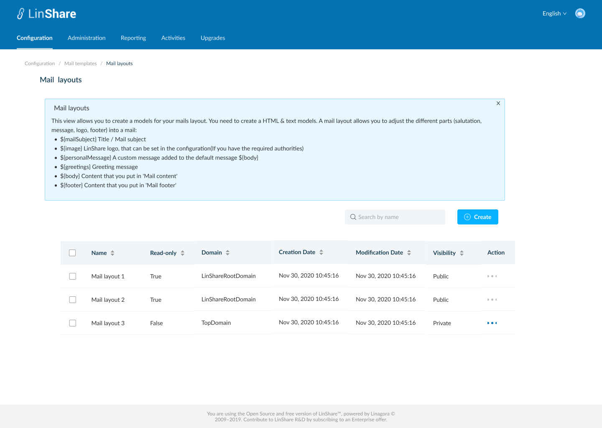

# Summary

* [Related EPIC](#related-epic)
* [Definition](#definition)
* [UI Design](#ui-design)
* [Misc](#misc)

## Related EPIC

* [New admin portal](./README.md)

## Definition

#### Preconditions

* Given that I am root admin or nested admin of LinShare
* I logged-in to the admin portal successfully

#### Description

- I select a domain and go to Configuration tab on top navigation bar
- I click on Email templates, a new screen will be opened with 5 categories:
    - Mail configuration
    - Mail layout
    - Mail footer
    - Mail content
    - Mail activation
- I select Mail layouts, then screen listing email layouts will be opened
- I click on tooltip icon and see an explanation text:
- "This view allows you to create a models for your mails layout. You need to create a HTML & text models. A mail layout allows you to adjust the different parts (salutation, message, logo, footer) into a mail.

   - ${mailSubject} Title / Mail subject
   - ${image} LinShare log, that can be set in the configuration(If you have the required authorities)
   - ${personalMessage} A custom message added to the default message ${body}
   - ${greetings} Greeting message
   - ${body} Content that you put in 'Mail content'
   - ${footer} Content that you put in 'Mail footer'

**UC1.Super-admin view the list of Mail layouts**
- If I am viewing setting of root domain, I can see the list of  Mail layouts that I created. They can be used for any lower-level domains.
- If I am viewing settings of a nested domain, I can see the list of  Mail layouts created by that domain and the  Mail layouts from higher level domain.
- I can see a tooltip icon on screen name, which I can click on and see the explanation text.
- The Mail layouts list includes columns:
    - Name
    - Read-only:
       - Default mail layout is read-only for both root admin and nested admin
       - Root admin can edit every mail layout (except Default mail layout )
       - Nested admin can edit only mail layout of his domain and nested domains. For mail layout of root admin, he can read-only
    - Domain: The name of domain that created the Mail layouts
    - Creation date
    - Modification date
    - Visibility: Public/Private: If mail layout is public, lower-level domain will appear in the layout list of lower-level domain. And lower-level domain can use this mail layout. If mail layout is private, lower-level domain will not appear in the layout list of lower-level domain.
    - Action: When I click on three-dot button, I can see actions: Duplicate, Edit, Delete(except for default mail layout where we will have Duplicate and view).

**UC2.Nested-admin view the list of  Mail layouts**
- As a nested admin, I can select one of my nested domains and view the list of Mail layouts that created for that domain and Mail layouts from higher-level domain.
- The Mail layouts list includes columns:
  - Name
  - Read-only:
     - Default mail layout is read-only for both root admin and nested admin
     - Root admin can edit every mail layout (except Default mail layout )
     - Nested admin can edit only mail layout of his domain and nested domains. For mail layout of root admin, he can read-only
  - Domain: The name of domain that created the Mail layout
  - Creation date
  - Modification date
  - Visibility: Public/Private: If mail layout is public, lower-level domain will appear in the layout list of lower-level domain. And lower-level domain can use this mail layout. If mail layout is private, lower-level domain will not appear in the layout list of lower-level domain. 
- Action: When I click on three-dot button, I can see actions:
    - If the Mail layout is from my higher-level domain (eg: i am admin of Top domain and the Mail layout is from Root domain), I can see the action: Duplicate, View
    - If the Mail layout is from my domain or lower-level domain, I can see the action: Duplicate, Edit, Delete (except for default mail layout where we will have Duplicate and view).

#### Postconditions

- I can sort by columns: Name, Read only, Domain, Creation date, Modification date
- Default sort is last modification date
- The Mail layouts list is paginated and the default number of displayed items is 25, I can change this number at the bottom of page
- I can see a search bar and typing in, the system will search by Mail layout's name and display corresponding result in the table below

[Back to Summary](#summary)

## UI Design

#### Mockups

#### Final design

[Back to Summary](#summary)
## Misc

[Back to Summary](#summary)

