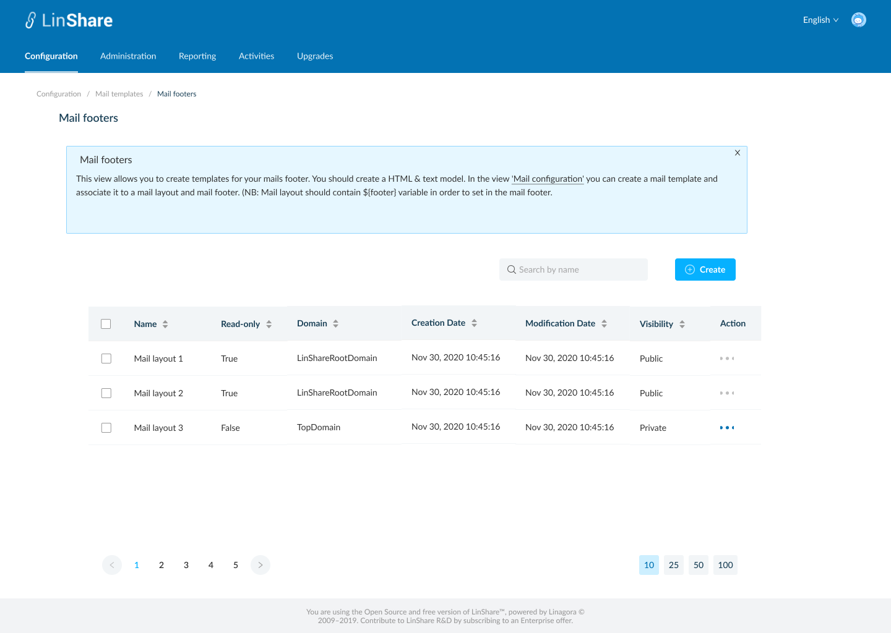

# Summary

* [Related EPIC](#related-epic)
* [Definition](#definition)
* [UI Design](#ui-design)
* [Misc](#misc)

## Related EPIC

* [New admin portal](./README.md)

## Definition

#### Preconditions

* Given that I am root admin or nested admin of LinShare
* I logged-in to the admin portal successfully

#### Description
- I select a domain and go to Configuration tab on top navigation bar
- I click on Email templates, a new screen will be opened with 5 categories:
    - Mail configuration
    - Mail layout
    - Mail footer
    - Mail content
    - Mail activation
- I select Mail footers, and the listing mail footer screen will be opened
- I can click on a tooltip and see helper text: 
- "Mail footer: This view allows you to create templates for your mails footer. You should create a HTML & text model.
In the view 'Mail configuration' you can create a mail template and associate it to a mail layout and mail footer. (NB: Mail layout should contain ${footer} variable in order to set in the mail footer."

**UC1.Super-admin view the list of Mail footers**
- If I am viewing setting of root domain, I can see the list of  Mail footers that I created. They can be used for any lower-level domains.
- If I am viewing settings of a nested domain, I can see the list of  Mail footers created by that domain and the  Mail footers from higher level domain.
- The Mail footers list includes columns:
    - Name
    - Read-only: True/False. If false, this Mail footer is created by the current selected domain. If true, this  Mail footer is created by the higher-level domain.
    - Domain: The name of domain that created the Mail footer
    - Creation date
    - Modification date
    - Visibility: Public/Private: If mail footer is public, lower-level domain will appear in the footer list of lower-level domain. And lower-level domain can use this mail footer. If mail footer is private, lower-level domain will not appear in the footer list of lower-level domain.
    - Action: When I click on three-dot button, I can see actions: Duplicate, Edit, Delete.

**UC2.Nested-admin view the list of  Mail footer**
- As a nested admin, I can select one of my nested domains and view the list of Mail footers that created for that domain and Mail footers from higher-level domain.
- The Mail footers list includes columns:
    - Name
    - Read-only: True/False. If false, this Mail footer is created by the selected domain. If true, this Mail footer is created by the higher-level domain.
    - Domain: The name of domain that created the Mail footer
    - Creation date
    - Modification date
    - Visibility: Public/Private: If mail footer is public, lower-level domain will appear in the footer list of lower-level domain. And lower-level domain can use this mail footer. If mail footer is private, lower-level domain will not appear in the footers list of lower-level domain.
- Action: When I click on three-dot button, I can see actions:
    - If the Mail footer is from my higher-level domain (eg: i am admin of Top domain and the Mail footer is from Root domain), I can see the action: Duplicate, View
    - If the Mail footer is from my domain or lower-level domain, I can see the action: Duplicate, Edit, Delete

#### Postconditions

- I can sort by columns: Name, Read only, Domain, Creation date, Modification date, visibility
- Default sort is last modification date
- The Mail footer list is paginated and the default number of displayed items is 25, I can change this number at the bottom of page
- I can see a search bar and typing in, the system will search by Mail footer's name and display corresponding result in the table below

[Back to Summary](#summary)

## UI Design

#### Mockups

#### Final design

[Back to Summary](#summary)
## Misc

[Back to Summary](#summary)

