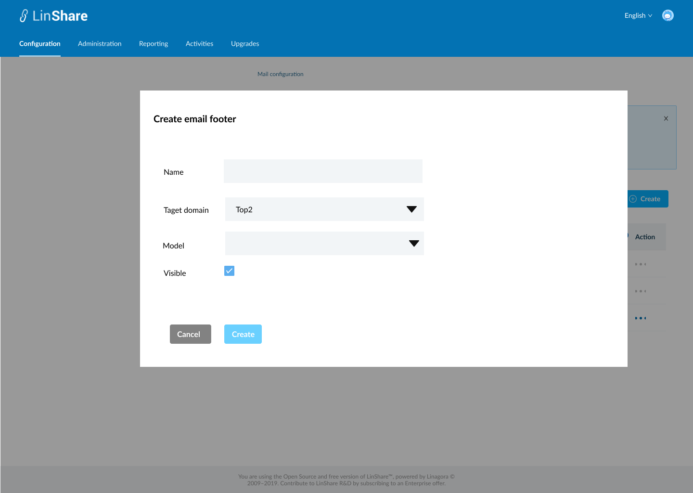
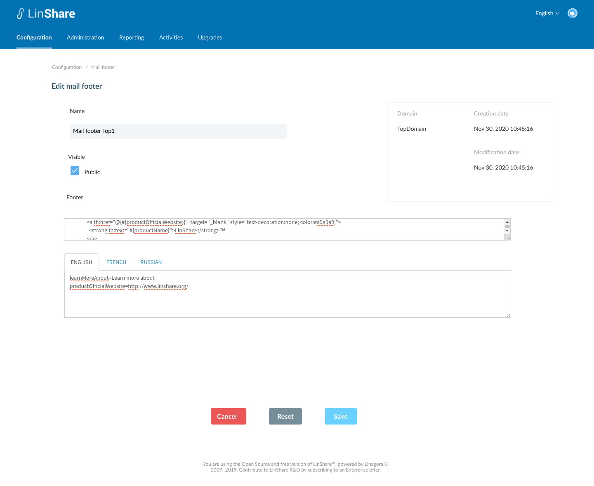
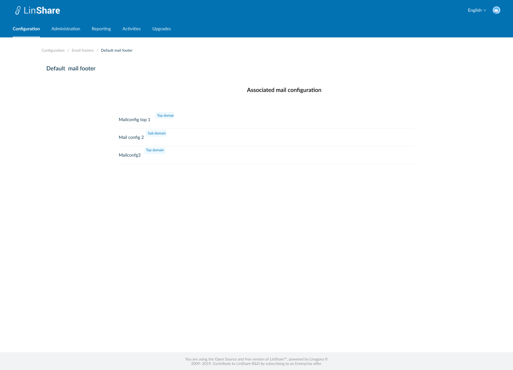
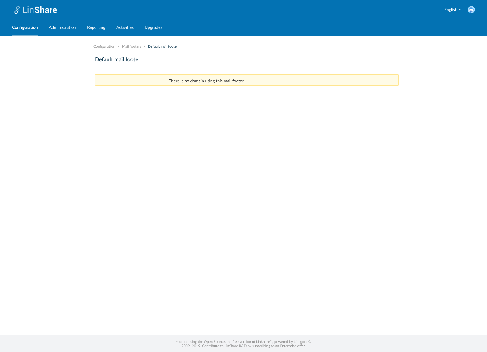

# Summary

* [Related EPIC](#related-epic)
* [Definition](#definition)
* [UI Design](#ui-design)
* [Misc](#misc)

## Related EPIC

* [New admin portal](./README.md)

## Definition

#### Preconditions

- Given that I am super-admin/nested admin in LinShare
- I logged-in to Admin portal successfully
- I select a domain and go to Configuration tab on top navigation bar
- I click on Mails => Mail footers, the screen Mail footer list will be opened.
- If I am seeing settings of root domain, I can see the list of Mail footers that root admin created. They can be used for any lower-level domains if it is public
- If I am seeing settings a nested domain in the domain tree, I can see the list of  Mail footers that Nested admin created and the Mail footers from higher level domain.

#### Description

**UC1. Create a mail footer**
- On Mail footers listing screen, I click on create button
- The screen Create Email footer will be displayed.
- To create an Email footer, I need to input fields:
    - Name: a text field and mandatory
    - Target domain: is the domain this mail footer will belongs to. Default value is the current selected domain. I can click and select another target domain from the drop-downn list.
    - Model: A drop-down list of mail footers that target domain has access right. This model will be used to duplicate for new footer
    - Visible: This checkbox is to allow  subdomains to use this footer or not.
- After input above fields, I click button Create, if there is no blank field, the new mail footer is created successfully with a toast message
- I am redirected to the Screen Mail footers listing and the new created mail footer is displayed in the table.
- Now when I open mail configuration for this domain, the mail footer will be shown as one of the options in drop-down list of the field "Footer"

**UC2. Edit mail footer**.
- If I am super-admin, I can edit all mail footers
- If I am nested admin, I can only edit the mail footer created by me and my lower-level domain.
- There are 2 ways to access a mail footer detail screen:
    - In the mail footers listing screen, I click on three dot-button of a mail footer and select option Edit from the drop-down list
    - Or I can click on the mail footer row in the mail footer listing table.
- By default, the mail footer detail screen will be in View mode
- If I have permission to Edit, there will be button Edit, I click on this button, the Edit mode will be enabled
- I can edit all fields including:
    - Name
    - Visible: checkbox
    - Mail footer: a string value that automatically filled by the same field in the model that I selected in Create footer screen.
    - Message translation: There are 3 tabs for 3 languages: English, Русский, Français. Each tab displays message translation list in one language. This is a string value that automatically filled by the same field in the model that I selected in Create footer screen.

- The non-editable fields include:
    - Domain
    - Creation date
    -Modification date
- After editing I click button Save, The system will validate if field "Name" is blank, it will be highlighted in red and a message:"[field name] cannot be blank"
- If there is no error, the updates will be saved and there will be a successful toast message.
- If I click button Reset, all the updates will be reset to the before values.

**UC3. View email footer**
- If I am nested admin, On email footers listing screen,  when I click on three-dot button of an email footer from higher level domain,
  I can see the option "View"
- When I click on this button, the screen email footer detail will be displayed in mode "view"
- I can not update any field, and there is no button Delete, Save, Reset as Edit screen

**UC4. Delete an Email footer**
- If I am nested admin I can only delete Email footer in my domain and my nested domain. I cannot delete Email footer from higher-domain
- If I am super-admin, I can delete every  Email footer
- There is no Delete button for Default Email footer
- There are 2 ways to delete a Email footer:
    - In the  Email footers listing screen, I click on three dot-button of an Email footer and select option Delete from the drop-down list
    - Or I can click an Email footer row on the listing table to go to Email footer detail screen. On this screen I can see the button Delete.
- When I click on button Delete:
    - If the Email footer is not used in any mail configuration, there will be a confirmation popup: "You are about to delete this Email footer, this procedure is irreversible. Do you want to proceed?" and Yes/No button
        - I choose Yes to confirm, the Email footer will be deleted.
        - System will prompt a deletion confirmation toast.
    - If the Email footer is used in any mail configuration, the system will display message: "This Email footer is used with at least one mail configuration. You cannot delete."

**UC5. Delete multiple Email footers**

- On Email footer listing screen, I can select multiple Email footers on the list by tick the checkbox of each item
- There will be a top bar that indicates number of selected Email footers, an isolation icon, an Undo icon and a Delete icon.
- When I click on Isolation icon, the screen only shows selected items
- When I click on Undo icon, all the selected items are unselected
- If I do not have permission to delete any of selected Email footer, the button Delete will be disabled.
- When I click on button Delete:
    - If any of selected Email footers is not used in any mail configuration, there will be a confirmation popup: "You are about to delete [number of selected items] Email footers, this procedure is irreversible. Do you want to proceed?" and Yes/No button
        - I choose Yes to confirm, the selected Email footers will be deleted.
        - System will prompt a deletion confirmation toast.
    - If any of selected Email footers is used in any mail configuration, the system will display message: " One of selected Email footer is used in at least one mail configuration. You cannot delete."

**UC6 Duplicate an email footer**
- On the Welcome email footer listing screen, i click on thee-dot button of a Welcome messages and select option Duplicate from the drop-down list
- The screen Create footer will be opened (UC1)
- Except the field Name is blank, other fields will have the same value as the email footer that I selected to duplicate
- I input the field Name, and can edit other fields
- When I click button Save, the system will validate as UC 1, create a new Email footer.

**UC7. View associated email configurations**

- On Email configuration listing screen, I click on three-dot button on Action column.
- I select option "View associated configurations"
- A new screen will be opened
- I can see the list of email configurations which are using this Email footer.
- There will be a label next to each email configuration's name that indicating domain 's name of email configuration
- When I click one email configuration on the list, I am navigated to detail screen of that email configuration.
- If the Email footer is not used with any email configuration, there will be a text message: " There is no email configuration using this Email footer. "
- If I am the nested admin, I can only view associates email configuration which are under my administration permission.

#### Postconditions

[Back to Summary](#summary)

## UI Design

#### Mockups

#### Final design

[Back to Summary](#summary)
## Misc

[Back to Summary](#summary)
