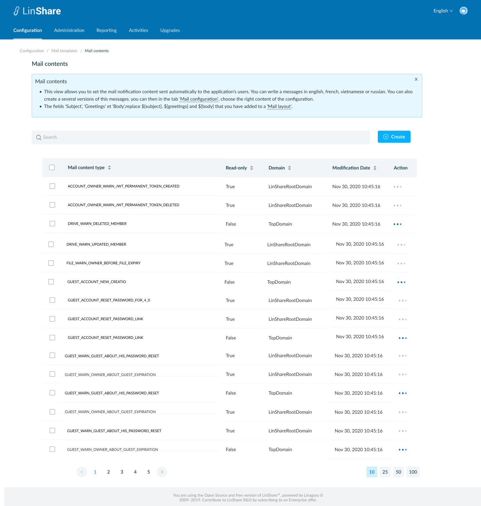
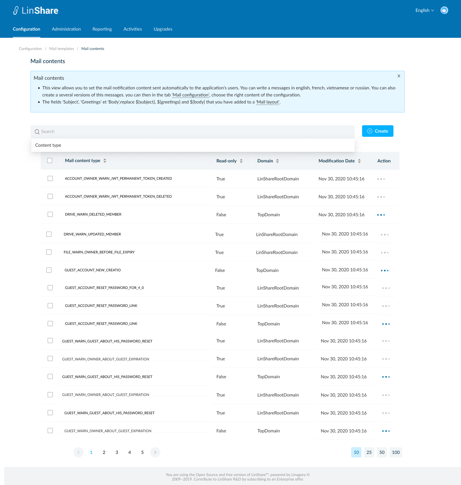
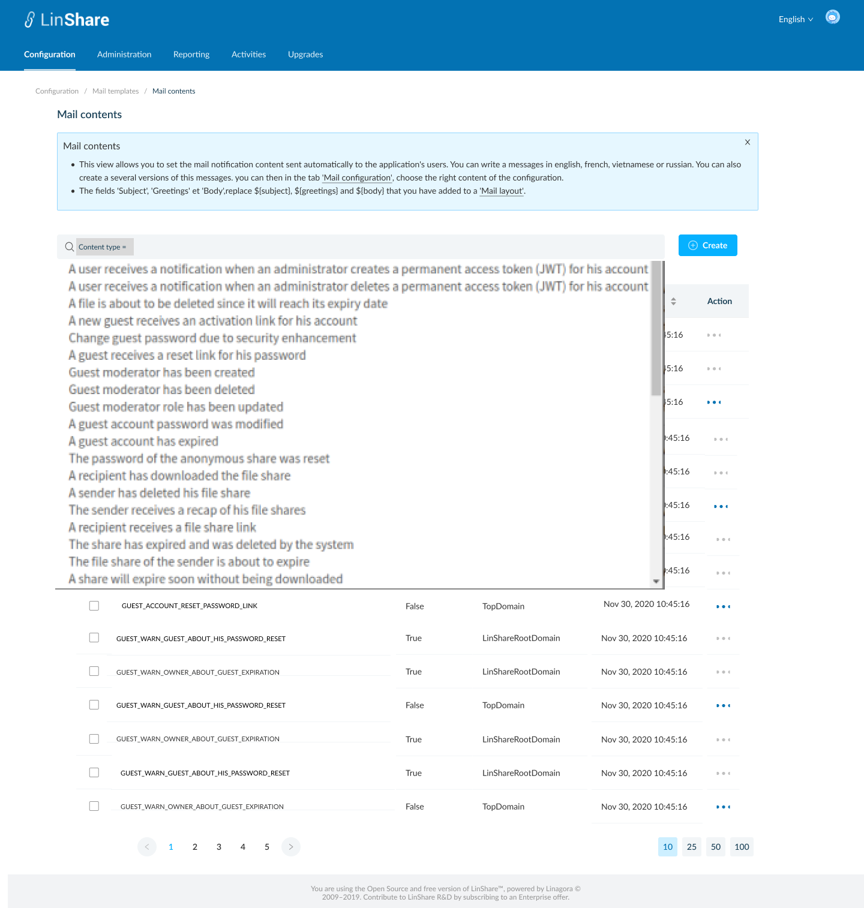
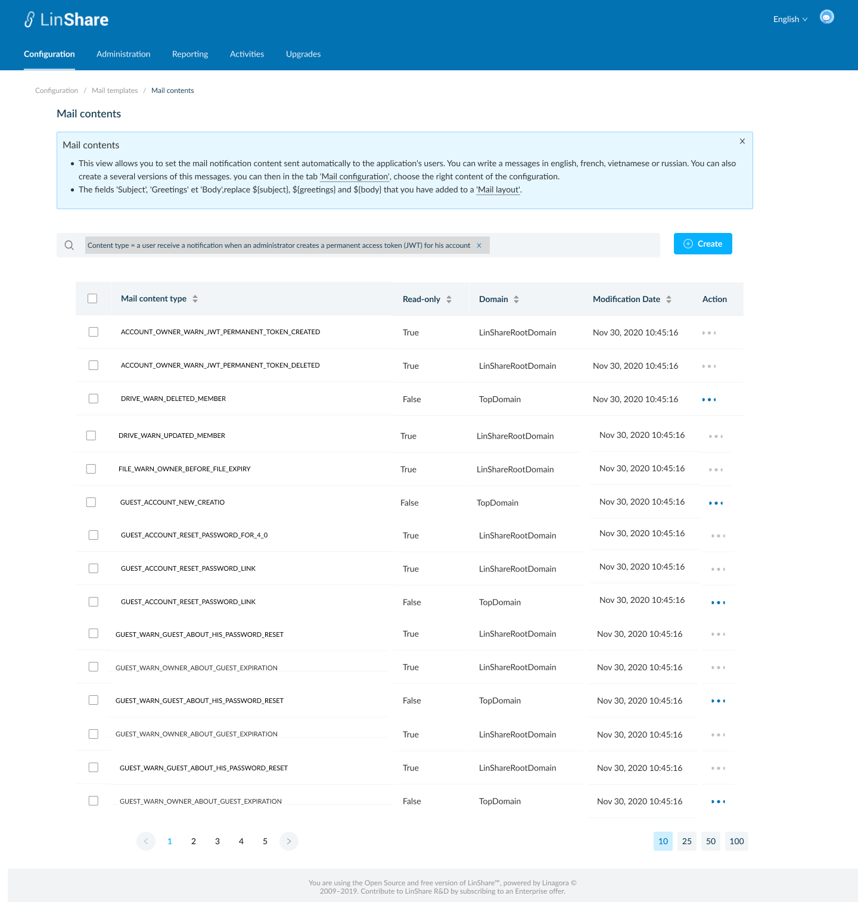

# Summary

* [Related EPIC](#related-epic)
* [Definition](#definition)
* [UI Design](#ui-design)
* [Misc](#misc)

## Related EPIC

* [New admin portal](./README.md)

## Definition

#### Preconditions

* Given that I am root admin or nested admin of LinShare
* I logged-in to the admin portal successfully

#### Description
- I select a domain and go to Configuration tab on top navigation bar
- I click on Email templates, a new screen will be opened with 5 categories:
    - Mail configuration
    - Mail layout
    - Mail footer
    - Mail content
    - Mail activation
- I select Mail content, and the listing mail contents screen will be opened
- I can click on a tooltip and see helper text:
- "This view allows you to set the mail notification content sent automatically to the application's users. You can write a messages in english, french, vietnamese or russian. You can also create a several versions of this messages. you can then in the tab 'Mail configuration', choose the right content of the configuration.
  - The fields 'Subject', 'Greetings' et 'Body',replace ${subject}, ${greetings} and ${body} that you have added to a 'Mail layout"

**UC1.Super-admin view the list of Mail contents**
- If I am viewing setting of root domain, I can see the list of  Mail contents that I created. They can be used for any lower-level domains.
- If I am viewing settings of a nested domain, I can see the list of  Mail contents created by that domain and the  Mail contents from higher level domain.
- The Mail contents list includes columns:
   - Content type
   - Read-only:
      - Root admin can edit every mail content (except Default mail content)
      - Nested admin can edit only mail content of his domain and nested domains. For mail content of root admin, he can read-only
   - Domain: The name of domain that created the Mail content
   - Modification date
   - Action: When I click on three-dot button, I can see actions: Duplicate, Edit, Delete. 
   - Each content type has a default content. The default contents are non-editable and cannot delete. 

**UC2.Nested-admin view the list of  Mail contents**
- As a nested admin, I can select one of my nested domains and view the list of Mail contents that created for that domain and Mail contents from higher-level domain.
- The Mail contents list includes columns:
    - Content type
    - Read-only: Nested admin can edit only mail content of his domain and nested domains. For mail content of root admin, he can read-only
    - Domain: The name of domain that created the Mail content
    - Modification date
- Action: When I click on three-dot button, I can see actions:
    - If the Mail content is from my higher-level domain (eg: i am admin of Top domain and the Mail content is from Root domain), I can see the action: Duplicate, View
    - If the Mail footer is from my domain or lower-level domain, I can see the action: Duplicate, Edit, Delete
- Each content type has a default content. The default contents are non-editable and cannot delete.

**UC3. Search mail content**
- I can see a search bar on top of the content list 
- When I click on Search field, there will be a drop-down list that contains all content types. I can select one from the list and system will display all contents that belong to selected content type in the contents list below. 
- Or I can input text to the search field and click Enter, system will search and displayed the matched ones.

#### Postconditions

- I can sort by columns: Content type, Read only, Domain,Modification date
- Default sort is latest modification date
- The Mail contents list is paginated and the default number of displayed items is 25, I can change this number at the bottom of page

[Back to Summary](#summary)

## UI Design

#### Mockups

#### Final design

[Back to Summary](#summary)
## Misc

[Back to Summary](#summary)

