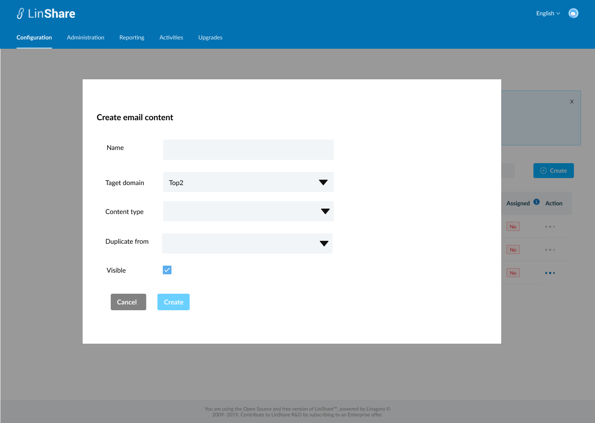
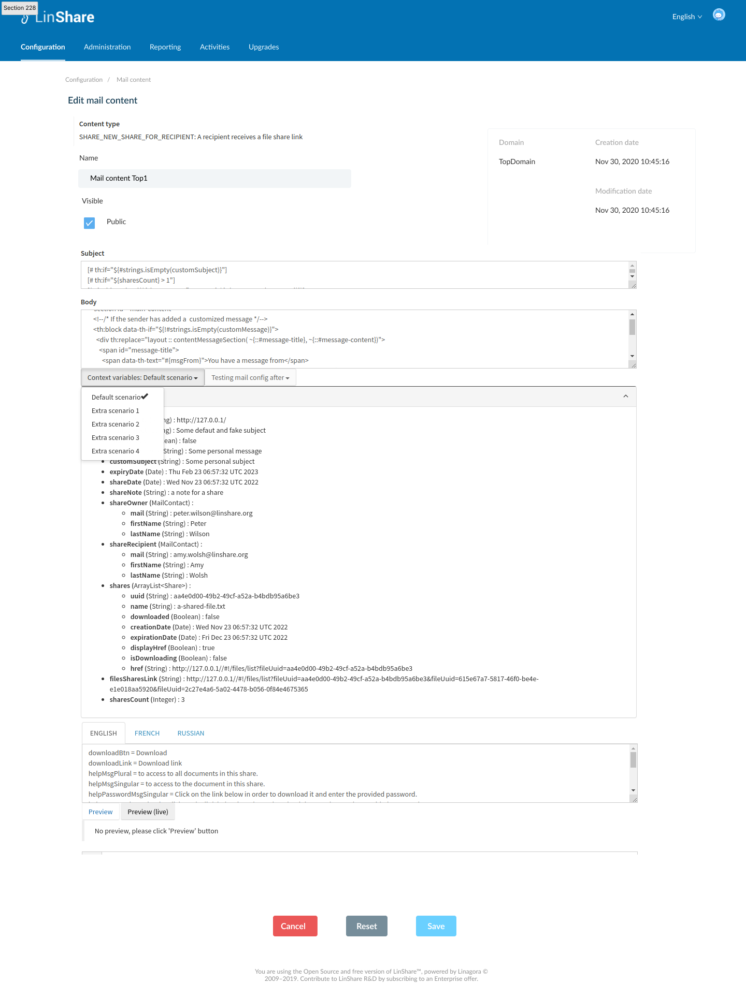
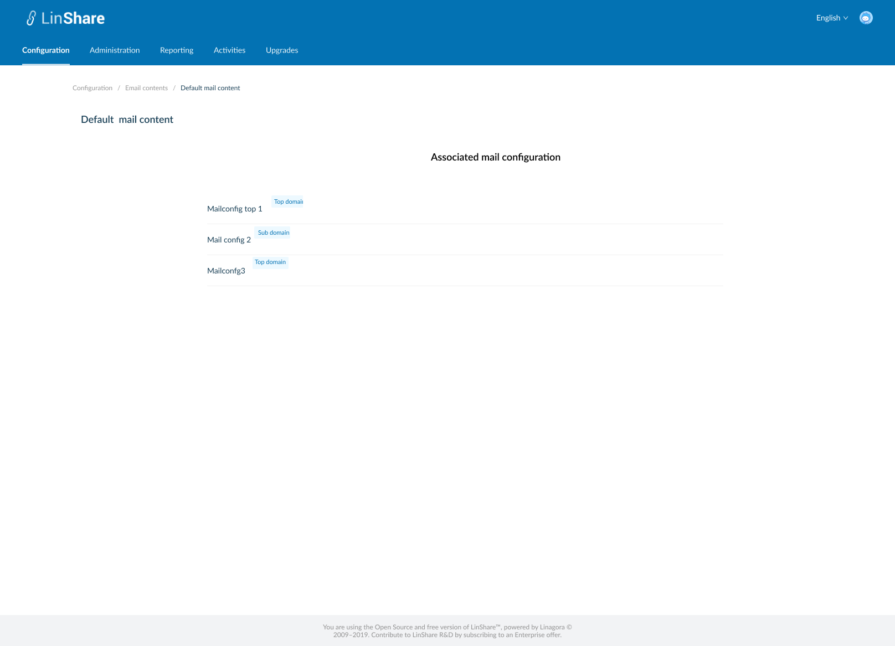
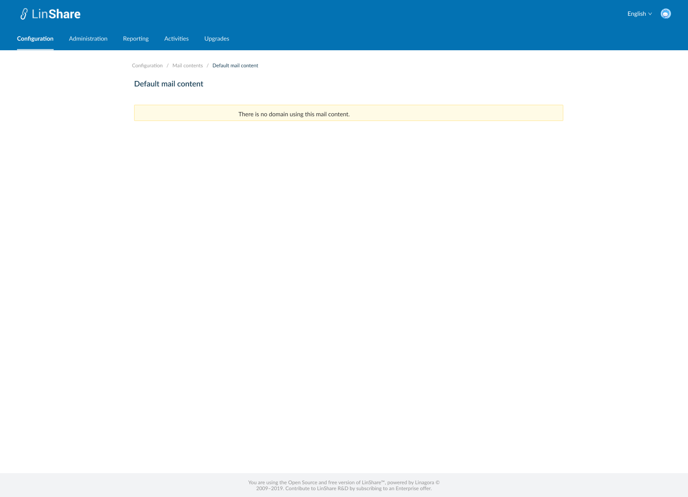

# Summary

* [Related EPIC](#related-epic)
* [Definition](#definition)
* [UI Design](#ui-design)
* [Misc](#misc)

## Related EPIC

* [New admin portal](./README.md)

## Definition

#### Preconditions

- Given that I am super-admin/nested admin in LinShare
- I logged-in to Admin portal successfully
- I select a domain and go to Configuration tab on top navigation bar
- I click on Mails => Mail contents, the screen Mail contents list will be opened.
- If I am seeing settings of root domain, I can see the list of Mail contents that root admin created. They can be used for any lower-level domains if it is public
- If I am seeing settings a nested domain in the domain tree, I can see the list of  Mail contents that Nested admin created and the Mail contents from higher level domain.

#### Description

**UC1. Create a mail content**
- On Mail contents listing screen, I click on create button
- The screen Create Email contents will be displayed.
- To create an Email contents, I need to input fields:
    - Name: a text field and mandatory
    - Target domain: is the domain this mail content will belongs to. Default value is the currently selected domain. I can click and select another target domain from the drop-downn list.
    - Content types: is the list of all contents in the system. I can select one content from the drop-down list. 
    - Duplicate from : A drop-down list of mail contents that target domain has access right. This mail content will be used to duplicate for new created mail content. 
    - Visible: This checkbox is to allow  subdomains to use this content or not.
- After input above fields, I click button Create, if there is no blank field, the new mail content is created successfully with a toast message
- I am redirected to the Screen Mail contents listing and the new created mail content is displayed in the table.
- Now when I open mail configuration for this domain, the mail content will be shown as one of the options of its content type.

**UC2. Edit mail content**.
- If I am super-admin, I can edit all mail contents
- If I am nested admin, I can only edit the mail content created by me and my lower-level domain.
- There are 2 ways to access a mail content screen:
    - In the mail contents listing screen, I click on three dot-button of a mail content and select option Edit from the drop-down list
    - Or I can click on the mail content  row in the mail contents listing table.
- By default, the mail content detail screen will be in View mode
- If I have permission to Edit, there will be button Edit, I click on this button, the Edit mode will be enabled
- I can edit all fields including:
    - Name
    - Visible: checkbox
    - Subject: a string value that automatically filled by the same field in the model that I selected in Create content screen.
    - Body: a string value that automatically filled by the same field in the model that I selected in Create content screen
    - Context Variables: A drop-down list of scenarios of this email. With each scenario, the context variables below can be different. The list of scenarios and context variables for each scenario are fixed by backend and I cannot edit this list.
    - Mail configuration list: The list of existing mail configurations created by current domain. By default, the mail content will be the same for every mail configuration. When a mail configuration of current domain is created or deleted, it is also updated to this list
    - Message translation: There are 3 tabs for 3 languages: English, Русский, Français. Each tab displays message translation list in one language. This is a string value that automatically filled by the same field in the model that I selected in Create content screen.
    - Preview/Preview live button: When I click on this button, the email content will be displayed below in user's view
- The non-editable fields include:
    - Content type: The content type of the email. 
    - Domain
    - Creation date
    -Modification date
- After editting I click button Save, The system will validate if field "Name" is blank, it will be highlighted in red and a message:"[field name] cannot be blank"
- If there is no error, the updates will be saved and there will be a successful toast message.
- If I click button Reset, all the updates will be reset to the before values.

**UC3. View email content**
- If I am nested admin, On email contents listing screen,  when I click on three-dot button of a email content from higher level domain,
  I can see the option "View"
- When I click on this button, the screen email content detail will be displayed in mode "view"
- I can not update any field, and there is no button Delete, Save, Reset as Edit screen

**UC4. Delete an Email content**
- If I am nested admin I can only delete Email content in my domain and my nested domain. I cannot delete Email content from higher-domain
- If I am super-admin, I can delete every  Email content
- There is no Delete button for Default Email content
- There are 2 ways to delete an Email content:
    - In the  Email content listing screen, I click on three dot-button of an Email content and select option Delete from the drop-down list
    - Or I can click an Email content row on the listing table to go to Email content detail screen. On this screen I can see the button Delete.
- When I click on button Delete:
    - If the Email content is not used in any mail configuration, there will be an confirmation popup: "You are about to delete this Email content, this procedure is irreversible. Do you want to proceed?" and Yes/No button
        - I choose Yes to confirm, the Email content will be deleted.
        - System will prompt a deletion confirmation toast.
    - If the Email content is used in any mail configuration, the system will display message: "This Email content is used with at least one mail configuration. You cannot delete."

**UC5. Delete multiple Email contents**

- On Email content listing screen, I can select multiple Email contents on the list by tick the checkbox of each item
- There will be a top bar that indicates number of selected Email contents, an isolation icon, an Undo icon and a Delete icon.
- When I click on Isolation icon, the screen only shows selected items
- When I click on Undo icon, all the selected items are unselected
- If I do not have permission to delete any of selected Email content, the button Delete will be disabled.
- When I click on button Delete:
    - If any of selected Email contents is not used in any mail configuration, there will be a confirmation popup: "You are about to delete [number of selected items] Email contents, this procedure is irreversible. Do you want to proceed?" and Yes/No button
        - I choose Yes to confirm, the selected Email contents will be deleted.
        - System will prompt a deletion confirmation toast.
    - If any of selected Email contents is used in any mail configuration, the system will display message: " One of selected Email content is used in at least one mail configuration. You cannot delete."

**UC6 Duplicate an email contents**
- On the Welcome email content listing screen, i click on thee-dot button of a Welcome messages and select option Duplicate from the drop-down list
- The screen Create content will be opened (UC1)
- Except the field Name is blank, other fields will have the same value as the email content that I selected to duplicate
- I input the field Name, and can edit other fields
- When I click button Save, the system will validate as UC 1, create a new Email content.

**UC7. View associated email configurations**

- On Email contents listing screen, I click on three-dot button on Action column.
- I select option "View associated configurations"
- A new screen will be opened
- I can see the list of email configurations which are using this Email content.
- There will be a label next to each email configuration's name that indicating domain 's name of email configuration
- When I click one email configuration on the list, I am navigated to detail screen of that email configuration.
- If the Email content is not used with any email configuration, there will be a text message: " There is no email configuration using this Email content. "
- If I am the nested admin, I can only view associates email configuration which are under my administration permission.

#### Postconditions

[Back to Summary](#summary)

## UI Design

#### Mockups

#### Final design

[Back to Summary](#summary)
## Misc

[Back to Summary](#summary)
