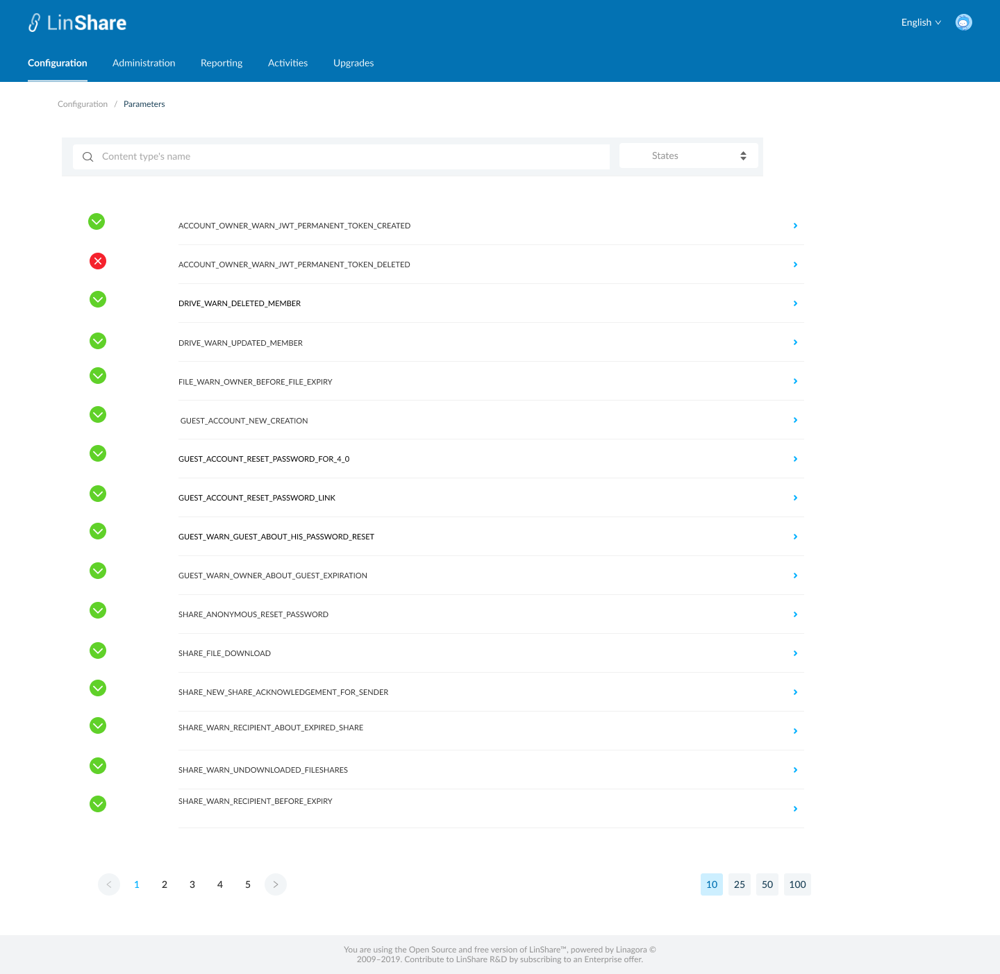

# Summary

* [Related EPIC](#related-epic)
* [Definition](#definition)
* [UI Design](#ui-design)
* [Misc](#misc)

## Related EPIC

* [New admin portal](./README.md)

## Definition

#### Preconditions

- Given that I am Root admin/nested admin of LinShare
- After log-in successfully, I go to Configuration => Select a domain => View details=> Email => Mail activation

#### Description

- The screen list of mail activations of selected domain will be displayed
- The list includes all mail content types and its activation status.
- Each content type will be displayed in a row with its status icon: enabled or disabled.
- I can click on each row to go to detail setting screen of that mail content activation
- I can search mail content type by name by inputting in the search bar, the matches will be shown instantly below.
- I can sort the mail activations by the state: Enabled or disabled.

#### Postconditions

- If i am super-admin, I can see the mail activation list of all domains
- If i am nested admin, I can see mail activation list of my domain and my nested domains if any
- The list is paginated and the default number of displayed items is 25, I can change this number at the bottom of page

[Back to Summary](#summary)

## UI Design

#### Mockups

#### Final design

[Back to Summary](#summary)
## Misc

[Back to Summary](#summary)

