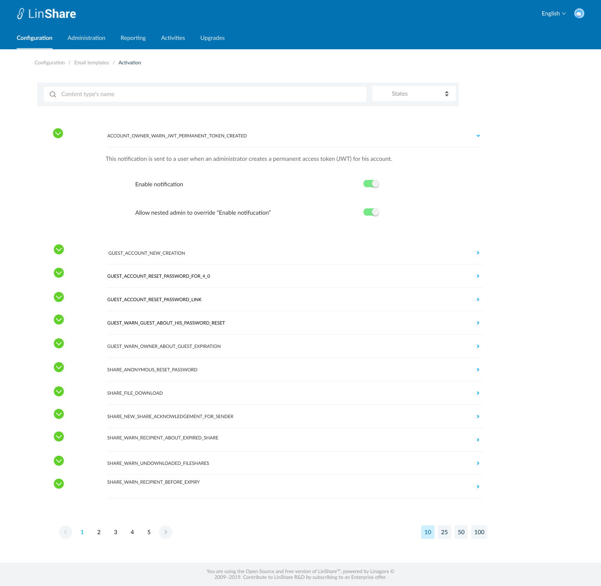
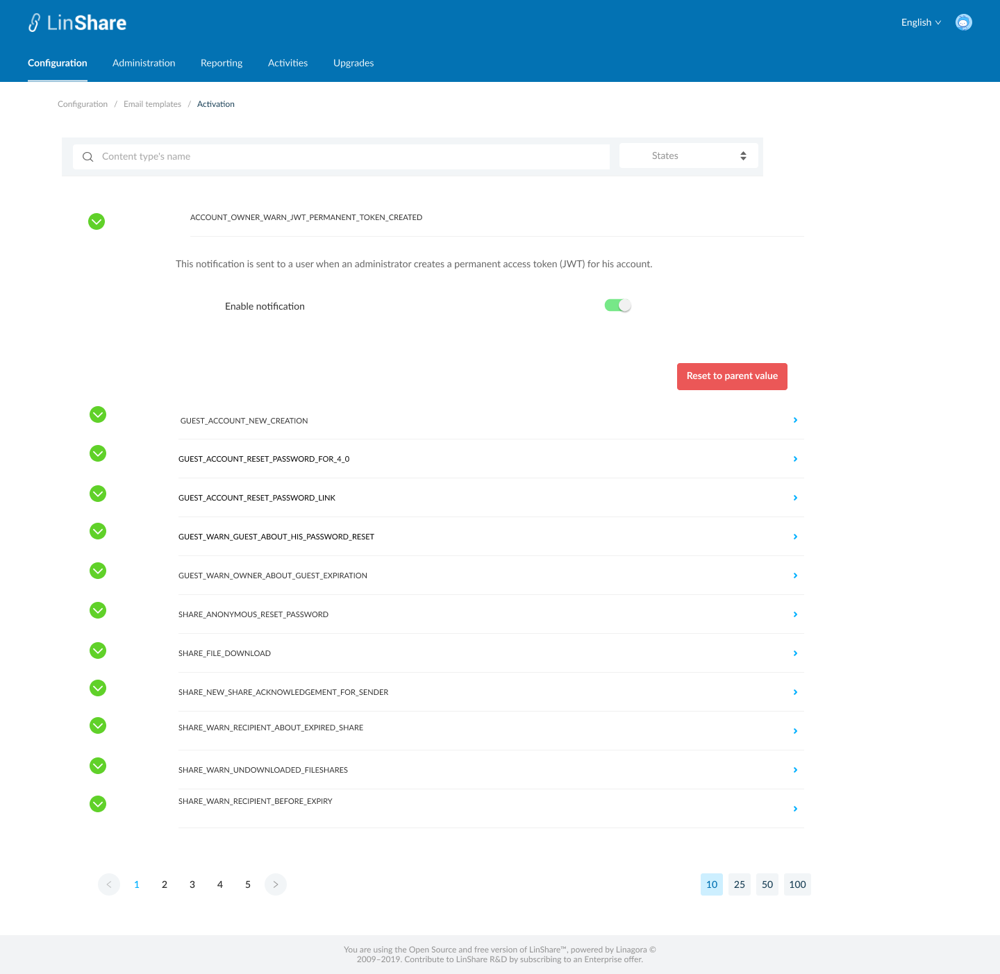

# Summary

* [Related EPIC](#related-epic)
* [Definition](#definition)
* [UI design](#ui-design)
* [Misc](#misc)

## Related EPIC

* [New admin portal](./README.md)

## Definition

#### Preconditions
- Given that am root admin/nested admin of LinShare.
- After log-in successfully, I go to Configuration Tab => Select any domain => View details
- I click on Tab Mail template, then select Mail Activation, the screen listing all mail content type activation is displayed. 

#### Description

#### UC1. I am root admin 

- On this screen, When I click on collapse icon on the mail content title, I can see the activation setting for this content type:
   - An explanation text about this mail content type
   - Toggle: Enable notification: When the toggle is enabled, this email content type will be sent for users in this domain. If it is disabled, this type of email will not be sent for users in this domain
   - Toggle: Allow nested admin to override "Enable notification": When I click on the icon "i", I can see a collapsible legend: " Once activated, nested admin can override the activation of this email notification for his own domain. When disabled, the value of setting "Enable notification" is applied for all nested domains and nested admin cannot update"
- Root admin can configure email activation for every domain
- There will be no toggle : "Allow nested admin to override "Email notification" in sub-domain and guest domain setting
- In nested domain there is a button Reset to parent domain. When settings in nested domain is same as it's parent domain, this button is disabled.
- When  setting in nested domain is different from it's parent domain's value, this button will be enabled.
- When I click on this button, the all the settings in this nested domain will be updated from it's parent domain.

#### UC2. I am nested admin

- On this screen, When I click on collapse icon on the mail content title, I can see the activation setting for this content type:
   - An explanation text about this mail content type
   - Toggle: Enable notification: When the toggle is enabled, this email content type will be sent for users in this domain. If it is disabled, this type of email will not be sent for users in this domain
   - If the root admin allow nested domain to change this setting, I can enable/disable above toggle for my own domain and my nested domains if any.
   - If the root admin does not allow nested admin to change this setting, the value of setting "Enable notification" is applied for all nested domains and nested admin cannot update this toggle

- If I can change toggle "Enable notification", there will be a button "Reset to parent value".
- When settings in nested domain is same as it's parent domain, this button is disabled.
- When  setting in nested domain is different from it's parent domain's value, this button will be enabled.
- When I click on this button, the all the settings in this nested domain will be updated from it's parent domain.

#### Postconditions

[Back to Summary](#summary)

## UI Design

#### Mockups

#### Final design

[Back to Summary](#summary)
## Misc

[Back to Summary](#summary)

