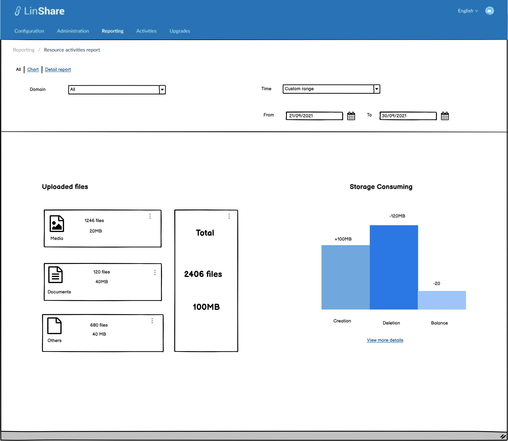
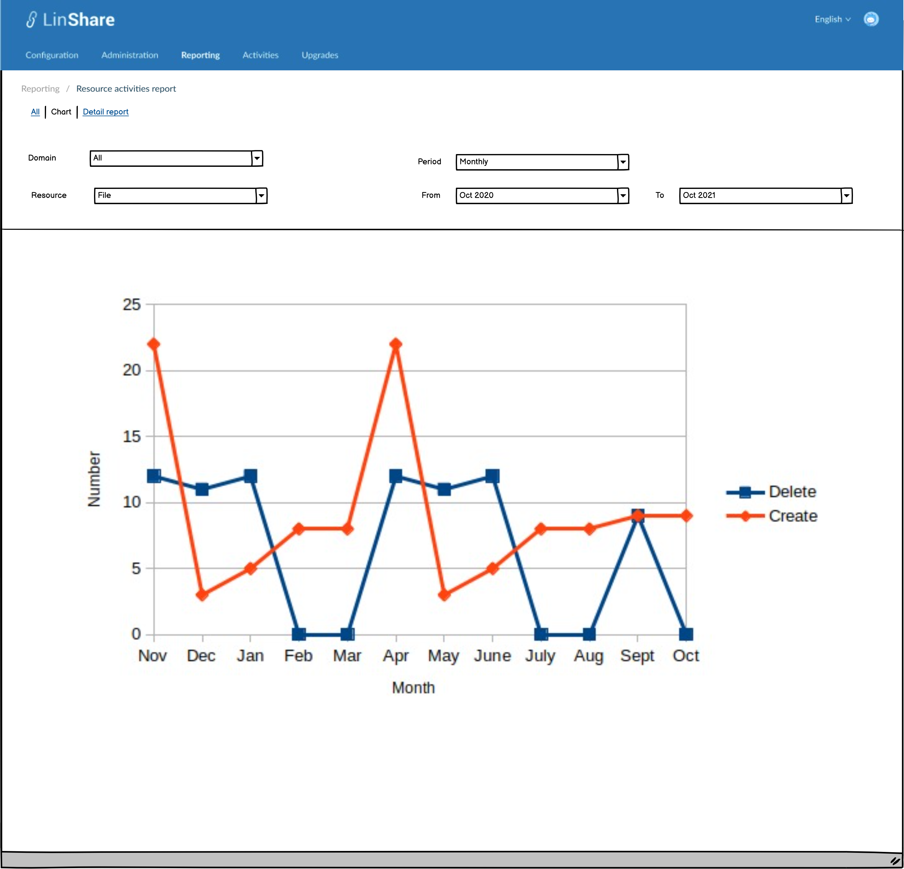
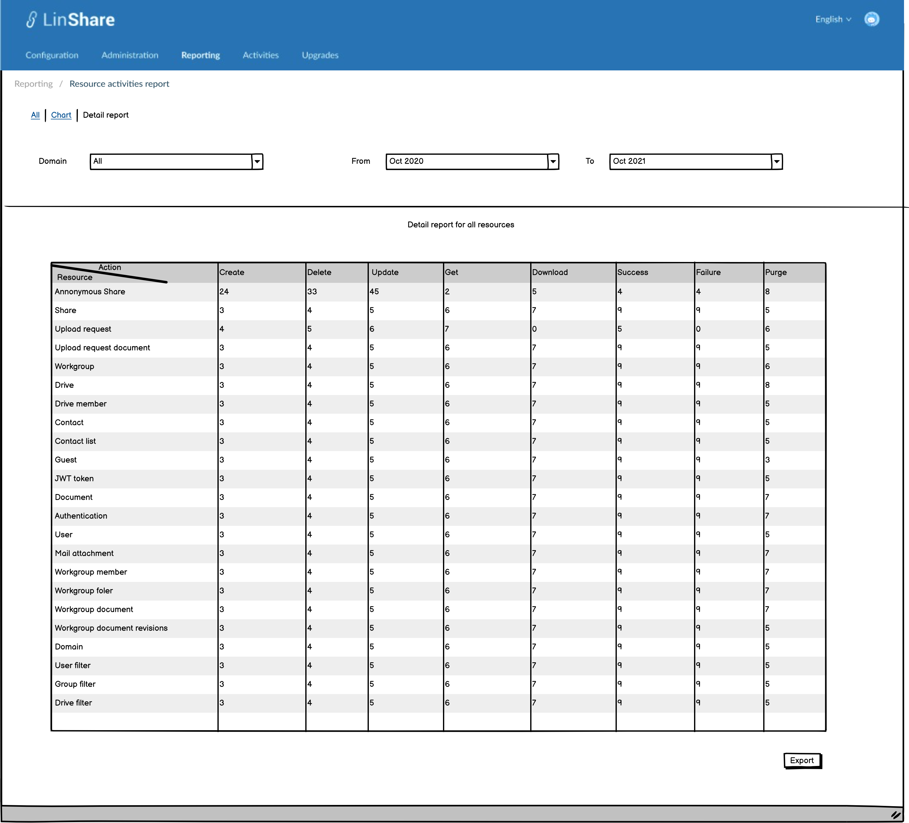

# Summary

* [Related EPIC](#related-epic)
* [Definition](#definition)
* [UI Design](#ui-design)
* [Misc](#misc)

## Related EPIC

* [New admin portal](./README.md)

## Definition

#### Preconditions

- Given that am super admin or nested admin of LinShare
- After log-in successfully, I go to  Tab Reporting 
- A new page will be opened.

#### Description

#### UC1. Filter and summary of uploaded files

- On this new screen, I can select filters: 
   - Filters include:
      - Domain: A combo-box. 
         - If I am root domain, I can see the list of all domains . 
         - If I am nested admin, I can see list of domains in which I have administration right. 
         - Default option is "All".
      - Category:
        - Whole domain 
        - Shared Space
        - My Space 
      - Time: A combo-box with option list: 
        - All time
        - Last 7 days 
        - Last 30 days 
        - Last 6 months
        - Last year
        - Custom range: Whe I select this option, there will be a date picker that allows me to select From date and To date
        - Default option is last 7 days 
   - When I select a domain, category and time and click Enter, the charts below will reflect data of the selected domain in selected time
      - Charts include:
        - Summary: This summary wil be calculated based on selected domain and selected period. This part will includes :
           - Total domain: 
           - Total workgroups
           - Total users
           - Total guests 
        - Total storage statics  : This is the current statistics of domain storage of selected domain/Myspace/Shared Space. It will not depend on Time filter. They are grouped into 3 categories:
          - Media files: Include images and videos. 
          - Documents: Includes files in document format. 
          - Others: The remaining files which do not belong to 2 above groups. 
        - Each category will display number of uploaded files and total file size
        - There is a summary statistics for 3 categories with total storage in use and available space
        - The button "Upgrade plan" is only available on SAAS version, when I click on this button, I am navigated to console homepage.

##### UC2. Resource detail statistics

- On the Domain statistics table, I can see the detail number of each resource 
   - Resources: 
      - If I am super admin, I can select all available resources: Anonymous Share, Share, Upload request,  Upload request document, Workgroup, Drive, Drive member, Contact,  Contact list, Guest, JWT token, Document, Authentication, User, Mail attachment, Workgroup member, Workgroup folder, Workgroup document, Workgroup document revisions, Domain
      User filter, Group filter, Drive filter
      - If I am nested admin , I can select all other resources except for:  Domain User filter, Group filter, Drive filter, Domains, Remote server, Providers,

   - After select domain and time frame, I click Enter and the Report will be generated with detail statistics about activities of every resource that I am allow to access
   - I can select columns to display on the table, each column is one action: Create, Delete, Download, Get, Update, Success, Fail, Purge
   
#### Post-conditions

- If I am root admin, I can see statistics of all domains in all platform or any domain
- If I am nested admin, I can only see statistics of my own domain and my nested domains (if any).

[Back to Summary](#summary)

## UI Design

#### Mockups

#### Final design

[Back to Summary](#summary)
## Misc

[Back to Summary](#summary)

