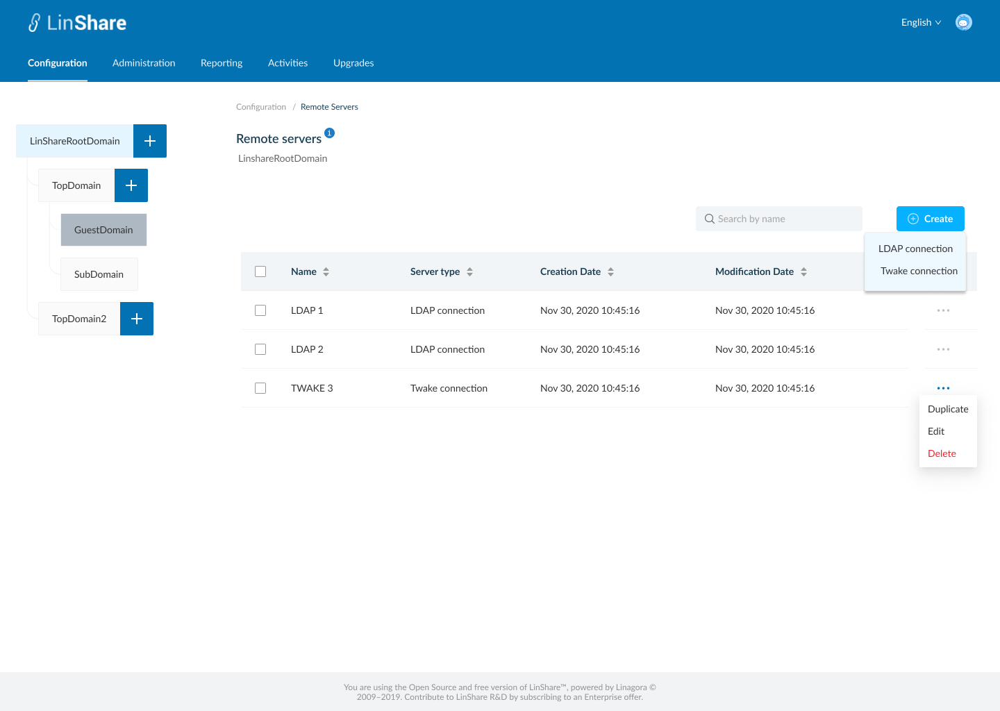
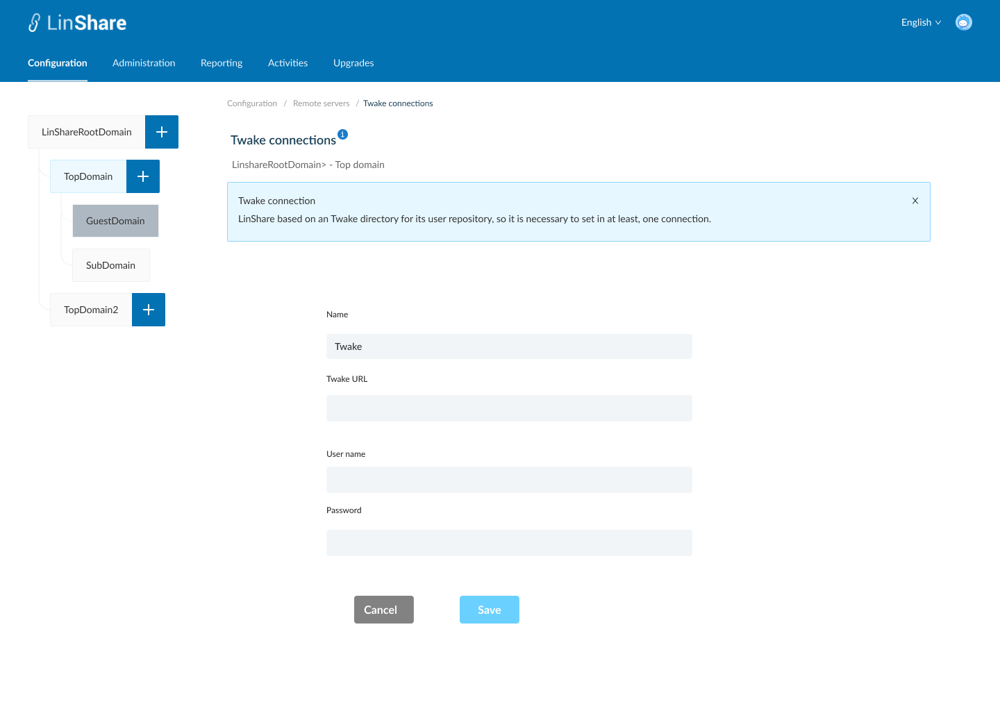
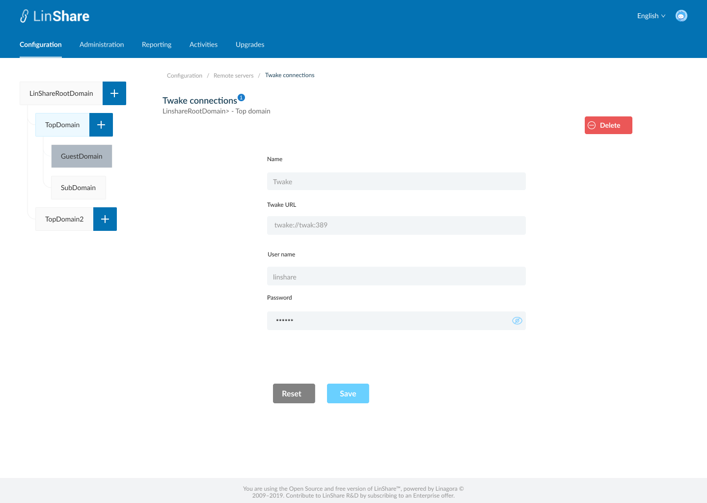
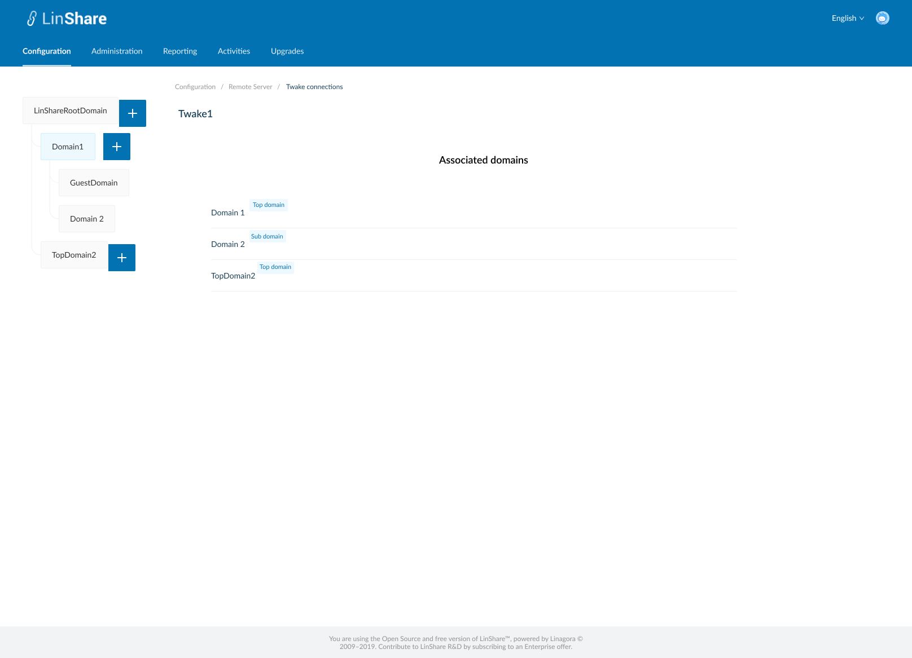
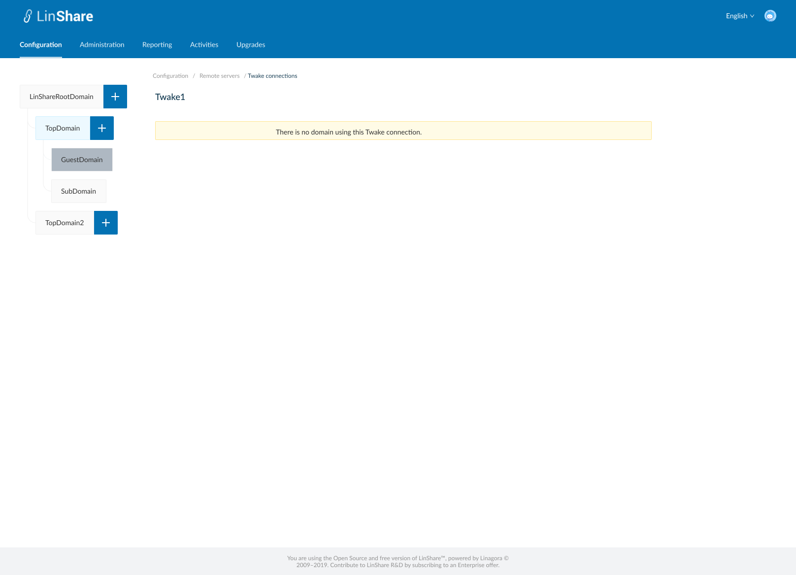

 # Summary

* [Related EPIC](#related-epic)
* [Definition](#definition)
* [UI Design](#ui-design)
* [Misc](#misc)

## Related EPIC

* [New admin portal](./README.md)

## Definition

#### Preconditions

* Given that i am super-admin in Linshare
* I logged-in to Admin portal successfully

#### Description

**UC1. Create Twake connection**
- I go to Configuration tab on top navigation bar, and select Remote servers
- The screen listing Remote server will be displayed
- I click on  button Create, there will be 2 options: LDAP connection and Twake connection
- I select Twake connection, screen Create Twake connection will be displayed.
- In this screen I can see a helper message on screen name when I click information icon
- To create a Twake connection, I need to input fields:
    - Name: a text field and mandatory
    - Twake URL: Text field and madatory
    - User name: a texfield and madatory
    - Password: a text field and madatory. When I start typing in this field, the inputted characters will be hidden by star icons automatically and the closed Eye icon will be shown. I click to this icon, the field value will be displayed.
- When i click button Save, the system will validate if any mandatory field is blank, it will be highlighted in red and a message:"[field name] cannot be blank"
- If there is no error, the new Twake connection is created and there will be a successful notification
- I am redirected to the Screen remote server listing, and the new created Twake connection appears on the list.
- If i click button Cancel, i am navigated to the Listing server screen.

**UC2. Edit Twake connection**

- There are 2 ways to access Edit Twake connection screen:
    - In the Remote server listing screen, i click on three dot-button of an Twake server and select option Edit from the drop-down list
    - Or i can click an the Twake server name on the Remote server listing table
- On the Twake connection Edit screen, i can update all fields: Name, Twake URL, User name, Password then click button Save.
- If any mandatory field is blank, it will be highlighted in red and a message:"[field name] cannot be blank"
- If all mandatory fields are filled, the updates will be saved and there will be a successful toast message.
- If i click button Reset, all the updates will be reset to the before values
- I can click Remote servers on the breadcrumb to navigate back to the server listing screen.

**UC3. Duplicate a Twake connection**

- On the Remote server listing screen, i click on thee-dot button of an twake connection and select option Duplicate from the drop-down list
- The screen Create twake connection will be opened.
- Except the field Name is blank, other fields will have the same value as the Twake connection that I selected to duplicate
- I input the field Name, and can edit other fields
- When I click button Save, the system will validate if any mandatory field is blank, it will be highlighted in red and a message:"[field name] cannot be blank"
- If there is no error, the new Twake connection is created and there will be a successful notification
- If I click button Cancel, I am navigated to the Listing server screen.

**UC4. Delete a Twake connection**
- There are 2 ways to delete an Twake connection:
    - In the Remote server listing screen, I click on three dot-button of a Twake server and select option Delete from the drop-down list
    - Or i can click a Twake connection row on the Remote server listing table to go to Twake server connection detail screen. On this screen I can see the button Delete
- When i click on button Delete, the system will validate:
    - If the Twake connection is not associated with any user providers, there will be a confirmation popup: "You are about to delete this remote sever connection, this procedure is irreversible. Do you want to proceed?" and YEs/No button
        - I choose Yes to confirm, the selected server connections will be deleted.
        - System will prompt a deletion confirmation toast.
    - If the Twake connection is associated with any provider, the system will display a message: " This server connection is associated with at least one of the providers. You cannot delete."

**UC5. View Associated domains**

- On Remote servers listing screen, i click on three-dot button on Action column.
- I select option "View associated domains"
- A new screen will be opened
- I can see the list of domain's name which are using the Twake connection with its user providers
- There will be a label next to each domain's name that indicating domain type of that domain
- Only Top domain or sub-domain can use Twake connection, Root domain and guest domain can't.
- When I click one domain on the list, I am navigated to user provider detail screen of that domain
- If the Twake connection is not Associated with any domain, there will be a text message: " There is no domain using this Twake connection. "

#### Postconditions

[Back to Summary](#summary)

## UI Design

#### Mockups

#### Final design

[Back to Summary](#summary)
## Misc

[Back to Summary](#summary)

 
