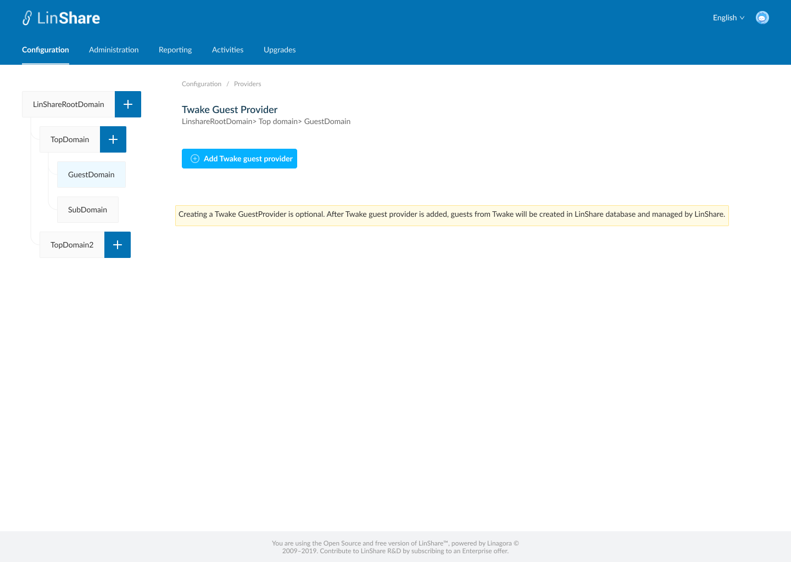
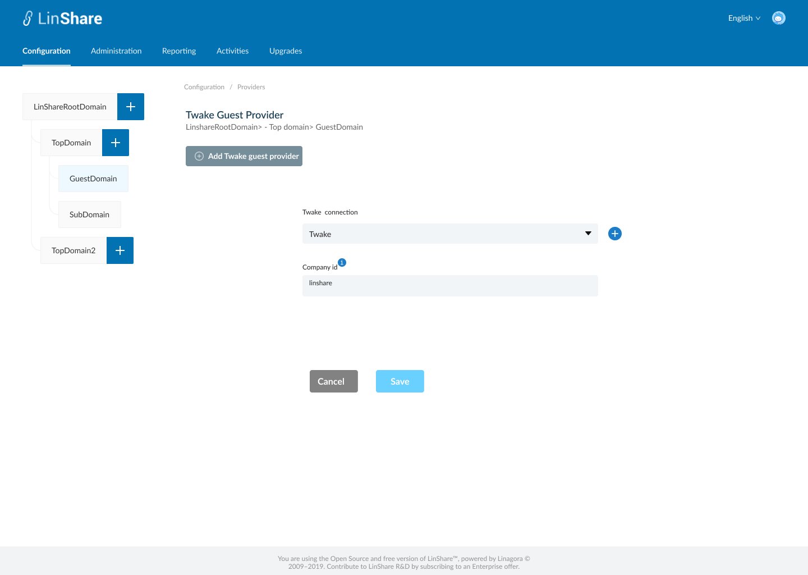
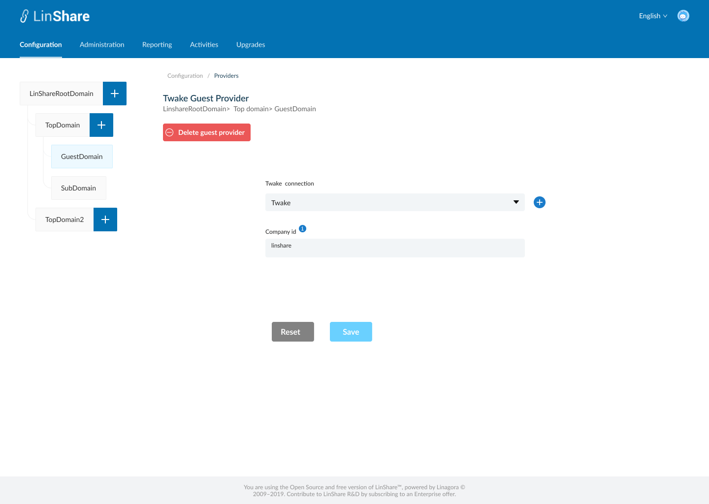

# Summary

* [Related EPIC](#related-epic)
* [Definition](#definition)
* [UI Design](#ui-design)
* [Misc](#misc)

## Related EPIC

* [New admin portal](./README.md)

## Definition

### Preconditions

- Given that i am super-admin in LinShare
- I logged-in to Admin portal successfully
- I choose a nested domain in domain tree and click on Configuration screen, I click on  Providers. (If I select root domain, I cannot see menu Providers)
- If I am selecting a Top domain or Sub-domain of domain tree, On screen Providers, I can see 3 types: User providers, Groups Provider, Drive Providers. 
- If I am selecting a guest domain of domain tree, When I select Providers in Configuration screen, I can see the only option: "Create Twake Guest Provider"

### Description

#### UC1. Create Twake User Provider for Top domain or Sub domain

- I select User Providers, if the current selected domain doesn't have an user provider, [screen 2](#screen-2) will be displayed.
- When I click button "Add user provider", there will be a drop-down list with 3 options: LDAP provider, OIDC provider, Twake provider
- I select Twake provider, [screen 3](#screen-3) will be displayed, the button "Add user provider" will be disabled
- To add an Twake user provider, I need to fill the followings:
    - Twake connection: mandatory field, a drop-down list which contain current Twake connections list. There is a button next to this field that when I click on, I am navigated to Create Twake connection screen
    - After I created and saved a Twake connection successfully, I am navigated back to this screen instead of Remote server listing screen
    - Company id:  a text field and mandatory. When I hover the tooltip, there will be a legend: "LinShare will start retrieving users from this company in Twake."
- When I click button Save, the system will validate:
   - If any mandatory field is blank, it will be highlighted in red and a message:"[field name] cannot be blank"
   - If there is no error, the User provider is saved and there will be a successful notification, I am redirected to [screen 4](#screen-4)
- If I click button Cancel, I am navigated to the [screen 2](#screen-2)

#### UC2. Create Twake Guest provider for Guest Domain

- A guest domain can only get guest provider from Twake. 
- When I select guest domain in Domain tree and select Providers on Configuration tab, [screen 5](#screen-5) will be opened and I can only see an option: Add Twake guest provider
- I can see a warning message:"Creating a Twake GuestProvider is optional. After Twake guest provider is added, guests from Twake will be created in LinShare database and managed by LinShare."
- I click on the button "Add Twake guest provider" and [screen 6](#screen-6) will be shown.
- I need to select Twake connection adn Company id then click button Save
- The system will validate as UC1

#### UC3. Edit Twake User Provider

- I select User Providers, if current selected domain already had an user provider, [screen 4](#screen-4) will be displayed.
- On this screen, I can edit all fields: Twake connection, Company id 
- When I click button Save, the system will validate:
  - If any mandatory field is blank, it will be highlighted in red and a message:"[field name] cannot be blank"
- If there is no error, the User provider is updated and there will be a successful notification.
- If I click button Reset, all the fields will be reset to the before-updated values.

#### UC4. Delete Twake User Provider

- On [screen 4](#screen-4), i can see a Delete button
- When I click on this button, there will be a confirmation popup:"You are about to delete this user provider, this procedure is irreversible. Do you want to proceed?" and Yes/No button
- I choose Yes to confirm, the Twake user provider will be deleted.
- System will prompt a deletion confirmation toast.
- I am navigated to screen 1.

### Postconditions

- The user provider is associated with the selected domain in the left domain tree.
- Root domain is not associated with any User provider
- Guest domain is only associated with guest provider from Twake
- Top domain or sub domain can retrieve user from 3 sources: Twake, OIDC, LDAP 
- When Twake user provider is created for top domain/sub-domain, the system will retrieve only all users excepting guests from Twake server 
- When Twake guest provider is created for guest domain, the system will retrieve only guest users from Twake server.

[Back to Summary](#summary)

## UI Design

#### Mockups

##### Screen 1

##### Screen 2

##### Screen 3

##### Screen 4

##### Screen 5

##### Screen 6

##### Screen 7

#### Final design

[Back to Summary](#summary)
## Misc

[Back to Summary](#summary)
