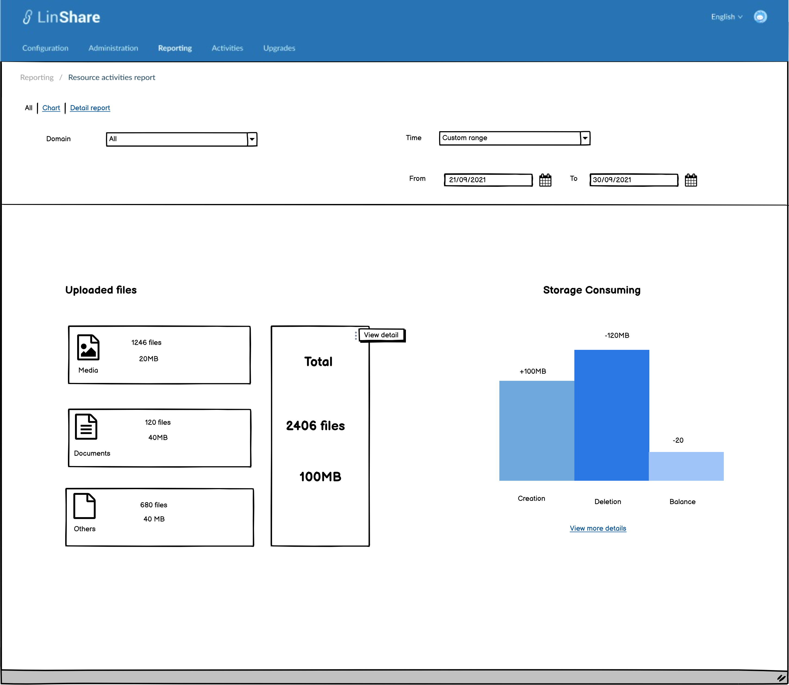
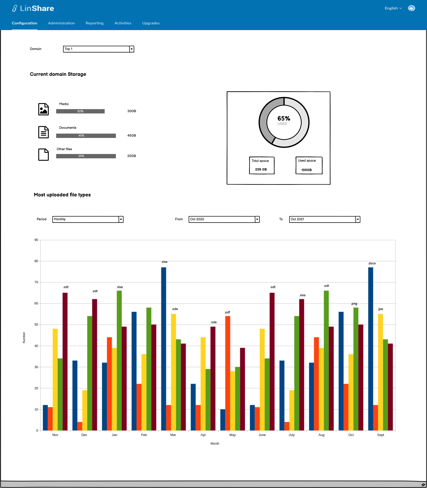

# Summary

* [Related EPIC](#related-epic)
* [Definition](#definition)
* [UI Design](#ui-design)
* [Misc](#misc)

## Related EPIC

* [New admin portal](./README.md)

## Definition

#### Preconditions

- Given that am super admin or nested admin of LinShare
- After log-in successfully, I go to  Tab Reporting
- I click on Resource activities report, a new screen will be opened.
- On the first tab of this screen, I can see statistics chart of uploaded files. 
- I click on thee-dot button of the column "Total", A button "View detail" will be shown
- I click on this button and a new screen below will be opened.

#### Description

- On this new screen, I can see 2 parts: Current domain storage and Most uploaded file types:  
    - Current Domain storage include:
        - Domain: A combo-box.
            - If I am root domain, I can see the list of all domains .
            - If I am nested admin, I can see list of domains in which I have administration right.
            - Default option is "All".
        - A chart that displays the statistics of groups of files in current selected domain. There are 3 groups: Media/Documents/Others and Each group contains total file size (GB) and proportion
        - A chart that displays the current domain's storage: Total space and used space by size (GB) and proportion
  - Most uploaded file types include:
      - Period: A combo-box
          - When click on this field, I can see the list of options: Monthly, weekly, yearly. Default value is monthly, time frame is 1 year
          - The field "From" and "To" will be displayed corresponding: If I selected monthly period, I can only select From[month/year] to [month/year]. If I select weekly, I can only select From [week/year] to [week/year].  If I select yearly, I can only select From [Year] to [Year]
          - The max period for type "monthly" is 12 months, the max period for type "weekly: is 12 weeks, and the max period for type "yearly" is 12 years
          - Default type is monthly, time frame is 1 year from current month.
      - When I select a domain and time and click Enter, the column chart below will display the number of 5 file types which are most uploaded on each time period that you selected (month/week/year)

#### Post-conditions

[Back to Summary](#summary)

## UI Design

#### Mockups

#### Final design

[Back to Summary](#summary)
## Misc

[Back to Summary](#summary)

