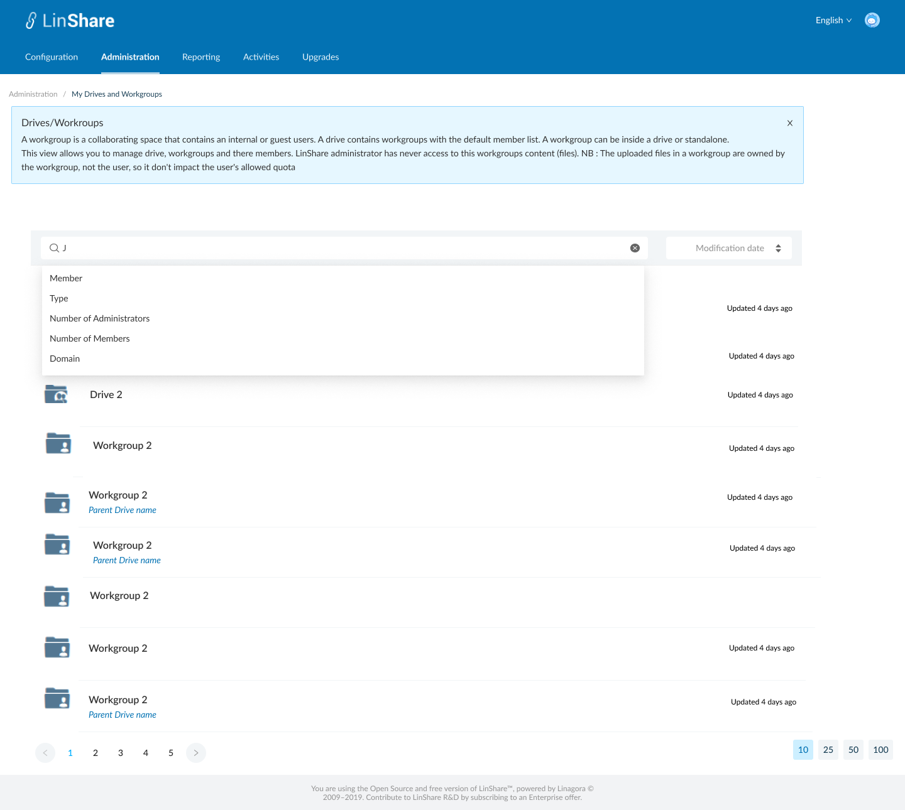
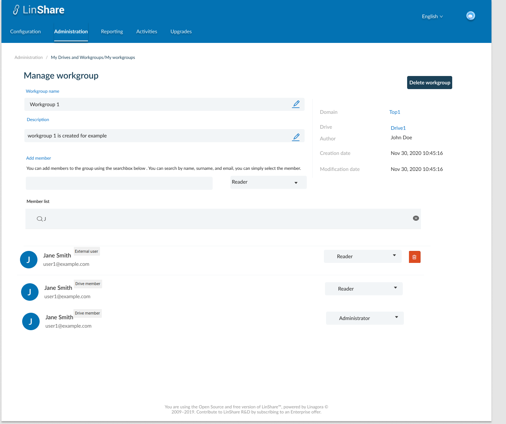
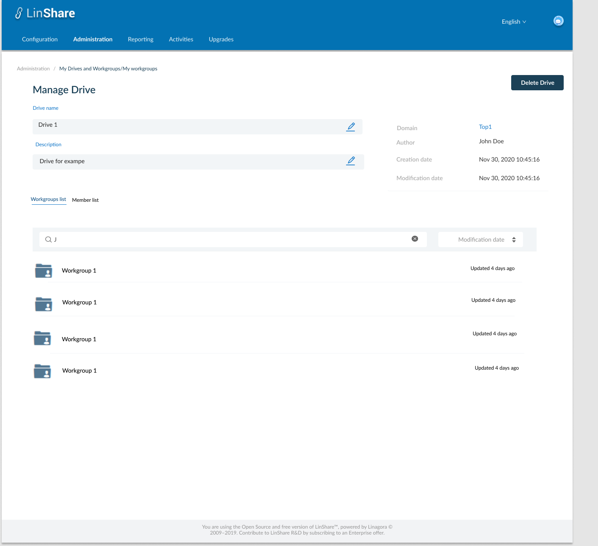

# Summary

* [Related EPIC](#related-epic)
* [Definition](#definition)
* [UI Design](#ui-design)
* [Misc](#misc)

## Related EPIC

* [New admin portal](./README.md)

## Definition

#### Preconditions

- Given that I am Nested admin or Root admin of LinShare

#### Description

- After log-in successfully to  Admin Portal, I select Administration Tab
- On Administration tab, I click on My Drives/ Workgroups, the screen My Drives and Workgroups will be opened.
- In new view I can see the list of all workgroups and Drives
- I click on the search bar, there will be a drop-down list of search criteria including: Member, Type, Number of administrators, Number of members and a new option: Domain
- When I select this search criteria, the search bar will display Domain = "Dropdown list".
- If I am root admin, the option list contains all domains of platform
- If I am nested admin, the option list contains domains that I have administration right.
- When I click Enter, the system will filter all drives/workgroup belonging to that selected domain and displays the result below.
- When I click one Drive/workgroup in the result list, the detail screen of that drive/workgroup will be displayed and I can see the Domain name information in a link.
- When I click on domain link, I am navigated to that domain detail page.

#### Postconditions

- I can search drives/workgrousp by one of above criteria or combine them
- Each search criteria in the search bar is seperated by a delete icon. I can click this icon to delete the criteria
- After select one criteria in search bar, that option is hidden in the drop-down list of search criteria.
- For example:
    - I chose Domain as a search criteria
    - I select one domain (e.g. Top1) from the option list 
    - Now the search bar displays: Domain=Top1
    - When I click on search bar, I can see the list of criteria is: Member; Type; Administrator number; Member number.

[Back to Summary](#summary)

## UI Design

#### Mockups

#### Final design

[Back to Summary](#summary)
## Misc

[Back to Summary](#summary)
